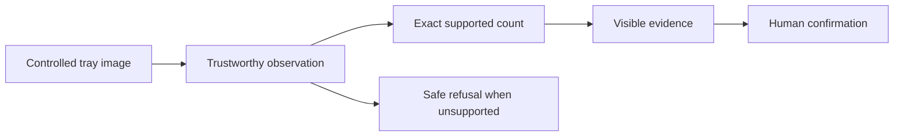
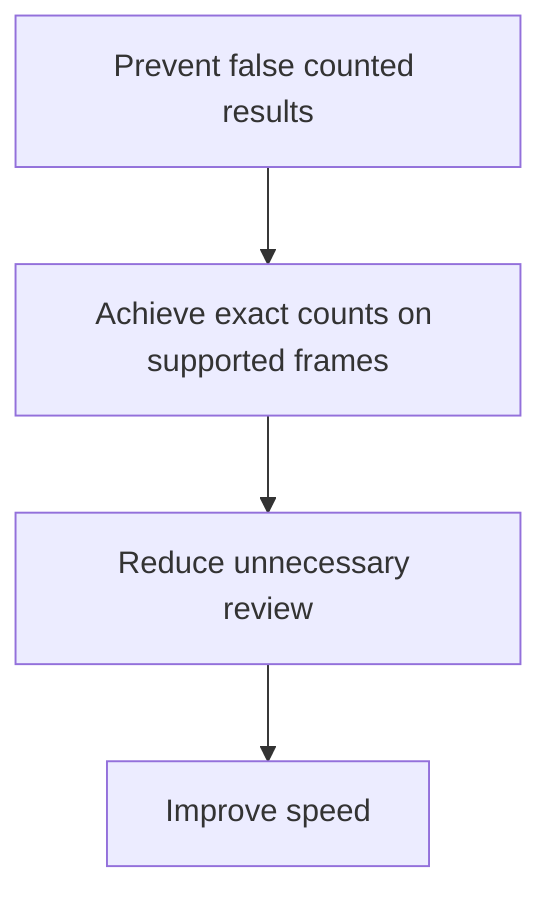
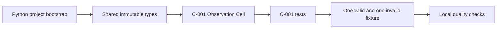

# P.C.A.I. Engineering Principles v1.0

## Purpose

This file defines the engineering standards that govern how P.C.A.I. is built.

It is not an architecture document and not an implementation specification. It is the standard against which engineering decisions, code reviews, pull requests, tests and future contributions are judged.

A new engineer should be able to read this file and understand the expected quality bar before writing code.

The immediate product goal remains simple and concrete:

> Build a pill-counting system that works reliably on controlled trays before expanding into broader intelligence.

# 1. Product truth before system ambition

P.C.A.I. may eventually support many Cells, intents and pharmacy workflows, but the first non-negotiable outcome is a working pill counter.



We do not allow platform ambition to delay the first useful product capability.

# 2. Evidence before confidence

A confidence score is not evidence.

Every accepted count must be traceable to:

- the original frame;
- frame-quality measurements;
- tray geometry;
- candidate observations;
- accepted and rejected regions;
- counting method outputs;
- warnings and limitations;
- the exact configuration used.

A model output without provenance is not a valid engineering result.

# 3. Unknown is a valid outcome

The system must be allowed to say:

```text
UNKNOWN
REVIEW_REQUIRED
REQUIRE_RECAPTURE
BLOCK
```

These are successful safety outcomes when the available evidence is insufficient.

The system must never invent certainty to avoid an inconvenient workflow interruption.

# 4. Deterministic first, learned second

The first counting baseline must be deterministic and interpretable.

Classical vision establishes:

- a measurable baseline;
- failure visibility;
- reproducible fixtures;
- a comparison point for learned models;
- a fallback path.

Learned segmentation is introduced only after the deterministic path can be measured honestly.

# 5. Cells have one responsibility

Each Cell owns one bounded mission.

A Cell must clearly state:

```text
Mission
Authority
Prohibited actions
Inputs
Outputs
Dependencies
Failure modes
Metrics
Tests
```

A Cell must not quietly absorb responsibilities that belong elsewhere.

Examples:

- C-001 observes; it does not count.
- C-002 measures frame quality; it does not identify pills.
- C-005 counts accepted candidates; it does not approve dispensing.
- C-011 applies policy; it does not fabricate evidence.

# 6. Explicit beats implicit

The following must be explicit:

- units;
- versions;
- identifiers;
- thresholds;
- state transitions;
- failure codes;
- optionality;
- assumptions;
- operating-envelope boundaries.

Avoid generic names such as:

```text
data
result
value
thing
handler
manager
utils
helpers
```

unless the meaning is truly unambiguous in context.

# 7. Readable beats clever

Code should be easy to inspect under pressure.

Preferred:

```python
quality = frame_quality_cell.assess(frame)
geometry = tray_geometry_cell.measure(frame)
candidates = candidate_observation_cell.observe(frame, geometry)
count = classical_counting_cell.count(candidates)
```

Avoid compressed control flow, hidden mutation, metaprogramming without necessity, and abstractions that save lines while obscuring meaning.

# 8. Beautiful code is a correctness tool

Beautiful code is:

- small;
- predictable;
- typed;
- deterministic;
- easy to test;
- visually structured;
- named in domain language;
- free from hidden side effects.

A file should contain one coherent concept. A class should have one responsibility. A function should operate at one level of abstraction.

Comments explain **why**, not what the code already says.

# 9. No magic numbers

Thresholds and limits belong in typed configuration.

Avoid:

```python
if focus_score < 120.0:
    ...
```

Prefer:

```python
if focus_score < configuration.minimum_focus_score:
    ...
```

Every threshold must have:

- a name;
- a unit;
- a versioned configuration source;
- a test;
- a benchmark or experimental basis before production approval.

# 10. Configuration is data, not code

Operating thresholds, camera limits, supported tray dimensions and counting policies must not be embedded throughout implementation files.

Configuration must be:

- typed;
- validated;
- versioned;
- serialisable;
- hashable;
- attached to outputs for provenance.

# 11. Immutable beats mutable

Domain contracts and observations should be immutable by default.

Use frozen dataclasses or equivalent value objects where practical.

A new observation, correction or decision creates a new record. It does not rewrite history.

# 12. Composition beats inheritance

Cells, algorithms and adapters should be composed through narrow interfaces.

Avoid deep inheritance trees.

The pipeline coordinates Cells. Cells do not import one another directly.

# 13. Public contracts are versioned

Every command, event, Synapse message and evidence schema that crosses a stable boundary requires a version.

Breaking changes require:

- a new schema version;
- migration or compatibility handling;
- contract tests;
- documentation updates.

# 14. Stable error codes

Failures exposed across boundaries use stable machine-readable codes and safe human-readable messages.

Example:

```python
raise InvalidImageError(
    code="FRAME_DECODE_FAILED",
    message="The captured frame could not be decoded as an approved image.",
)
```

Do not expose stack traces, raw library errors or sensitive diagnostics to ordinary users.

# 15. Fail loudly and safely

The system must not silently continue after:

- corrupted image bytes;
- mismatched frame hashes;
- missing calibration;
- invalid tray geometry;
- unsupported objects;
- unresolved count disagreement;
- stale evidence;
- invalid state transitions.

Recoverable failures should produce clear next actions. Unrecoverable failures should preserve enough evidence for diagnosis.

# 16. Tests are executable documentation

A good test explains a business or engineering rule.

```python
def test_classical_count_refuses_touching_regions() -> None:
    candidates = candidate_set_with_one_touching_pair()

    result = counting_cell.count(
        ClassicalCountingInput(
            frame_id="frame-001",
            candidate_set=candidates,
            configuration=strict_counting_configuration(),
        )
    )

    assert result.status is CountStatus.REVIEW_REQUIRED
    assert "TOUCHING_REGIONS_PRESENT" in result.reason_codes
```

Tests should cover:

- expected behaviour;
- exact threshold boundaries;
- malformed inputs;
- unsupported conditions;
- retries;
- determinism;
- performance regressions;
- previously discovered defects.

Every production defect requires a regression test.

# 17. Visual debugging is mandatory

Counting and vision behaviour must be inspectable visually.

Development outputs should render:

- tray boundaries;
- detected candidates;
- candidate IDs;
- accepted regions;
- rejected regions;
- touching regions;
- unknown objects;
- quality failures;
- final count status.

Logs alone are insufficient for visual systems.

# 18. Fixtures are product assets

Every representative image fixture must have matching ground truth.

```text
fixture image
fixture metadata
expected visible count
expected pipeline status
expected reason codes
operating conditions
notes
```

Fixtures must cover both supported and unsupported conditions.

A benchmark that contains only easy success cases is not valid.

# 19. False acceptance matters more than apparent coverage

The most dangerous early failure is not returning `REVIEW_REQUIRED` too often.

It is returning a confident but wrong count on an unsupported frame.

Priority order:



# 20. Measure before optimising

Do not optimise based on intuition.

Measure:

- median latency;
- p95 latency;
- peak memory;
- CPU usage;
- GPU usage where applicable;
- candidate recall;
- false positives;
- exact-count accuracy;
- unsupported-frame false-pass rate.

Performance work begins only after a reproducible benchmark exists.

# 21. Determinism is a feature

Given the same:

- image bytes;
- configuration;
- code version;
- dependency versions;
- hardware-relevant settings;

A deterministic Cell should produce the same structured result.

Where nondeterminism is unavoidable, it must be declared, seeded where possible and measured.

# 22. Every decision must be replayable

A future engineer must be able to reconstruct:

- what input was observed;
- which configuration was active;
- which Cell versions ran;
- what each Cell produced;
- why the workflow continued or stopped;
- what the human confirmed or corrected.

Replayability is not an audit add-on. It is part of correct behaviour.

# 23. Structured logging only

No uncontrolled `print()` statements in production code.

Logs should include stable fields such as:

```text
cell_id
operation
frame_id
session_id
correlation_id
status
duration_ms
configuration_version
provider_version
reason_codes
```

Logs are for diagnostics. Domain events are for workflow history. They are not interchangeable.

# 24. Security and privacy by default

The implementation must:

- avoid logging raw image bytes;
- avoid leaking credentials or tokens;
- validate file types and sizes;
- bind observations to trusted devices and sessions;
- preserve tenant boundaries;
- minimise retained sensitive data;
- use least privilege for services and Cells.

# 25. Code review standard

A pull request is not ready when it merely works on the author's machine.

It must demonstrate:

- clear scope;
- tests;
- typed contracts;
- failure behaviour;
- visual output where applicable;
- documentation changes;
- benchmark impact where relevant;
- no unexplained architecture drift.

# 26. Pull request checklist

```text
[ ] The change directly supports a current product milestone.
[ ] Cell responsibility remains bounded.
[ ] Public contracts are typed and versioned where required.
[ ] No unexplained magic numbers were introduced.
[ ] Failure codes and recovery behaviour are explicit.
[ ] Unit tests cover normal and failure paths.
[ ] Integration fixtures were added or updated where relevant.
[ ] Visual overlays were reviewed for vision changes.
[ ] Determinism was preserved or declared.
[ ] Performance was measured if the critical path changed.
[ ] Engineering Manual and Visual Atlas were updated when needed.
[ ] No prior document version was overwritten for a major conceptual change.
```

# 27. File-level documentation standard

Every substantive Cell implementation file should begin with a concise module docstring:

```python
"""
P.C.A.I. — C-004 Candidate Observation Cell

Mission
-------
Transform a calibrated tray image into measurable foreground candidates.

Authority
---------
May observe and measure regions inside the approved tray area.

Prohibited
----------
Must not assume every region is one pill.
Must not produce a final count.
"""
```

The docstring should remain concise. Detailed contracts belong in the Engineering Manual.

# 28. Final pre-code sweep

The documentation and implementation plan were reviewed one final time before coding.

## 28.1 Confirmed decisions

- Pill counting is the first working product capability.
- The first executable path is C-001 through C-005.
- The initial count baseline is deterministic classical vision.
- Difficult or unsupported conditions return review rather than guessed counts.
- Learned segmentation follows the deterministic baseline.
- Event sourcing remains planned, but the pure counting path should be proven before infrastructure complexity dominates development.
- The Architecture Bible remains unchanged unless implementation evidence requires a formal architectural correction.
- Major documentation changes create versioned files; minor corrections may update the current version.

## 28.2 Issues corrected during the sweep

- Removed the earlier sequencing assumption that counting should wait until all trust infrastructure was complete.
- Replaced the single-engine mental model with bounded Cells while preventing further architecture expansion from delaying code.
- Preserved `VERIFYING` as distinct from `PROCESSING` in the session model.
- Preserved `ARCHIVED` as a lifecycle state.
- Clarified that frame receipt and capture request are facts inside `CAPTURING`, not primary aggregate states.
- Clarified that target count is workflow-dependent.
- Clarified that quality overrides cannot erase original measurements.
- Clarified that projection success is not required for an already committed completion.
- Clarified that count outputs must use references and provenance rather than duplicated mutable state.
- Clarified that the first classical count should count isolated accepted candidates only.

## 28.3 Remaining experimental decisions

The following must be resolved through hardware tests and fixtures rather than assumption:

- camera and lens selection;
- tray dimensions and material;
- lighting geometry and intensity;
- fiducial type and placement;
- focus threshold;
- exposure thresholds;
- glare threshold;
- broad supported pill-size range;
- morphology parameters;
- touching-region classification thresholds;
- Jetson latency and memory limits.

No numeric threshold in experimental code should be described as validated until benchmark evidence exists.

# 29. Coding entry gate

Coding may begin when the following are present on the implementation branch:

```text
ENGINEERING_PRINCIPLES_v1.0.md
PCAI_ENGINEERING_MANUAL_v0.2.md
PCAI_VISUAL_ATLAS_v0.3.md
```

The first code commit should contain only:

- project bootstrap;
- shared primitives;
- C-001 Observation Cell;
- C-001 unit tests;
- fixture-loading foundation;
- no speculative future modules.

# 30. First coding milestone



The milestone is complete only when the same test suite passes locally with one documented command.
