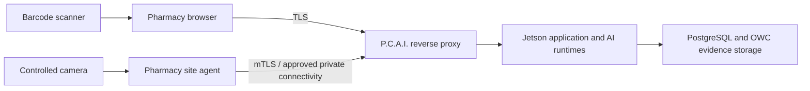
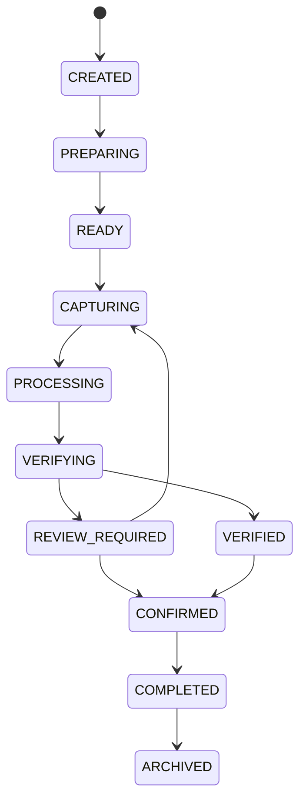
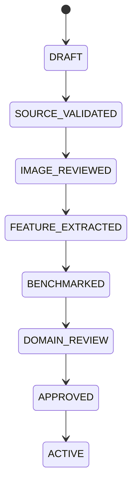

Warning: truncated output (original token count: 63153)
Total output lines: 4474

---
title: "P.C.A.I. Architecture Bible"
subtitle: "AI-Native, Evidence-Driven, Multi-Agent Tablet Counting, Identification, Verification and Pharmacy Intelligence Platform"
version: "2.0"
status: "Approved architecture baseline for engineering"
date: "2026-07-26"
classification: "Project Architecture - Public Repository by Owner Direction"
---

# P.C.A.I. Architecture Bible

## Master Product, System, AI, Data, Security and Engineering Architecture

**AI-native, evidence-driven, multi-agent tablet counting, identification, verification and pharmacy intelligence platform**

> **Governing principle:** P.C.A.I. never claims certainty beyond its evidence. It either produces a result inside a validated operating envelope, or it refuses safely and requests review.

| **Document field**         | **Value**                                                                       |
|----------------------------|---------------------------------------------------------------------------------|
| Working name               | P.C.A.I.                                                                        |
| Document status            | Approved architecture baseline for engineering                                  |
| Version                    | 2.0                                                                             |
| Baseline date              | 2026-07-26                                                                      |
| Primary hardware           | NVIDIA Jetson 8 GB + OWC Envoy Ultra 2 TB SSD                                   |
| Primary interface          | Secure browser-based web application                                            |
| Primary deployment concept | Central P.C.A.I server with pharmacy-site cameras; local motor control deferred |
| Primary domain             | Pharmacy tablet/capsule counting, identification, verification and records      |
| Architecture style         | Offline AI runtime, modular monolith, event sourced, evidence-first             |
| Scope rule                 | Pharmacy only; no references to unrelated projects unless explicitly requested  |

This document consolidates the complete product vision, operating principles, pharmacy workflow model, architecture, event-sourcing design, AI runtime, vision and identification strategy, security, deployment, testing, risks, missing areas, and implementation roadmap discussed for P.C.A.I. It is the single architectural source of truth from which product requirements, engineering tickets, architecture decision records, schemas, APIs, test plans, validation protocols, deployment procedures and operating runbooks are derived.

This version preserves the earlier Gold Standard and AI-Native Updated blueprints and extends them with implementation-grade contracts. It deliberately distinguishes approved decisions from proposed implementation details and experiments. Nothing identified as an open decision is silently converted into a fact.

## Document authority and usage

The Architecture Bible governs the structure and non-negotiable safety behaviour of P.C.A.I. It does not replace detailed product requirements, standard operating procedures, source-code documentation, model cards, validation reports, security assessments or qualified legal and regulatory advice. Those artefacts must trace back to this document and may refine implementation details, but they may not contradict an approved architecture decision without an Architecture Decision Record (ADR).

The intended readers are the founder, product owner, solution architect, backend and frontend engineers, computer-vision and machine-learning engineers, security engineers, test and validation personnel, pharmacy domain reviewers, deployment operators and future auditors. Each reader should be able to understand both what the system does and why authority is distributed the way it is.

### Decision-status vocabulary

| Status | Meaning | Change rule |
|---|---|---|
| **APPROVED** | A binding architecture decision for the current baseline. | Change only through an accepted ADR with impact analysis and migration plan. |
| **REQUIRED** | A control or property that must exist before the affected capability can be released. | May be implemented in different ways, but may not be omitted. |
| **PROPOSED** | A preferred implementation direction that has not yet been proven on the target hardware or in pharmacy workflow testing. | Validate through a prototype, benchmark or design review before freezing. |
| **EXPERIMENTAL** | A hypothesis to be tested under controlled conditions. | Do not use for commercial claims or production dependencies until promoted. |
| **DEFERRED** | Explicitly outside the current release, while preserving an architectural integration path. | Requires new scope approval before implementation. |
| **PROHIBITED** | A behaviour that violates product safety, privacy, authority or evidence principles. | Must not be implemented without redefining intended use and formally replacing this baseline. |

### Sources consolidated

This file is the successor to the following internal baselines:

- `PCAI_Master_Blueprint_Gold_Standard.docx`
- `PCAI_Master_Blueprint_AI_Native_Updated.docx`

Where the two baselines differed, the AI-native version was treated as the later architecture because it retained the Gold Standard and added the multi-agent model. The non-negotiable hardware, browser-first, offline-first, event-sourcing, human-authority and central-server decisions remain unchanged.

# Executive Summary

P.C.A.I is an AI-native, evidence-driven, multi-agent pharmacy intelligence platform whose first product counts tablets and capsules, identifies the medicine, verifies it against expected context, records evidence, and preserves an immutable history of every significant action and AI decision. It is not designed as a chatbot wrapped around a pill counter. Intelligence is distributed across specialised agents for vision, medicine understanding, OCR, verification, policy, knowledge, session coordination, replay and system operations. The initial server hardware is an NVIDIA Jetson with 8 GB RAM connected to an OWC Envoy Ultra 2 TB SSD. The browser is the user interface; no dedicated touchscreen is required.

The initial deployment experiment intentionally follows the founder’s preferred central-server approach: the Jetson and SSD remain at a server location, while pharmacies use controlled cameras and a secure browser workflow. Physical motor control is postponed. When motors are introduced, immediate safety control will remain local to the pharmacy to prevent network latency from causing over-dispensing.

The system must not treat a single neural-network prediction or a single agent as truth. Counting, identification and inspection remain separate capabilities, but they operate inside a coordinated AI society. Classical computer vision, instance segmentation, OCR, calibrated measurements, visual embeddings, medicine context, deterministic rules, approved knowledge and human confirmation combine into evidence. Local language and reasoning models give the agents planning, explanation, retrieval and tool-use capabilities. A sceptical Verification Agent actively searches for disagreement and missing evidence; a Policy Agent enforces non-negotiable pharmacy rules; the Runtime Agent coordinates the process. No agent independently authorises dispensing.

Event sourcing is foundational. The authoritative record is an append-only event stream. Current session state, timelines, reports, and replay views are projections derived from events. Raw observations and evidence are retained separately from conclusions so future model versions can reinterpret historical data without rewriting what was originally observed.

## Final gap analysis — what had been missing

| **Gap**                                   | **Why it matters**                                                                                   | **Decision in this blueprint**                                                                                                                                                      |
|-------------------------------------------|------------------------------------------------------------------------------------------------------|-------------------------------------------------------------------------------------------------------------------------------------------------------------------------------------|
| Absolute “100%” language                  | No real vision system can honestly guarantee zero errors across unrestricted tablets and conditions. | Define a bounded operating envelope and a verified-or-escalate outcome. The system may refuse a count; it must not silently guess.                                                  |
| Medication identity source of truth       | Visual similarity alone is unsafe and public pill data can be incomplete or licensed.                | Use bottle/prescription/barcode context as primary expectation; vision provides independent verification. Govern all medicine-data provenance and licensing.                        |
| Pharmacy-site compute/network bridge      | An internet camera alone cannot securely and reliably manage capture, buffering and authentication.  | Provide a small site gateway or secure IP-camera agent, even if central AI remains on the Jetson.                                                                                   |
| Network failure and central-server outage | Multiple pharmacies could stop simultaneously.                                                       | Define degraded mode, store-and-forward capture, health checks, recovery, backups and later redundancy. Counting cannot be represented as available when the server is unreachable. |
| Camera and tray standardisation           | Accuracy depends more on controlled optics and lighting than model choice.                           | Specify fixed mount, enclosure, tray, illumination, calibration target, exposure and quality gates.                                                                                 |
| Ground-truth test process                 | A high confidence score is not proof of accuracy.                                                    | Create controlled labelled test sets, dual-human reconciliation, challenge sets, acceptance gates and model cards.                                                                  |
| Cybersecurity operations                  | HTTPS and JWT alone are insufficient for a multi-pharmacy appliance.                                 | Add device identity, mutual authentication, secrets management, patching, logging, rate limits, network segmentation and incident response.                                         |
| Privacy and retention                     | Images may capture labels, patient information or staff.                                             | Minimise captured fields, define retention classes, encryption, access controls, exports, legal holds and secure deletion for non-event media where permitted.                      |
| Regulatory/product claims                 | Identification and verification may be interpreted as safety-critical clinical functionality.        | Maintain intended-use statement, human-in-the-loop controls, hazard analysis, validation evidence and legal/regulatory review before commercial claims.                             |
| Operational ownership                     | Models, calibrations and medicine profiles can silently drift.                                       | Assign approval owners, version every change, require signed releases and record configuration/calibration events.                                                                  |
| Data flywheel governance                  | Saving every image is not automatically lawful, useful or label-correct.                             | Separate production evidence from training candidates; require consent, de-identification, quality review and controlled promotion into datasets.                                   |
| Disaster recovery                         | The 2 TB SSD is a single point of failure.                                                           | Define encrypted backups, restoration tests, spare hardware, event-store checksums and recovery-time objectives.                                                                    |
| Observability vs event sourcing           | Events cannot replace metrics, traces and technical logs.                                            | Use event store for business/AI history; use structured logs, metrics and traces for system operations.                                                                             |
| Human factors and accessibility           | A technically correct system can still cause workflow errors.                                        | Design for rapid pharmacy use, clear uncertainty, colour-independent alerts, keyboard access and explicit confirmation steps.                                                       |

# Table of Contents

## Part I - Product and Architecture Baseline

1. Purpose, Scope and Intended Use
2. Product Vision and Principles
3. Pharmacy Knowledge and Workflow Model
4. P.C.A.I. v0.1 Product Definition
5. Hardware and Deployment Architecture
6. Software Architecture
7. Domain and Object Model
8. Event Sourcing, Timeline and Replay
9. Observation, Fact, Evidence and Decision Model
10. AI Runtime and Offline LLM
11. Vision, Counting and Identification Engine
12. Medicine Knowledge and Visual Fingerprints
13. Browser Experience and User Workflows
14. Data, Storage and Retention
15. Security, Privacy and Governance
16. Reliability, Failure Modes and Recovery
17. Testing, Validation and Quality System
18. APIs and Integration Contracts
19. Deployment, Operations and Monitoring
20. Development Standards and Repository Structure
21. Roadmap and Sprint Plan
22. Risk Register and Open Decisions
23. Acceptance Criteria and Definition of Done
24. Final Architecture Review and Conclusion

## Part II - Detailed Engineering Architecture and Binding Contracts

- **25.** Architecture Governance and Decision Management
- **26.** Event Store and Event-Sourced Domain Architecture
- **27.** Data Architecture, Evidence Storage and Information Lifecycle
- **28.** AI, Agent and Capability Runtime Architecture
- **29.** Vision, Counting, OCR and Medicine-Identification Architecture
- **30.** API, Command and Integration Architecture
- **31.** Security, Privacy and Trust Architecture
- **32.** Deployment, Runtime and Operations Architecture
- **33.** Observability, Service Levels and Operational Intelligence
- **34.** Reliability, Recovery and Business Continuity
- **35.** Verification, Validation and Quality Architecture
- **36.** Implementation Program and First Engineering Baseline

## Appendices

- Appendix A - Initial Event Catalogue
- Appendix B - Example Session Timeline
- Appendix C - Example Evidence Bundle
- Appendix D - Threat Model Starter
- Appendix E - Pharmacy Pilot Readiness Checklist
- Appendix F - Initial Agent Contract Catalogue
- Appendix G - Glossary
- Appendix H - Architecture Decision Baseline
- Appendix I - Initial Command Catalogue
- Appendix J - Expanded Event Catalogue and Ownership
- Appendix K - Requirements Traceability Starter
- Appendix L - Experiment and Open-Decision Register
- Appendix M - Core Operational Runbooks
- Appendix N - Repository and Engineering Conventions
- Appendix O - Final Architecture Completeness Review

# Part I - Product and Architecture Baseline

# 1. Purpose, Scope and Intended Use

## 1.1 Purpose

The purpose of P.C.A.I is to reduce uncertainty and manual effort in pharmacy tablet and capsule counting while creating a reliable, reviewable evidence record. It observes a controlled counting tray, estimates quantity, identifies or verifies the medication, detects conditions requiring review, and stores the complete session history.

## 1.2 Initial intended use

- Assist trained pharmacy staff with counting tablets, capsules and supported softgel forms placed within a controlled imaging tray.

- Identify likely medicine candidates from approved local medicine profiles and verify the observed pills against the medicine expected from a barcode, bottle, prescription or operator selection.

- Create a session record containing observations, counts, identification evidence, user actions, model versions and final human confirmation.

- Provide browser-based history, search, replay, administration and an offline AI assistant over approved records and documents.

## 1.3 Explicit non-goals for v0.1

- P.C.A.I does not autonomously prescribe, diagnose, recommend dosage, interpret clinical appropriateness or replace pharmacist judgement.

- P.C.A.I does not automatically dispense or control motors in the first release.

- P.C.A.I does not claim reliable identification of an unrestricted unknown pill from appearance alone.

- P.C.A.I does not guarantee a count under uncontrolled lighting, uncontrolled camera geometry, severe occlusion, excessive overlap or unsupported pill types.

- P.C.A.I is not a cloud SaaS dependency. Core inference and local knowledge run on owned hardware.

## 1.4 Bounded reliability statement

The correct engineering target is not “always returns a number.” The target is “returns a verified count within the validated operating envelope, or clearly refuses and requests corrective action.” A safe refusal is a successful system response. This distinction is essential to approaching commercial-grade reliability.

- **VALIDATED:** Count = 90; identity evidence is consistent; the session may be confirmed.
- **REVIEW_REQUIRED:** Objects are touching/overlapping, image quality is low, models disagree or identity evidence conflicts.
- **FAILED:** Camera/server is unavailable, input is corrupted, configuration is unsupported or required evidence is incomplete.

# 2. Product Vision and Principles

## 2.1 Vision

P.C.A.I is an AI-native, evidence-driven, multi-agent pharmacy intelligence platform. The first application is tablet/capsule counting and medicine verification. Artificial intelligence is present from the beginning not as one central model, but as specialised, replaceable agents operating under evidence, policy, event-sourcing and human-authority constraints. The long-term pharmacy product family may include Counter, Verify, Inventory, Audit, Analytics, Assist and later Robotics, but Version 1 remains focused on the counting and identification workflow.

## 2.2 Permanent principles

| **Principle**                          | **Meaning**                                                                                                                        |
|----------------------------------------|------------------------------------------------------------------------------------------------------------------------------------|
| Offline first                          | Core inference, records and approved knowledge continue on owned infrastructure without external AI APIs.                          |
| Browser first                          | Users interact through a secure responsive browser application; no dedicated touchscreen is required.                              |
| Pharmacy scope isolation               | No unrelated industries or prior projects are introduced unless the founder explicitly expands scope.                              |
| Event first                            | Every significant action and AI decision produces an immutable event.                                                              |
| Observation first                      | Raw observations are separated from interpretations and conclusions.                                                               |
| Evidence first                         | Every AI conclusion references supporting observations, measurements and rules.                                                    |
| Human authority                        | The pharmacist or authorised operator owns the final confirmation. AI may recommend review but cannot override a human correction. |
| No silent guessing                     | Unsupported or uncertain cases become REVIEW_REQUIRED, not confident-looking answers.                                              |
| Model replaceability                   | Applications request capabilities; they do not depend on a specific YOLO, OCR or LLM implementation.                               |
| Version everything                     | Models, medicine profiles, rules, calibration, configuration, prompts and APIs are versioned.                                      |
| Replayability                          | Any session can be reconstructed from its event stream and preserved evidence.                                                     |
| Security and least privilege           | Every device, user and service has an identity and receives only required access.                                                  |
| Practicality over architecture theatre | Use a modular monolith on the Jetson; extract services only when justified.                                                        |
| Every bug becomes a test               | Production failures generate regression cases and challenge-dataset examples.                                                      |

- AI-native, not merely AI-enabled: intelligent components are assumed in the architecture from day one.

- Multi-agent by design: specialised agents collaborate, challenge one another and expose structured evidence.

- No single-agent authority: important outcomes require independent verification, policy compliance and human confirmation.

- AI may increase autonomy only when it also increases explainability, provenance, replayability and safe fallback behaviour.

- Agents request capabilities through typed contracts; they never receive unrestricted shell, database or filesystem access.

- Agent reasoning and tool use are recorded as immutable events without treating hidden chain-of-thought as an auditable business record.

## 2.3 The P.C.A.I loop

REALITY → OBSERVE → MEASURE → INTERPRET → BUILD EVIDENCE → DECIDE → RECORD EVENT → REPLAY → IMPROVE

# 3. Pharmacy Knowledge and Workflow Model

## 3.1 Core pharmacy objectives

- Correct medicine.

- Correct strength and dosage form.

- Correct quantity.

- Correct prescription/patient context.

- Evidence that the preceding checks were performed.

## 3.2 Flows that P.C.A.I must understand

| **Flow**         | **Description**                                                               | **P.C.A.I role**                                                                        |
|------------------|-------------------------------------------------------------------------------|-----------------------------------------------------------------------------------------|
| Medicine flow    | Supplier → storage → stock bottle → tray → dispensed bottle.                  | Observe the selected source and pills without replacing physical custody controls.      |
| Information flow | Prescription → drug/strength/quantity → label → record.                       | Use expected context to constrain verification and record the evidence chain.           |
| People flow      | Technician, pharmacist, owner, support technician and administrator.          | Enforce roles, record actor identity and design screens around actual responsibilities. |
| Decision flow    | Select medicine, verify strength, verify quantity, review anomalies, confirm. | Provide evidence and clear escalation; human remains final decision owner.              |
| Evidence flow    | Barcode, frame, mask, count, OCR, measurements, confirmation and timeline.    | Bind all evidence to the session and preserve provenance.                               |
| Trust flow       | Technician action → AI observation → evidence → pharmacist confirmation.      | Strengthen trust by showing why the system reached its conclusion.                      |

## 3.3 Standard assisted-count workflow

1. User logs in.
2. User starts a counting session.
3. Expected medicine and target count are selected or scanned.
4. Camera and tray quality checks pass.
5. User places tablets/capsules on the tray.
6. P.C.A.I captures one or more stable frames.
7. Vision produces instances, masks, measurements and image-quality facts.
8. OCR and identification produce medicine candidates.
9. Confidence/evidence engine compares count and identity against expected context.
10. System returns VERIFIED or REVIEW_REQUIRED.
11. User confirms, corrects or repeats.
12. Session is completed; all events and evidence are committed.
13. Inventory integration may update later, but is outside the first core slice.

## 3.4 Error taxonomy

| **Category**          | **Example**                                                   | **Response**                                                                 |
|-----------------------|---------------------------------------------------------------|------------------------------------------------------------------------------|
| Human selection error | Wrong stock bottle or expected medicine selected.             | Identity mismatch alert; require rescanning or pharmacist confirmation.      |
| Image quality error   | Blur, glare, shadow, focus or exposure failure.               | Reject frame before inference and provide a corrective instruction.          |
| Counting error        | Touching, stacked or hidden pills.                            | Model disagreement/occlusion signal; request spreading or alternate capture. |
| Recognition error     | Look-alike medicine or unreadable imprint.                    | Present top candidates and unknown state; do not force a label.              |
| Process error         | No barcode, skipped expected medicine or interrupted session. | Block completion or mark incomplete with explicit reason.                    |
| System error          | Camera, storage, database, GPU or network unavailable.        | Fail safely, preserve partial events and expose recovery guidance.           |
| Security error        | Invalid token, unexpected device or privilege violation.      | Deny action, emit security event, alert administrator where appropriate.     |

# 4. P.C.A.I v0.1 Product Definition

## 4.1 Minimum lovable product

| **Capability**        | **v0.1 behaviour**                                                                 | **Priority** |
|-----------------------|------------------------------------------------------------------------------------|--------------|
| Authentication        | Admin, pharmacist/technician and viewer roles; secure login and session expiry.    | NOW          |
| Dashboard             | Health, camera, storage, GPU, local LLM and recent-session status.                 | NOW          |
| Camera                | Connect, preview, lock settings, capture and quality scoring.                      | NOW          |
| Counting              | Static-tray tablet/capsule counting with visual annotation and review state.       | NOW          |
| Identification        | Expected-medicine verification plus candidate identification using appearance/OCR. | NOW          |
| Session history       | Searchable completed/incomplete sessions with evidence and correction history.     | NOW          |
| Event timeline/replay | Reconstruct system and AI decisions in order.                                      | NOW          |
| Offline LLM assistant | Tool-driven search, explanation and approved local RAG.                            | NOW          |
| Model registry        | Installed model versions, hash, status and benchmark metadata.                     | NOW          |
| Medicine profiles     | Approved medicine reference profiles and images.                                   | NOW          |
| Reports               | Session/export summaries with final confirmation and anomalies.                    | NOW          |
| Inventory automation  | Automatic stock deduction and forecasting.                                         | LATER        |
| Motors/dispensing     | Vibration, gate and bottle filling.                                                | LATER        |
| AI/digital twin       | Fleet-wide digital representation and proactive intelligence.                      | LATER        |
| PCS specification     | External platform standard.                                                        | FUTURE       |

## 4.2 North-star metric

Verified Assisted Counting Session Success Rate: the percentage of eligible sessions completed with the correct count, correct identity verification or appropriate review escalation, a complete evidence trail, and no safety-critical silent failure.

## 4.3 Supporting metrics

- Exact-count accuracy by pill type and count range.

- False verified rate (most important safety metric).

- Review-required rate and its causes.

- Medicine identity top-1 and top-k accuracy.

- Unknown/reject calibration quality.

- Median and 95th-percentile session latency.

- Session completion time and user correction rate.

- Frame rejection rate by camera/site.

- Service uptime, recovery time and event-loss rate.

- Model drift indicators by medicine, site and camera.

# 5. Hardware and Deployment Architecture

## 5.1 Owned central hardware

- NVIDIA Jetson with 8 GB memory as the initial AI and application server.

- OWC Envoy Ultra 2 TB SSD as model, image/evidence, database, event, backup-staging and log storage.

- Stable power, cooling, Ethernet and an uninterruptible power supply are strongly recommended.

## 5.2 Pharmacy-site hardware

A central Jetson does not remove all pharmacy-site hardware. Each station needs a deterministic optical setup and a secure capture/control bridge.

| **Component**          | **Requirement**                                                                                            | **Reason**                                                            |
|------------------------|------------------------------------------------------------------------------------------------------------|-----------------------------------------------------------------------|
| Camera                 | Industrial or high-quality USB/PoE camera, fixed focus, sufficient resolution, controllable exposure.      | Repeatability and remote management.                                  |
| Lens                   | Low-distortion lens selected for tray dimensions and working distance.                                     | Accurate shape and measurement.                                       |
| Lighting               | Enclosed, diffused, flicker-free illumination with fixed colour temperature and brightness.                | Eliminate pharmacy-room lighting variability.                         |
| Tray                   | Matte, cleanable, high-contrast tray with known dimensions and fiducial/calibration markers.               | Segmentation, scale and hygiene.                                      |
| Mount/enclosure        | Rigid camera distance and angle; blocks stray light.                                                       | Prevents recalibration and focus drift.                               |
| Site gateway           | Small secure device/agent or capable IP camera for capture, buffering, authentication and browser pairing. | A raw remote camera stream is insufficiently robust and secure.       |
| Barcode scanner        | Browser-compatible USB scanner or camera barcode capture.                                                  | Provides expected medicine, lot and context.                          |
| Local motor controller | ESP32-class controller when robotics arrives.                                                              | Immediate fail-safe hardware control independent of internet latency. |

## 5.3 Central-server topology



Jetson services include the reverse proxy, API, web UI, event store, projections, PostgreSQL, vision runtime, OCR, LLM/RAG, object storage and monitoring.

## 5.4 Why a site agent is required

- Maintains camera identity and certificates.

- Buffers images when the network briefly fails.

- Applies capture settings and quality checks.

- Prevents unrestricted camera exposure to the internet.

- Allows browser pairing without giving browsers direct camera credentials.

- Later hosts immediate motor safety logic while the central server provides vision decisions.

## 5.5 Capacity reality for the Jetson

The 8 GB Jetson is appropriate for one development station and a carefully controlled pilot. It must be benchmarked before supporting multiple simultaneous pharmacy streams. Memory is not the only limit; GPU throughput, video decode, CPU, thermal throttling and model concurrency determine capacity. The architecture must queue jobs and expose capacity rather than assume unlimited live streams.

## 5.6 Storage layout

```text
/pcai-data
  /events       append-only event partitions/checkpoints
  /database     PostgreSQL data and backup staging
  /objects      evidence images, annotations and exports
  /models       vision, OCR, LLM, embeddings and metadata
  /datasets     governed training candidates; not raw production by default
  /knowledge    approved manuals, SOPs and indexes
  /logs         bounded technical logs
  /backups      encrypted backup staging
  /quarantine   corrupted or unapproved inputs
```

# 6. Software Architecture

## 6.1 Architectural style

P.C.A.I begins as a modular monolith plus specialised local runtimes. The core backend runs as one deployable FastAPI application with strict internal module boundaries. PostgreSQL, reverse proxy and local model runtimes may be separate containers. This avoids microservice overhead on the Jetson while preserving extraction paths for future scaling.

## 6.2 Logical layers

| **Layer**          | **Responsibilities**                                                     | **May not do**                                                |
|--------------------|--------------------------------------------------------------------------|---------------------------------------------------------------|
| Browser/UI         | Display state, submit commands, stream updates, collect confirmations.   | Directly access models, event database or camera credentials. |
| API/Application    | Authenticate, authorise, validate commands, coordinate use cases.        | Contain model-specific inference code.                        |
| Domain             | Session, medicine, evidence, decision and event rules.                   | Depend on web frameworks or hardware details.                 |
| Capability runtime | Observe, detect, count, OCR, identify, reason and search.                | Own final human approval or write arbitrary domain tables.    |
| Infrastructure     | PostgreSQL, event persistence, object storage, network, model processes. | Define pharmacy business meaning.                             |
| Hardware/site      | Capture controlled frames and later actuate motors safely.               | Make unverified medicine/dispensing decisions.                |

## 6.3 Core modules

| **Module**         | **Responsibility**                                                                |
|--------------------|-----------------------------------------------------------------------------------|
| Identity & Access  | Users, roles, sessions, device identities and permissions.                        |
| Pharmacy & Station | Tenant/site/station configuration and camera association.                         |
| Counting Session   | Lifecycle, commands, expected medicine/count and final confirmation.              |
| Observation        | Raw frame metadata and quality results.                                           |
| Evidence           | Facts, model outputs, relationships and provenance.                               |
| Decision           | Candidate hypotheses, confidence, rules and human confirmation.                   |
| Medicine           | Approved medicine identities, variants, imprints and reference profiles.          |
| Event Store        | Append-only event writing, stream reads, optimistic concurrency and checksums.    |
| Projections        | Current session state, dashboard, reports and search indexes derived from events. |
| Replay             | Timeline reconstruction and evidence display.                                     |
| Model Registry     | Model version, hash, approval, benchmark and compatibility.                       |
| Knowledge/RAG      | Approved local documents and retrieval indexes.                                   |
| AI Orchestrator    | Tool selection, structured reasoning and explanation.                             |
| System/Operations  | Health, storage, GPU, camera, backups and diagnostics.                            |

## 6.4 Command, event and query discipline

- **Command:** an authenticated request to change state (`StartSession`, `CaptureFrame`, `ConfirmDecision`).
- **Event:** an immutable fact that already occurred (`SessionStarted`, `FrameCaptured`, `DecisionConfirmed`).
- **Query:** a read-only request against a projection (`GetSession`, `SearchEvents`, `GetHealth`).

# 7. Domain and Object Model

## 7.1 Primary aggregates

| **Aggregate/Object** | **Purpose**                                                           | **Source of truth**                         |
|----------------------|-----------------------------------------------------------------------|---------------------------------------------|
| Pharmacy             | Organisation/tenant boundary.                                         | Events + pharmacy projection.               |
| Station              | Physical counting station and site-agent identity.                    | Events + station projection.                |
| User                 | Human identity and role assignments.                                  | Identity events + user projection.          |
| CountingSession      | Unit of pharmacy work and evidence.                                   | Session event stream.                       |
| FrameObservation     | Raw captured frame metadata and quality facts.                        | Immutable observation record + object hash. |
| PillInstance         | Per-frame or tracked pill identity, mask and measurements.            | Evidence objects.                           |
| MedicineProfile      | Approved drug/strength/dosage-form variant and reference fingerprint. | Versioned medicine events.                  |
| EvidenceBundle       | All supporting and contradicting facts for a decision.                | Immutable evidence object.                  |
| Decision             | Machine hypotheses, rule outcome and human final confirmation.        | Decision events.                            |
| ModelArtifact        | Versioned model, hash and evaluation record.                          | Model registry events/projection.           |
| KnowledgeDocument    | Approved local SOP/manual/document and index version.                 | Knowledge events and object storage.        |
| SystemConfiguration  | Versioned thresholds, camera and retention policy.                    | Configuration events.                       |

## 7.2 Identity strategy

Use opaque globally unique identifiers internally (UUIDv7 or ULID) and readable display codes only for humans. Do not encode sensitive or mutable facts into primary keys.

- **Internal ID:** `01J...` (sortable ULID example).
- **Display code:** `SES-20260725-000001`.
- **Correlation ID:** follows one user operation across events/services.
- **Causation ID:** identifies the command or event that caused a new event.

## 7.3 Session state machine



Alternative terminals are `CANCELLED`, `FAILED` and `ABANDONED`. No transition may bypass validation or erase prior state; corrections append events.

## 7.4 Decision ownership

| **Owner type** | **Examples**                                     | **Authority**                                                       |
|----------------|--------------------------------------------------|---------------------------------------------------------------------|
| Vision model   | Count/mask/feature output.                       | Observation only.                                                   |
| OCR model      | Imprint candidates.                              | Observation only.                                                   |
| Rules engine   | Thresholds, mismatches and mandatory review.     | Can block automated verification.                                   |
| LLM            | Tool orchestration and explanation.              | Advisory; cannot bypass deterministic controls.                     |
| Technician     | Selects inputs and may propose correction.       | Subject to role policy.                                             |
| Pharmacist     | Final confirmation/override.                     | Final human authority within configured workflow.                   |
| Administrator  | Approves models, medicine profiles and policies. | Governance authority; not a substitute for dispensing confirmation. |

# 8. Event Sourcing, Timeline and Replay

## 8.1 Event store as authoritative history

Business and AI history is append-only. Event streams are grouped by aggregate (for example, one stream per counting session). Projections represent current state but can be rebuilt. Evidence files are content-addressed and referenced by events; they are not embedded as large event payloads.

## 8.2 Event envelope

```json
{
  "event_id": "ULID",
  "event_type": "counting.session.started",
  "event_version": 1,
  "aggregate_type": "counting_session",
  "aggregate_id": "...",
  "stream_revision": 3,
  "occurred_at_utc": "...",
  "recorded_at_utc": "...",
  "actor": {"type": "user|service|device", "id": "..."},
  "pharmacy_id": "...",
  "station_id": "...",
  "correlation_id": "...",
  "causation_id": "...",
  "payload": {},
  "metadata": {"software_version": "...", "model_versions": {}, "schema_hash": "..."},
  "integrity": {"payload_sha256": "...", "previous_event_hash": "..."}
}
```

## 8.3 Event categories

| **Category**       | **Examples**                                                                      |
|--------------------|-----------------------------------------------------------------------------------|
| Identity/security  | user.logged_in, access.denied, device.authenticated, role.changed                 |
| System/operations  | system.started, service.degraded, storage.threshold_reached, backup.completed     |
| Camera/calibration | camera.connected, settings.locked, calibration.approved, frame.rejected           |
| Session            | session.created, expected_medicine.selected, capture.requested, session.completed |
| Observation        | frame.captured, quality.measured, instances.segmented, imprint.observed           |
| Evidence           | evidence.bundle.created, evidence.conflict_detected, hypothesis.generated         |
| Decision           | decision.proposed, verification.required, human.corrected, decision.confirmed     |
| Model/governance   | model.installed, benchmark.completed, model.activated, threshold.changed          |
| Knowledge          | medicine_profile.created, reference_image.approved, document.indexed              |
| Retention/export   | media.retention_expired, export.generated, legal_hold.applied                     |

## 8.4 Corrections and deletion

Events are never edited. A correction is a new event referencing the original. Personal or legally removable media must be handled through retention and cryptographic/object deletion policies while preserving a minimal audit event that deletion occurred. This prevents “nothing is deleted” from conflicting with privacy obligations.

## 8.5 Replay modes

- Operational timeline: human-readable sequence of commands, events and system status.

- Evidence replay: original frame, annotations, masks, OCR crops, measurements and hypotheses.

- State replay: rebuild session state from events.

- Model re-evaluation: run a newer approved model on preserved observations without modifying original decisions.

- Audit replay: show exactly what the system and user knew at the historical time, including then-active model/rules/profile versions.

## 8.6 Event sourcing is not observability

P.C.A.I also needs bounded structured logs, metrics and traces. Events answer “what happened in the pharmacy workflow”; logs/metrics/traces answer “why is the system slow, failing or consuming resources.” They are related but not interchangeable.

# 9. Observation, Fact, Evidence and Decision Model

## 9.1 Definitions

| **Term**     | **Definition**                                                            | **Example**                                                   |
|--------------|---------------------------------------------------------------------------|---------------------------------------------------------------|
| Observation  | Raw or minimally processed statement about reality.                       | Frame captured at 12 MP; exposure 4 ms.                       |
| Fact         | Measured/derived value with method and uncertainty.                       | Object area 3,240 px; estimated width 8.1 ± 0.2 mm.           |
| Evidence     | A fact connected to a hypothesis with supporting or contradicting weight. | Imprint M500 supports profile X.                              |
| Hypothesis   | Candidate explanation, including Unknown.                                 | Metformin 500 mg candidate.                                   |
| Decision     | Selected machine outcome under rules and thresholds.                      | Identity consistent; count 90; VERIFIED proposed.             |
| Confirmation | Human acceptance, correction or rejection.                                | Pharmacist confirms count and medicine.                       |
| Knowledge    | Versioned pattern or approved reference beyond one session.               | Approved reference profile for manufacturer/strength variant. |

## 9.2 Evidence bundle requirements

- References immutable observations and model outputs by ID and hash.

- Separates supporting, contradicting and missing evidence.

- Records method, model/version, threshold and calibration version.

- Includes uncertainty; never treats model confidence as calibrated probability unless validated.

- Lists alternate hypotheses and an explicit Unknown hypothesis.

- Identifies the policy or rule that produced VERIFIED or REVIEW_REQUIRED.

- Records whether a human viewed, corrected and confirmed the result.

## 9.3 Confidence architecture

Do not create an arbitrary weighted percentage and call it truth. Begin with interpretable subsystem scores, validate calibration on held-out data, and use rules for hard safety constraints. The system should expose both confidence and evidence completeness.

Example only (must be empirically calibrated):

- Count agreement across segmentation methods
- Occlusion/overlap risk
- Frame quality and calibration validity
- OCR/imprint match
- Shape/size/colour similarity
- Expected-context match
- Out-of-distribution/unknown score
- Historical profile variability

Hard rule example: expected imprint contradiction → REVIEW_REQUIRED regardless of aggregate score.

# 10. AI Runtime and Offline LLM

## 10.1 Role of the LLM

The LLM is a coordinator and explanation layer, not the counter, classifier of record or safety rule engine. It receives structured tool outputs, invokes authorised tools, searches approved local records/knowledge and explains why the deterministic workflow reached a state.

## 10.2 Allowed tasks

- Start or inspect a session through typed tools after user authorisation.

- Explain count/identity evidence and why review is required.

- Search session history and produce summaries.

- Answer questions from approved local SOPs and manuals with citations to local source records.

- Help administrators review system health, model versions and recurring failure patterns.

- Generate draft reports from structured records.

## 10.3 Prohibited tasks

- Directly count pills from text or make the authoritative count.

- Override identity mismatches, safety rules or required pharmacist confirmation.

- Provide unsupported medical, dosage or clinical advice.

- Write arbitrary SQL or access unapproved files.

- Modify events, evidence or model approval records.

- Use external AI APIs in the offline baseline.

## 10.4 Local model constraints

The 8 GB Jetson requires a small quantised instruct model. Selection must be based on measured memory, latency, tool-call reliability and structured-output compliance on the exact Jetson software stack. The model files reside on the OWC SSD; active runtime memory still depends on RAM/GPU memory and cannot be increased by SSD capacity.

## 10.5 AI tool contract

```yaml
tool_name: search_sessions
input_schema: "{date_range, pharmacy_id?, medicine_id?, status?, confidence_below?}"
output_schema: "{items: [...], total, query_id}"
permission: sessions.read
side_effects: none
events:
  - ai.tool.called
  - ai.tool.completed
  - ai.tool.failed
```

The LLM never receives a general shell, unrestricted filesystem or unrestricted database tool.

## 10.6 RAG

- Only approved documents are indexed.

- Every response cites document ID/version/section.

- Retrieval and generation events are stored.

- Documents are scanned, versioned and assigned visibility.

- The assistant states when the approved knowledge base does not contain an answer.

## 10.7 AI-native architectural position

P.C.A.I gives AI a large and visible role, but it does so through bounded intelligence rather than a single omnipotent model. AI is distributed across perception, medicine understanding, verification, knowledge retrieval, workflow coordination, replay analysis and system operations. The stable platform contract is the capability requested and the evidence returned; the underlying model may change without changing the pharmacy application.

APPLICATION → CAPABILITY REQUEST → AGENT/RUNTIME → APPROVED TOOLS & MODELS → EVIDENCE → VERIFICATION → EVENT → HUMAN-AUTHORISED OUTCOME

## 10.8 The P.C.A.I agent society

The initial architecture defines logical agents. On the Jetson they may run inside the same modular-monolith process and may share one local model runtime. “Agent” therefore describes mission, authority, tools, memory and contracts—not necessarily a separate container or a separate LLM loaded into memory.

- Runtime Agent — coordinates the workflow, maintains the current plan and chooses authorised capabilities. It cannot bypass policy or verification.

- Vision Agent — evaluates frame quality, detects and segments objects, tracks identities, extracts visual features and reports observations. It does not declare the medicine of record.

- OCR Agent — selects useful tablet crops, performs imprint reading, returns alternative readings and exposes OCR uncertainty.

- Medicine Agent — compares observations, measurements, OCR and approved medicine profiles; produces ranked hypotheses rather than a forced single answer.

- Counting Agent — fuses segmentation, contour, tracking and consistency checks into a candidate count and count-specific evidence.

- Inspection Agent — searches for broken tablets, foreign objects, mixed appearance, severe overlap and other reject conditions.

- Verification Agent — acts as the sceptic. It attempts to disprove the leading hypothesis, detects contradictions, requests additional evidence and determines whether the evidence threshold is met.

- Policy Agent — evaluates approved pharmacy and system policies. It is deterministic where policy requires deterministic enforcement.

- Knowledge Agent — retrieves approved SOPs, medicine records, model cards and historical patterns with source/version provenance.

- Session Agent — understands the current counting-session state, required next action, pending evidence and allowed state transitions.

- Replay Agent — reconstructs a session from immutable events and evidence, compares original and later model interpretations, and produces human-readable explanations.

- Operations Agent — reviews service health, storage, camera quality, thermal state and recurring operational failure patterns, but cannot silently change production settings.

## 10.9 Agent constitution and authority boundaries

- Agents may observe, propose, explain, retrieve and request authorised tools only within their declared mission.

- Agents never modify raw observations, immutable events, prior evidence or historical decisions.

- Agents cannot grant themselves permissions, install models, approve medicine profiles or change production thresholds.

- The Verification Agent is organisationally independent from the agent proposing the leading medicine/count hypothesis.

- The Policy Agent may block or escalate an outcome even when all predictive agents agree.

- The pharmacist remains the final operational authority for dispensing decisions.

- Unknown, insufficient evidence and contradiction are valid outcomes; the system must not force consensus.

- No agent is allowed to reduce a safety requirement merely to improve speed or completion rate.

## 10.10 Multi-agent verification protocol

For every significant count or identity decision, P.C.A.I runs a structured deliberation. The purpose is not theatrical conversation between bots; it is controlled production of independent hypotheses, critiques, evidence requests and a deterministic resolution record.

1. The Session Agent creates the decision context and identifies the required outcome.

2. The relevant perception agents produce observations and quality measurements.

3. The Counting and Medicine Agents produce ranked hypotheses with evidence references.

4. The Verification Agent searches for counter-evidence, missing evidence, mixed pills, ambiguity and conflicts.

5. The Knowledge Agent retrieves only approved context needed to interpret the observation.

6. The Policy Agent applies mandatory thresholds, review rules and workflow constraints.

7. The Runtime Agent assembles the structured decision proposal without altering source evidence.

8. The browser presents the result, uncertainty, contradictions and required next action to the authorised user.

9. Human confirmation, correction or rejection is recorded as a new immutable event.

Important: agreement among agents is not itself proof. Consensus is considered only alongside evidence independence, source quality, model diversity, calibration and policy requirements. Multiple agents backed by the same model and same input are correlated, not independent votes.

## 10.11 AI Bus and shared blackboard

Agents communicate through typed messages and a session-scoped blackboard rather than unrestricted natural-language chat. The blackboard stores references to observations, facts, evidence, hypotheses, contradictions, tool results, policies, agent state and required actions. Durable business facts are emitted to the event stream; temporary reasoning state remains bounded to the session.

### Agent message envelope

message_id \| session_id \| correlation_id \| agent_id \| mission \| intent \| input_refs \| output_schema_version \| evidence_refs \| uncertainty \| requested_capability \| permissions \| created_at \| expires_at

- No free-form agent output becomes a business fact until it passes schema validation.

- Every tool request is permission checked and evented.

- Every output references its inputs and model/runtime versions.

- Duplicate commands are idempotent; retries cannot create duplicate authoritative outcomes.

- Session blackboards have bounded size, expiration and explicit promotion rules into long-term knowledge.

## 10.12 Agent memory model

- Working memory — temporary session context and unresolved hypotheses.

- Episodic memory — immutable event/evidence history of completed sessions.

- Semantic memory — approved medicine profiles, SOPs, model cards and validated knowledge.

- Operational memory — camera, service and model performance trends.

- Learning candidates — human corrections and difficult cases awaiting governed review; they are not automatically promoted into production knowledge.

Agents may retrieve memory through authorised tools, but they do not own or silently rewrite memory. Event sourcing remains the authoritative historical mechanism.

## 10.13 Model strategy on the 8 GB Jetson

The agent society must be logical before it is physically distributed. Loading a separate language model for every agent would exceed the Jetson’s practical capacity and create unnecessary latency. Version 1 should use one small quantised local reasoning model, shared through a model runtime, with agent-specific system contracts, tools, schemas, retrieval scopes and deterministic guardrails. Vision/OCR models remain specialised and may be loaded on demand.

- Prioritise structured-output reliability and tool-use accuracy over benchmark charisma.

- Use deterministic code for arithmetic counts, thresholds, permissions and policy enforcement.

- Route simple tasks to rules or small models; reserve the LLM for coordination, explanation, retrieval synthesis and ambiguous reasoning.

- Use a GPU scheduler/model manager to avoid uncontrolled simultaneous model loading.

- Measure cold-start latency, peak RAM, thermal throttling, token throughput and vision/LLM contention on the actual Jetson.

- Allow the server hardware to be upgraded later without changing browser or pharmacy-site contracts.

## 10.14 Agent observability and AI event sourcing

Agent operation must be inspectable without claiming to preserve private hidden chain-of-thought. P.C.A.I records structured, business-relevant reasoning artefacts: hypotheses, evidence references, contradictions, requested tools, policies evaluated, validation results, uncertainty, selected outcome and human response.

- ai.agent.started / ai.agent.completed / ai.agent.failed

- ai.hypothesis.proposed / ai.hypothesis.rejected

- ai.evidence.requested / ai.evidence.received

- ai.contradiction.detected / ai.contradiction.resolved

- ai.tool.requested / ai.tool.authorised / ai.tool.completed / ai.tool.denied

- ai.verification.passed / ai.verification.review_required / ai.verification.failed

- ai.policy.evaluated / ai.policy.blocked

- ai.explanation.generated

- ai.human.confirmed / ai.human.corrected / ai.human.rejected

## 10.15 AI autonomy levels

Autonomy is introduced deliberately and per capability. It is never implied merely because a stronger model is installed.

- Level 0 — observe and record only.

- Level 1 — recommend an action and explain the evidence.

- Level 2 — execute reversible, low-risk software actions after explicit user approval.

- Level 3 — execute predefined workflow actions automatically within policy and with immediate human review available.

- Level 4 — future bounded physical automation with local fail-safes, independent sensing and validated stop behaviour.

- No Version 1 agent receives authority to dispense, change policy, approve models or learn directly into production.

## 10.16 Continuous improvement and governed learning loop

P.C.A.I should become more intelligent through verified experience, but production learning is a governed pipeline—not uncontrolled online training.

HUMAN CORRECTION → LEARNING-CANDIDATE EVENT → DATA QUALITY REVIEW → LABEL APPROVAL → DATASET VERSION → OFFLINE TRAINING → VALIDATION → MODEL APPROVAL → CANARY/SHADOW DEPLOYMENT → MONITORING → PROMOTION OR ROLLBACK

- Corrections are preserved with original observations and original model outputs.

- No single pharmacy correction automatically changes the medicine knowledge base for all pharmacies.

- New models must replay historical benchmark sessions and pass regression gates.

- Shadow mode compares a candidate agent/model against production without influencing the user outcome.

- Every promotion and rollback is an immutable change event with approval provenance.

## 10.17 AI success metrics

- Counting accuracy and verified-session success rate.

- Medicine top-1/top-k identification accuracy within declared supported profiles.

- Unknown/review-required precision: ability to refuse unsafe guesses.

- Contradiction detection recall.

- Tool-call schema compliance and permission-denial correctness.

- Explanation faithfulness to recorded evidence.

- Human correction rate and repeat-error rate.

- Agent latency, model-loading time, memory pressure and thermal stability.

- Calibration quality: whether stated uncertainty matches observed error rates.

- Historical replay consistency across model versions.

# 11. Vision, Counting and Identification Engine

## 11.1 Pipeline

Frame source → Quality gate → Lens/perspective correction → Tray segmentation → Pill instance segmentation → Touching/overlap analysis → Count fusion → Per-instance measurements → Colour/texture → OCR/imprint → Embeddings/classification → Unknown detection → Evidence bundle

## 11.2 Static-tray counting strategy

For the first version, pills are placed in a controlled tray and counted from stable images. Tracking is useful for multi-frame consensus and later motion/dispensing, but static instance segmentation and geometric validation are the primary approach. Vehicle-style line crossing should not be the default for a stationary tray.

## 11.3 Counting methods and fusion

| **Method**                              | **Strength**                                   | **Failure mode**                                    | **Use**                                        |
|-----------------------------------------|------------------------------------------------|-----------------------------------------------------|------------------------------------------------|
| Classical contours/watershed            | Fast, interpretable, useful for high contrast. | Fails on touching, transparent or variable pills.   | Independent cross-check and diagnostics.       |
| Instance segmentation                   | Exact masks and per-pill geometry.             | Requires dataset and may merge/duplicate instances. | Primary learned counting model.                |
| Connected components after tray masking | Simple baseline.                               | Sensitive to shadows and touching pills.            | Sanity check.                                  |
| Multi-frame consensus                   | Reduces transient noise and glare.             | Does not reveal fully hidden pills.                 | Stability/verification.                        |
| Weight/load cell later                  | Independent quantity signal.                   | Requires known unit weight and calibration.         | Future cross-check, not sole count.            |
| Human correction                        | Ground truth for unresolved cases.             | Can be wrong if not reconciled.                     | Final authority and training candidate source. |

## 11.4 Identification hierarchy

1. Expected context: barcode/bottle/prescription/operator selects the medicine variant expected.

2. Visual verification: appearance, imprint, dimensions and embeddings are compared against the approved expected profile.

3. Candidate identification: if expected context is unavailable, return ranked candidates plus Unknown, never an unqualified single answer.

4. Human confirmation: pharmacist confirms or corrects.

5. Governed learning: corrected samples enter quarantine and require review before becoming reference/training data.

## 11.5 OCR reality

Tablet imprint OCR is difficult because characters are small, curved, embossed/debossed, low-contrast and partially occluded. The design must support crop enhancement, multiple orientations, top/bottom side context and explicit “unreadable” output. A single overhead camera may not see both sides; this limits unconditional identification and must be reflected in product claims.

## 11.6 Supported object taxonomy

- Whole tablet

- Capsule

- Softgel (after validation)

- Half tablet

- Broken/chipped tablet

- Foreign object

- Powder/debris region

- Unknown object

- Overlapping/stacked group requiring review

## 11.7 Frame quality gate

| **Check**     | **Example metric**                                   | **Action if failed**                   |
|---------------|------------------------------------------------------|----------------------------------------|
| Focus         | Laplacian/learned sharpness plus calibration target. | Reject and instruct focus/cleaning.    |
| Exposure      | Clipping and histogram bounds.                       | Adjust controlled exposure; recapture. |
| Glare         | Specular area and saturation.                        | Lighting correction or review.         |
| Tray coverage | Fiducials/corners visible.                           | Reposition or recalibrate.             |
| Motion        | Inter-frame movement/blur.                           | Wait for stable frame.                 |
| Occlusion     | Merged masks, depth/shape anomalies.                 | Ask user to spread pills.              |
| Contamination | Unexpected regions/debris.                           | Require tray cleaning/review.          |

## 11.8 Calibration

- Intrinsic camera/lens calibration.

- Perspective/homography calibration to tray plane.

- Pixel-to-millimetre scale with uncertainty.

- Colour reference/white balance.

- Lighting baseline and acceptable drift.

- Calibration approval event, version and expiry.

- Automatic check using fiducials at session start.

# 12. Medicine Knowledge and Visual Fingerprints

## 12.1 Medicine profile structure

| **Field group**     | **Examples**                                                                                                          |
|---------------------|-----------------------------------------------------------------------------------------------------------------------|
| Identity            | Generic name, brand, strength, dosage form, manufacturer, product/NDC-equivalent identifiers where legally available. |
| Appearance          | Colour, shape, scoring, coating, transparency, markings.                                                              |
| Imprints            | Front/back text, symbols, orientation variants and OCR normalisation.                                                 |
| Measurements        | Width, length, diameter, thickness if captured, acceptable ranges and uncertainty.                                    |
| Reference media     | Approved multi-angle images, lighting/camera metadata and rights/provenance.                                          |
| Embeddings/features | Versioned visual embeddings, colour histograms, contour descriptors and texture features.                             |
| Lifecycle           | Draft, reviewed, approved, superseded, deprecated; effective dates and reviewer.                                      |
| Provenance          | Source, licence/permission, collection method and verification records.                                               |

## 12.2 Visual fingerprint

A visual fingerprint is a versioned structured profile, not a claim that appearance uniquely identifies every drug. It combines observable characteristics and expected variation. Similar-looking medicines can share characteristics; the system must preserve ambiguity and use context.

## 12.3 Data provenance and licensing

P.C.A.I must not assume that existing pill-image databases can be copied into a commercial product. Every reference source requires documented licence/permission, jurisdictional review, update process and quality validation. Pharmacy-collected images require customer agreement, privacy review and separation between operational evidence and model-training use.

## 12.4 Profile approval workflow



Changes create new versions. Existing sessions continue to reference the historical version used at the time.

# 13. Browser Experience and User Workflows

## 13.1 Roles

| **Role**                      | **Primary actions**                                                                             |
|-------------------------------|-------------------------------------------------------------------------------------------------|
| Technician/Operator           | Start session, scan/select expected medicine, capture, review instructions, propose correction. |
| Pharmacist                    | Review evidence, confirm/correct count and identity, close exceptions.                          |
| Pharmacy Administrator        | Manage users/stations, reports, retention and local policies.                                   |
| P.C.A.I Support               | View authorised diagnostics and events; no patient/medicine evidence unless explicitly granted. |
| Model/Knowledge Administrator | Approve model/profile/document versions under controlled process.                               |
| Viewer/Auditor                | Read-only access to approved reports, timelines and exports.                                    |

## 13.2 Core screens

| **Screen**    | **Must show**                                                                                               |
|---------------|-------------------------------------------------------------------------------------------------------------|
| Login         | Tenant/station identity, secure credentials and clear failure messages.                                     |
| Dashboard     | System/camera/AI/storage health, active session, recent anomalies and capacity.                             |
| New Count     | Expected medicine, target count, camera preview, quality status and Start.                                  |
| Processing    | Stable image, detected outlines, count, identification, evidence completeness and no distracting animation. |
| Review        | Supporting/contradicting evidence, alternate candidates, image zoom, repeat/correct/confirm actions.        |
| History       | Search/filter sessions by date, medicine, user, status, count and confidence.                               |
| Replay        | Ordered timeline, frames, annotations, model/rule/profile versions and corrections.                         |
| Medicines     | Approved profiles, reference images, versions and status.                                                   |
| AI Assistant  | Typed questions, cited local records/documents, clear action confirmation.                                  |
| Events        | Administrator/auditor event search and export.                                                              |
| Models        | Installed/active versions, benchmark and compatibility status.                                              |
| System        | Camera calibration, storage, backups, services, GPU, network and updates.                                   |
| Users & Roles | Least-privilege assignments and activity history.                                                           |

## 13.3 UX safety rules

- Never use colour alone to communicate status.

- Display count and identity separately; one may be verified while the other requires review.

- Do not show a misleading “99.9%” without context and calibration.

- Require explicit confirmation for final session completion.

- Make Repeat Capture and Spread Pills prominent when needed.

- Preserve entered work after recoverable failures.

- Show the expected medicine and detected candidate simultaneously.

- Warn when the current camera/calibration/model is outside validated configuration.

# 14. Data, Storage and Retention

## 14.1 Data classes

| **Class**                 | **Examples**                                             | **Default treatment**                                             |
|---------------------------|----------------------------------------------------------|-------------------------------------------------------------------|
| Immutable business events | Session, decision, confirmation, model/config changes.   | Append-only, integrity protected, long retention per policy.      |
| Evidence media            | Original/processed frames, crops, masks and annotations. | Encrypted; retention tier based on operational/legal need.        |
| Projections               | Session summaries, dashboards, search indexes.           | Rebuildable; backed up for convenience.                           |
| Technical telemetry       | Logs, metrics and traces.                                | Bounded retention and rotation.                                   |
| Training candidates       | Corrected/approved samples.                              | Quarantined; de-identified and reviewed before dataset promotion. |
| Models/knowledge          | Model artifacts, manifests, documents, indexes.          | Versioned, hashed and approved.                                   |
| Secrets                   | Keys, certificates, passwords.                           | Never stored in source tree or normal event payloads.             |

## 14.2 Content-addressed objects

Evidence files should be stored with SHA-256 content hashes, metadata and access policy. Events reference object IDs/hashes. This detects corruption, deduplicates identical files and proves which media supported a historical decision.

## 14.3 Retention

Retention is policy-driven by jurisdiction/customer and must distinguish audit events from media. “Store everything forever” is not acceptable without legal and privacy analysis. P.C.A.I must support retention holds, deletion approval, deletion events and proof of deletion for eligible media.

## 14.4 Backups

- Encrypted event/database backup on a separate physical device or secure remote repository.

- Incremental schedule plus periodic full backup.

- Object-storage manifest and hash verification.

- Regular restore tests, not just backup success messages.

- Documented recovery point objective (RPO) and recovery time objective (RTO).

- Spare Jetson/server migration procedure and configuration export.

# 15. Security, Privacy and Governance

## 15.1 Security architecture

| **Control**        | **Implementation direction**                                                                                  |
|--------------------|---------------------------------------------------------------------------------------------------------------|
| Transport security | TLS for browsers and site agents; mutual TLS/device certificates for station agents where possible.           |
| Authentication     | Argon2id password hashing, secure session cookies or short-lived tokens, MFA for administrators.              |
| Authorisation      | Tenant isolation and role/permission checks on every command/query.                                           |
| Device identity    | Unique station certificate/key; revocation and rotation.                                                      |
| Secrets            | Dedicated secret files/store, strict permissions, no secrets in events/logs.                                  |
| Network            | No directly exposed camera ports; firewall, VPN/private overlay or secured reverse connection.                |
| Application        | Input validation, CSRF protection for cookie sessions, rate limiting, secure headers and dependency scanning. |
| Data at rest       | Filesystem/database/object encryption where feasible; protected backup keys.                                  |
| Audit              | Security events, access to evidence, exports, configuration and model changes.                                |
| Updates            | Signed release artifacts, staged rollout, rollback and patch policy.                                          |
| Incident response  | Detection, containment, key rotation, forensic export and customer communication procedure.                   |

## 15.2 Privacy by design

- Frame the tray tightly to avoid patient labels and staff faces.

- Do not store patient identifiers unless a future integration explicitly requires and legally supports them.

- Separate pharmacy operational identifiers from patient data.

- Restrict support access; use time-limited approvals and record every access.

- De-identify training candidates and prevent production evidence from automatically entering training.

- Provide tenant export and retention controls.

## 15.3 Governance engine

- Model approval and retirement.

- Medicine profile approval and supersession.

- Calibration approval/expiry.

- Threshold and business-rule change control.

- Knowledge-document approval.

- Retention/legal hold policies.

- User/device access reviews.

- Change objects and signed release notes.

## 15.4 Regulatory and quality posture

Before commercial deployment, obtain qualified legal/regulatory advice for each market and carefully define intended use and claims. The architecture should support a quality-management approach: requirements traceability, risk management, verification/validation evidence, change control, complaint handling and post-market monitoring. This blueprint does not declare a specific regulatory classification.

# 16. Reliability, Failure Modes and Recovery

## 16.1 Reliability model

The central-server approach creates concentration risk. P.C.A.I must expose availability honestly and fail safely. A session is not “successful” merely because the browser displays a cached page.

| **Failure**          | **Detection**                        | **Safe behaviour**                                            | **Recovery**                                     |
|----------------------|--------------------------------------|---------------------------------------------------------------|--------------------------------------------------|
| Camera disconnected  | Heartbeat/site-agent event.          | Block capture; preserve session.                              | Reconnect/re-pair; camera health checklist.      |
| Poor image quality   | Frame quality gate.                  | Reject before count.                                          | Instruction to clean/reposition/spread.          |
| Network interruption | Agent heartbeat/timeout.             | Buffer eligible frame locally; mark processing unavailable.   | Automatic retry with idempotency.                |
| Jetson unavailable   | External health probe.               | All sites show service unavailable; no fake local result.     | Restart/failover/manual migration.               |
| GPU out of memory    | Scheduler/runtime metrics.           | Queue or reject; never crash whole application.               | Unload model/restart worker/cap concurrency.     |
| SSD near full        | Threshold event.                     | Stop nonessential captures; preserve events.                  | Retention/backup/admin action.                   |
| Database failure     | Connection/transaction monitor.      | Do not complete session without durable event commit.         | Restart/restore/failover.                        |
| Event conflict       | Optimistic concurrency check.        | Reject duplicate/out-of-order command.                        | Reload stream and retry idempotently.            |
| Model crash          | Worker health and timeout.           | Mark capability unavailable; no fallback guess.               | Restart worker or approved fallback model.       |
| Power loss           | UPS/system event/incomplete streams. | Durable committed events survive; session remains incomplete. | Boot recovery scans incomplete sessions.         |
| Clock drift          | NTP/monotonic comparison.            | Flag timestamp confidence.                                    | Resynchronise; preserve recorded/occurred times. |
| Corrupt object       | Hash mismatch.                       | Quarantine; block evidence confirmation if required.          | Restore from backup or recapture.                |

## 16.2 Idempotency

Every write command from browser/site agent receives an idempotency key. Retries must not create duplicate sessions, frames or confirmations. Event streams use expected revision/optimistic concurrency.

## 16.3 Recovery on boot

1. Verify event-store integrity and last checkpoints.

2. Start database and projection services.

3. Rebuild or catch up projections.

4. Verify object-store manifests and available space.

5. Load approved configuration and model registry.

6. Start model workers within capacity limits.

7. Mark incomplete sessions and offer Resume, Cancel or Review.

8. Emit system.recovered with recovery summary.

# 17. Testing, Validation and Quality System

## 17.1 Test pyramid

| **Level**          | **Examples**                                                                             |
|--------------------|------------------------------------------------------------------------------------------|
| Unit               | State transitions, rules, event schemas, evidence calculations, permissions.             |
| Contract           | API schemas, model worker outputs, site-agent protocol, event upcasting.                 |
| Integration        | FastAPI + event store + projections + object storage + model stubs.                      |
| Hardware-in-loop   | Real camera, lighting, tray and Jetson under thermal/network conditions.                 |
| Vision benchmark   | Labelled pill datasets across counts, forms, overlap, glare and unknowns.                |
| End-to-end         | Browser session from login through human confirmation and replay.                        |
| Resilience         | Power loss, network loss, storage full, model crash, duplicate commands.                 |
| Security           | Threat modelling, dependency scans, authentication/tenant tests and penetration testing. |
| Usability          | Observed pharmacy workflow, error comprehension, accessibility and time-on-task.         |
| Release validation | Golden dataset, regression suite, model calibration and signed approval.                 |

## 17.2 Ground-truth protocol

- Counts are established by two independent human counts or a controlled dispensing/counting reference, with disagreement reconciliation.

- Medicine identity and variant are verified from authoritative packaging/data by qualified reviewers.

- Every sample records camera, lighting, tray, lot/variant and condition.

- Training, validation, calibration and final test sets are separated by session and preferably by lot/site.

- Challenge sets deliberately include look-alikes, unknowns, half tablets, transparency, glare, touching, overlap, debris and damaged pills.

- No model is approved solely on aggregate accuracy; evaluate false verified outcomes and per-class performance.

## 17.3 Acceptance targets framework

Numerical targets must be set after baseline experiments, not invented. The release gate should include exact-count accuracy inside the supported envelope, zero or near-zero false verified outcomes on the final challenge set, calibrated review thresholds, latency limits, event durability and successful recovery tests. “99.999%” must never be used without a documented denominator, conditions and independent validation.

## 17.4 Model card

- Name/version/hash and owner.

- Intended use and prohibited use.

- Training data provenance and exclusions.

- Supported pill forms and camera configuration.

- Performance by class/count/condition/site.

- Known limitations and failure patterns.

- Calibration method and thresholds.

- Hardware/software compatibility.

- Approval date, reviewer and rollback model.

# 18. APIs and Integration Contracts

## 18.1 Core resource APIs

| **Resource**  | **Representative operations**                                                      |
|---------------|------------------------------------------------------------------------------------|
| /auth         | Login, logout, refresh/session, MFA/admin actions.                                 |
| /pharmacies   | Read/configure tenant; admin only.                                                 |
| /stations     | Register, pair, health, camera configuration.                                      |
| /sessions     | Create, start, cancel, capture, review, confirm, complete.                         |
| /observations | Read immutable frame/quality observations; controlled creation by capture service. |
| /evidence     | Read evidence bundles and referenced objects.                                      |
| /decisions    | Read proposals; correct/confirm through commands.                                  |
| /medicines    | Search profiles, read versions, governed draft/approval actions.                   |
| /events       | Search event projections and read authorised stream timelines.                     |
| /replay       | Build timeline/evidence replay.                                                    |
| /models       | Read registry; install/activate/retire through admin commands.                     |
| /knowledge    | Approved documents, indexing status and citations.                                 |
| /assistant    | Structured chat/tool orchestration; no unrestricted endpoints.                     |
| /system       | Health, storage, GPU, backup, version and diagnostics.                             |

## 18.2 Real-time communication

Use WebSocket or Server-Sent Events for session progress and health updates. The connection transports projection updates, not raw trusted state. Reconnection fetches current state by query and resumes from a cursor.

## 18.3 Site-agent protocol

- Mutually authenticated registration/pairing.

- Camera capabilities and locked configuration manifest.

- Heartbeat and health metrics.

- Capture command with idempotency ID.

- Encrypted frame upload with hash, timestamp and calibration version.

- Local buffer status and retry.

- Remote configuration only through signed/authorised commands.

- Later motor commands separated into a safety-critical local-control protocol.

## 18.4 API versioning

Version public contracts and event payloads. Prefer additive changes. Event upcasters allow old payload versions to be read by newer code while retaining the original stored event.

# 19. Deployment, Operations and Monitoring

## 19.1 Initial container set

| **Container/process** | **Purpose**                                                       |
|-----------------------|-------------------------------------------------------------------|
| reverse-proxy         | TLS termination, secure headers, routing and rate limits.         |
| pcai-web              | Browser application static/server-rendered assets.                |
| pcai-api              | FastAPI modular monolith, event commands/queries and projections. |
| postgres              | Event store tables, projections, identity and metadata.           |
| pcai-vision-worker    | Camera/frame inference and TensorRT/OpenCV pipelines.             |
| pcai-llm-worker       | Local quantised LLM runtime and structured tool gateway.          |
| pcai-ocr-worker       | OCR runtime; may later merge with vision based on benchmarking.   |
| pcai-indexer          | Embeddings and approved knowledge indexing.                       |
| pcai-monitor          | Metrics, health checks and alert rules.                           |
| backup-agent          | Encrypted scheduled backups and restore verification.             |

## 19.2 Startup order

Storage mounts → Database → Event integrity check → Projections → API → Model registry → Vision/OCR/LLM workers → Web UI → External health ready

## 19.3 Monitoring

- CPU/GPU utilisation, memory, temperature and throttling.

- Model load/inference latency and queue depth.

- Camera/site-agent connectivity and frame-quality trends.

- Event append latency/conflicts and projection lag.

- Database size, SSD utilisation, I/O errors and SMART data.

- Backup age and last verified restore.

- Authentication failures, access denials and unusual exports.

- Per-site/session failure and review rates.

## 19.4 Update strategy

- Signed versioned release bundles.

- Pre-deployment backup and compatibility check.

- Database/event schema migrations with rollback planning.

- Canary deployment to development station.

- Golden-session regression and model benchmark.

- Atomic activation and health verification.

- Rollback to previous application/model/config version.

- Change event and release manifest preserved.

# 20. Development Standards and Repository Structure

## 20.1 Repository

```text
pcai/
  apps/
    api/
    web/
    site-agent/
  pcai_core/
    identity/
    pharmacies/
    stations/
    sessions/
    observations/
    evidence/
    decisions/
    medicines/
    events/
    replay/
    models/
    knowledge/
    system/
  capabilities/
    vision/
    counting/
    ocr/
    identification/
    llm/
    embeddings/
  infrastructure/
    postgres/
    object_store/
    security/
    telemetry/
  contracts/
    api/
    events/
    tools/
  deployment/
    docker/
    jetson/
  docs/
  tests/
    unit/
    contract/
    integration/
    hardware/
    vision_benchmarks/
    e2e/
  scripts/
```

## 20.2 Engineering rules

- No circular module dependencies.

- Domain code does not import web, database or model frameworks.

- No direct database access outside repositories/event-store infrastructure.

- Every state-changing use case accepts a command and emits events.

- Every AI output is typed and schema validated.

- No unrestricted dictionaries called data/result; use domain names.

- No magic thresholds; all thresholds are versioned configuration with units and rationale.

- No print statements in production; structured logs only.

- Every externally visible error has a stable code and safe message.

- Every production bug receives a regression test.

- Secrets never enter source control, events or normal logs.

- Code review checks event/evidence/audit consequences, not only functionality.

## 20.3 Technology baseline

| **Area**             | **Initial choice**                                                    | **Notes**                                                    |
|----------------------|-----------------------------------------------------------------------|--------------------------------------------------------------|
| Backend              | Python + FastAPI + Pydantic + SQLAlchemy/SQLModel-style repositories. | Exact versions pinned and validated on Jetson.               |
| Database/event store | PostgreSQL.                                                           | Separate append-only event tables and read projections.      |
| Frontend             | React/Next.js + TypeScript.                                           | Responsive browser/PWA; avoid unnecessary client complexity. |
| Vision               | OpenCV + an instance-segmentation model exported to ONNX/TensorRT.    | Model selection follows benchmark, not fashion.              |
| OCR                  | Benchmark PaddleOCR/Tesseract/specialised lightweight OCR.            | May require custom imprint pipeline.                         |
| LLM                  | Small quantised local instruct model through controlled runtime.      | Benchmark structured tool calling on Jetson.                 |
| Embeddings           | Small local embedding model.                                          | Approved knowledge and record search.                        |
| Deployment           | Docker Compose or Jetson-compatible containers.                       | Validate NVIDIA runtime compatibility.                       |
| Telemetry            | Prometheus-compatible metrics + structured JSON logs.                 | Keep resource footprint controlled.                          |
| Testing              | pytest, Playwright and vision benchmark harness.                      | Hardware-in-loop pipeline required.                          |

# 21. Roadmap and Sprint Plan

## 21.1 Sprint sequence

| **Sprint**                        | **Outcome**                                                                             | **Exit criterion**                                                    |
|-----------------------------------|-----------------------------------------------------------------------------------------|-----------------------------------------------------------------------|
| Sprint 1A — Foundation contracts  | Repository, domain objects, event envelope, schemas and ADRs.                           | Contracts reviewed; event replay of a sample session works in tests.  |
| Sprint 1B — Appliance platform    | Jetson/SSD setup, containers, DB, reverse proxy, auth, health and dashboard.            | Power on → services start → secure browser login.                     |
| Sprint 1C — Camera vertical slice | Site agent/camera preview, locked settings, capture, object storage and quality events. | Capture a calibrated frame remotely and replay its timeline.          |
| Sprint 1D — Local LLM slice       | Small model runtime, typed tools, history query and cited local document answer.        | LLM cannot access unapproved tools; tool calls/events are replayable. |
| Sprint 2 — Counting baseline      | Tray segmentation, classical baseline, instance segmentation and annotations.           | Validated static count benchmark with review escalation.              |
| Sprint 3 — Identification         | Medicine profiles, OCR, feature extraction, candidate ranking and unknown.              | Expected-medicine verification tested on supported profiles.          |
| Sprint 4 — Evidence and review UX | Evidence bundle, confidence calibration, review/confirmation and replay.                | End-to-end verified session with human correction.                    |
| Sprint 5 — Pilot hardening        | Security, backups, monitoring, resilience, onboarding and support.                      | Controlled single-pharmacy pilot readiness review.                    |
| Sprint 6 — Multi-pharmacy pilot   | Tenant/site controls, capacity queueing, central operations and support tools.          | Measured capacity and safe operation across pilot sites.              |
| Later                             | Inventory integration, motors, robotics, AI/digital twin and broader analytics.         | Only after core product demonstrates reliable value.                  |

## 21.2 First vertical slice

The first real build should prove the architecture end-to-end with minimal intelligence: log in, start a session, request a remote frame, calculate frame-quality facts, store the image by hash, append events, display the timeline, ask the local LLM to explain the quality result through a typed tool, and complete/cancel the session. This slice tests browser, camera, security, events, evidence, storage, LLM and replay before counting models are added.

## 21.3 AI-first delivery sequence

- Sprint 1A — event store, identity, permissions, session blackboard and AI message contracts.

- Sprint 1B — shared local LLM runtime, Runtime Agent, typed tools and browser assistant shell.

- Sprint 2 — Vision, Counting and Frame Quality Agents with deterministic counting evidence.

- Sprint 3 — OCR, Medicine, Knowledge and Verification Agents; ranked hypotheses and contradiction handling.

- Sprint 4 — Policy Agent, replay explanations, governed corrections, shadow evaluation and model registry.

- Sprint 5+ — carefully increased autonomy, multi-pharmacy intelligence, inventory and later physical automation after validation.

# 22. Risk Register and Open Decisions

| **Risk**                             | **Impact**  | **Mitigation/decision**                                                                            |
|--------------------------------------|-------------|----------------------------------------------------------------------------------------------------|
| Central Jetson capacity              | High        | Benchmark concurrency; job queue; controlled pilot; upgrade server without changing site workflow. |
| Single-server outage                 | High        | UPS, monitoring, backup/restore, spare hardware and future redundant server.                       |
| Pill look-alikes                     | High        | Expected context, imprint/OCR, measurements, Unknown state and human confirmation.                 |
| Hidden/stacked pills                 | High        | Controlled tray, quality/occlusion detection and mandatory spread/recount.                         |
| Transparent/glossy forms             | High        | Lighting experiments, polarisation/diffusion, challenge dataset and supported-form limitations.    |
| Medicine reference rights            | High        | Licence/provenance review and customer agreements.                                                 |
| Regulatory classification/claims     | High        | Intended-use control, human authority, risk file and legal/regulatory review.                      |
| Image privacy                        | High        | Tight framing, minimisation, retention and access controls.                                        |
| Jetson software compatibility        | Medium/High | Pin compatible JetPack/CUDA/TensorRT/container versions; reproducible appliance image.             |
| LLM latency/reliability              | Medium      | Small quantised model, typed tools, timeouts and non-LLM deterministic workflows.                  |
| Model drift                          | High        | Per-site metrics, profile/version tracking, periodic benchmark and controlled rollout.             |
| Dataset label errors                 | High        | Dual review, quarantine and promotion workflow.                                                    |
| Event-store growth                   | Medium      | Partitioning, snapshots/projections, retention policy for large media and capacity monitoring.     |
| Operator bypass                      | High        | Workflow gates, role controls, auditable overrides and usability testing.                          |
| Camera cleanliness/calibration drift | High        | Fiducial checks, cleaning SOP, calibration expiry and alerts.                                      |
| Network security                     | High        | No exposed cameras, device certificates, private connectivity and incident response.               |
| Overengineering                      | Medium      | Vertical slices, explicit NOW/LATER/FUTURE and sprint exit criteria.                               |

## 22.1 Open decisions that require experiments

- Exact Jetson model/JetPack version and supported container runtime.

- Camera sensor, lens, working distance, tray size and lighting geometry.

- Maximum validated count per frame and supported tablet/capsule size range.

- Primary segmentation model and classical cross-check method.

- OCR approach and whether dual-side capture is needed.

- Small local LLM and serving runtime that meet tool-call/latency targets.

- Secure network/site-agent approach for the first pharmacy pilot.

- Retention periods and whether patient/prescription identifiers are included at all.

- Target market/jurisdiction and resulting regulatory/quality obligations.

- Exact pharmacy workflow and roles based on on-site observation.

## 22.2 AI-native risks requiring explicit controls

- Agent theatre: multiple prompts around one model may look independent while sharing the same failure mode.

- Consensus illusion: agreement can amplify a shared error rather than reduce it.

- Prompt injection through documents, barcodes, OCR text or operator-entered content.

- Tool misuse, excessive permissions and confused-deputy behaviour.

- Unbounded loops, latency growth and resource exhaustion on the Jetson.

- Memory poisoning through incorrect human labels or unapproved documents.

- Explanation drift where narrative text no longer matches the evidence actually used.

- Model/version incompatibility with old agent contracts or stored schemas.

- Privacy leakage through cross-pharmacy retrieval or overly broad agent memory.

- Over-automation pressure that bypasses pharmacist judgement before validation supports it.

# 23. Acceptance Criteria and Definition of Done

## 23.1 Platform acceptance

- Jetson powers on and P.C.A.I services start automatically.

- A browser reaches P.C.A.I over TLS and an authorised user can log in.

- Tenant/role checks prevent unauthorised cross-pharmacy access.

- Station agent authenticates and reports camera health.

- A frame can be captured, hashed, encrypted/stored and displayed.

- Events are append-only, ordered and replayable after restart.

- Dashboard shows honest health/capacity and no silent service failure.

- Backups complete and a documented restore test succeeds.

## 23.2 Counting/identity acceptance

- All testing occurs inside a documented validated operating envelope.

- Every completed session has an expected medicine (or explicitly unknown workflow), quantity result, evidence, model/profile/calibration versions and human confirmation.

- The system never marks VERIFIED when a configured hard contradiction exists.

- Uncertain, occluded, unsupported and out-of-distribution cases reliably escalate.

- Count and identity are separately reported and separately confirmable.

- Golden/challenge datasets pass release thresholds with traceable reports.

- A historical session can be replayed exactly and re-evaluated without altering original results.

## 23.2A AI-agent acceptance

- Every agent has a declared mission, authority boundary, tool allowlist, input/output schema and failure behaviour.

- Every significant agent action emits the required immutable events and provenance references.

- Unsafe or malformed tool requests are denied and tested.

- The agent can return unknown/review-required without being pressured into a forced answer.

- Agent explanations are generated from recorded evidence references and can be replayed.

- Repeated runs are idempotent where required and cannot duplicate authoritative outcomes.

- Latency, RAM, GPU contention and thermal behaviour meet the tested appliance budget.

- Human confirmation/correction remains available and is preserved without overwriting the original AI decision.

## 23.3 Definition of done for any feature

- Requirement and safety effect documented.

- Domain/API/event contracts defined.

- Authorisation and privacy reviewed.

- Events/evidence/projections identified.

- Unit, integration and regression tests pass.

- Telemetry and failure behaviour implemented.

- Documentation and operator guidance updated.

- Migration/rollback plan exists where state changes.

- No unsupported claim added to UI or marketing.

- Founder scope rule and NOW/LATER/FUTURE priority respected.

# 24. Final Architecture Review and Conclusion

## 24.1 What is complete enough to begin engineering

The architecture now has a clear bounded product, pharmacy workflow, human authority model, central deployment concept, site-agent requirement, modular-monolith structure, event-sourced history, observation/evidence semantics, AI-native multi-agent runtime, offline model strategy, vision and identification approach, security/governance controls, reliability strategy, validation system and staged roadmap. The AI role is now substantial and future-oriented without being granted unchecked authority. The blueprint is complete enough to stop broad architectural ideation and begin Sprint 1A contracts and the first vertical slice.

## 24.2 What must not be frozen prematurely

- Exact model families and LLM names.

- Camera/lens/lighting/tray selection before physical experiments.

- Numerical confidence weights and acceptance thresholds before calibration.

- Multi-pharmacy concurrency claims before Jetson benchmarks.

- Regulatory classification before qualified review.

- Retention periods before market/customer requirements.

## 24.3 The final product statement

P.C.A.I is an AI-native, evidence-driven, multi-agent pharmacy intelligence platform. It observes controlled tablet-counting sessions, measures quantity and visual identity, coordinates specialised AI agents, tests competing hypotheses, detects contradictions, applies approved policies, builds explainable evidence, requires human confirmation for dispensing, and preserves an immutable replayable history of every significant action and AI decision.

## 24.4 Non-negotiable founder directives captured

- Working name is P.C.A.I.

- Event sourcing remains a core architectural choice.

- Offline AI and an LLM are included from the start.

- Jetson 8 GB and OWC 2 TB SSD are the initial server hardware.

- The product is accessed securely through a browser; no dedicated touchscreen.

- Central-server architecture is intentionally explored.

- Motor control is postponed; local fail-safe control will be used when added.

- AI/digital twin and PCS are postponed until the product works.

- AI must have a major, visible role from the beginning and evolve toward specialised agents rather than remain a minor assistant feature.

- P.C.A.I is multi-agent by design, but no single agent or agent consensus replaces evidence, policy or pharmacist authority.

- AI may increase autonomy only when explainability, event history, provenance, testing and safe fallback improve with it.

- Focus remains only on this pharmacy project; no unrelated history references.

- Reliability and honest uncertainty are prioritised over speed or forced answers.

# Part II - Detailed Engineering Architecture and Binding Contracts

The first twenty-four chapters define the product and architectural direction. Part II translates that direction into implementation-grade boundaries. These chapters are binding wherever they use **APPROVED**, **REQUIRED** or **PROHIBITED**. Concrete model names, exact thresholds, hardware dimensions and performance claims remain open until measured on the owned Jetson, camera, lighting and tray configuration.

# 25. Architecture Governance and Decision Management

## 25.1 Governance purpose

P.C.A.I. operates in a pharmacy workflow and produces evidence that may influence a human dispensing decision. Architecture therefore cannot be managed only as informal developer preference. Every material change must be evaluated for its effect on intended use, evidence quality, event history, safety controls, security, privacy, performance, validation, deployment and recovery.

Architecture governance is intentionally lightweight enough for an early company, but strict about high-impact changes. The goal is not paperwork for its own sake. The goal is to prevent a convenient code change from silently weakening the evidence chain or expanding product claims.

## 25.2 Architecture authorities

| Authority | Owns | Must consult | May not do alone |
|---|---|---|---|
| Founder/Product Owner | Product scope, priorities, accepted workflow, commercial boundaries and final scope approval. | Pharmacy domain reviewer, architecture and validation owners. | Declare technical validation complete without evidence. |
| Architecture Owner | Architecture baseline, ADR process, module boundaries, cross-cutting controls and technical coherence. | Product, security, AI/ML, operations and validation owners. | Approve pharmacy claims or validation thresholds alone. |
| Pharmacy Domain Owner | Workflow correctness, terminology, operator responsibilities and human decision points. | Product, UX, validation and regulatory advisers. | Approve software security or model release alone. |
| AI/ML Owner | Models, datasets, model cards, calibration, inference contracts and drift monitoring. | Pharmacy, validation, security and architecture owners. | Promote a model directly from training to production. |
| Security/Privacy Owner | Threat model, access policy, secrets, device identity, incident response and privacy controls. | Architecture, operations, product and qualified advisers. | Redefine intended use or retention law. |
| Validation Owner | Requirements traceability, verification protocol, test independence, release evidence and nonconformance handling. | All technical and domain owners. | Lower a release gate merely to meet a date. |
| Operations Owner | Deployment, monitoring, backup, recovery, patching, capacity and support readiness. | Architecture, security, validation and site representatives. | Activate unapproved models, policies or configurations. |

One person may initially hold several roles, but approvals must still be recorded by role. When the same person proposes and approves a high-risk change, the event and ADR must disclose that fact and an independent review should be obtained before a commercial pilot.

## 25.3 Architecture Decision Records

Every decision that changes a trust boundary, authoritative data source, public contract, event semantics, human authority, supported operating envelope, security control, AI capability, deployment topology or recovery objective requires an ADR. An ADR is immutable after acceptance; a later ADR may supersede it.

Each ADR contains:

- ADR identifier, title, status, owner and decision date.
- The problem and operational context.
- Constraints inherited from this Architecture Bible.
- Considered options, including the option to make no change.
- The chosen decision and why it was selected.
- Safety, privacy, security, validation, performance and operational consequences.
- Data/event/schema migration requirements.
- Rollback or exit strategy.
- Evidence used: benchmark, prototype, threat analysis, pharmacy observation or test report.
- Approvers and any unresolved dissent.
- Links to requirements, issues, code changes, model cards and release manifests.

ADR status flows through `PROPOSED -> REVIEWED -> ACCEPTED -> IMPLEMENTED -> VERIFIED`. An ADR may become `REJECTED`, `DEFERRED` or `SUPERSEDED`. The status transition is itself recorded as an architecture-governance event once the governance module exists.

## 25.4 Change classification

| Class | Examples | Minimum control |
|---|---|---|
| C0 - Editorial | Spelling, clearer wording, non-semantic diagrams. | Peer review; no ADR. |
| C1 - Local implementation | Internal refactor preserving contracts and behaviour. | Code review, automated tests and evidence that public behaviour is unchanged. |
| C2 - Contract or configuration | API field, event version, threshold, camera setting, dependency or retention-policy change. | ADR or governed change record, compatibility analysis, regression tests and rollout plan. |
| C3 - Safety or trust boundary | Human authority, verification rule, tenant isolation, device authentication, evidence deletion or model promotion. | ADR, hazard/threat review, independent validation and explicit approval. |
| C4 - Intended-use expansion | Autonomous dispensing, clinical advice, patient-data integration, new jurisdiction or unrestricted pill identification. | New product/risk assessment, qualified legal/regulatory review and revision of the Architecture Bible. |

## 25.5 Requirements traceability

Every implementable requirement receives a stable identifier:

- `PCAI-FR-####` for functional requirements.
- `PCAI-NFR-####` for non-functional requirements.
- `PCAI-SAF-####` for safety and human-authority requirements.
- `PCAI-SEC-####` for security and privacy requirements.
- `PCAI-AI-####` for AI, model and agent requirements.
- `PCAI-DATA-####` for event, evidence and retention requirements.
- `PCAI-OPS-####` for deployment, monitoring and recovery requirements.

Each requirement links forward to design components, code modules, tests, validation evidence and releases, and backward to intended use, a risk control, an ADR or an operational need. A feature is not complete if its behaviour exists but its traceability is missing.

## 25.6 Configuration governance

Configuration is treated as versioned product behaviour, not as an untracked `.env` convenience. Thresholds, enabled capabilities, model selections, calibration limits, camera settings, retention rules, role permissions and feature flags are stored as named versioned configuration objects. Each production activation records:

- Previous and new version.
- Exact values and units.
- Reason for change.
- Environment, pharmacy and station scope.
- Compatibility and validation evidence.
- Approver identity.
- Activation time and rollback version.

Secrets are never included in configuration events. Events may reference a secret version or key identifier but never its value.

# 26. Event Store and Event-Sourced Domain Architecture

## 26.1 Authoritative-data rule

**APPROVED:** The event store is the authoritative source for business workflow history, AI decision history, governance changes and human confirmation. Read models are disposable projections. Evidence objects are immutable, content-addressed artefacts referenced by events. Models, prompts, policies, medicine profiles and calibration records are versioned and referenced by identifiers and hashes.

Event sourcing does not mean that every temporary computation is permanently stored. A business-significant observation, hypothesis, contradiction, tool execution, decision, correction, approval, configuration change or access-sensitive action becomes an event. High-volume intermediate tensors, debug images and tokens remain bounded technical artefacts unless a defined evidence policy promotes them.

## 26.2 Aggregate boundaries

An aggregate is the unit whose invariants must remain consistent in one command transaction. The initial aggregate boundaries are:

| Aggregate | Stream key | Principal invariants |
|---|---|---|
| Counting Session | `counting-session/{session_id}` | Valid state transitions; one active capture operation at a time; final confirmation cannot precede a decision; completion requires required evidence. |
| Pharmacy | `pharmacy/{pharmacy_id}` | Tenant identity and lifecycle; pharmacy-scoped policies cannot reference another tenant. |
| Station | `station/{station_id}` | One owning pharmacy; device identity; calibration and camera configuration compatibility. |
| Medicine Profile | `medicine-profile/{profile_id}` | Versioned lifecycle; only approved versions may be used for verification; supersession never rewrites historical versions. |
| Model Artifact | `model/{model_id}` | Hash uniqueness; validated compatibility; only approved versions may become active. |
| Knowledge Document | `knowledge/{document_id}` | Approved source/version/visibility before indexing for authoritative retrieval. |
| Configuration | `configuration/{configuration_id}` | Immutable versions; authorised activation; defined scope and rollback. |
| User/Role Assignment | `identity/{identity_id}` | Role assignment and revocation history; no privilege without a recorded grant. |
| Retention/Legal Hold | `retention/{policy_or_hold_id}` | Deletion cannot violate an active hold; every media deletion is accountable. |

Cross-aggregate workflows are coordinated by an application-level process manager. A command may atomically append to one aggregate stream and an outbox in the same PostgreSQL transaction. Cross-stream effects are eventually consistent and must be idempotent. No code may simulate a distributed transaction by partially updating several projections.

## 26.3 Command-processing transaction

The standard write path is:

1. Authenticate the caller and resolve tenant, station and actor context.
2. Authorise the command against role, resource scope and current policy.
3. Validate the command schema, units, identifiers and idempotency key.
4. Load the aggregate stream at a recorded revision.
5. Rehydrate aggregate state by applying events or a verified snapshot plus later events.
6. Execute domain logic without network or filesystem side effects.
7. Produce zero or more new domain events or a typed rejection.
8. Append events using `expected_stream_revision`.
9. Write required outbox messages in the same database transaction.
10. Commit once.
11. Return the accepted event identifiers and current projection cursor, not an invented final state.

If the expected revision is stale, the append fails with a concurrency conflict. The application reloads the stream and retries only when the command is declared safe to retry. Human confirmations, corrections and external side effects are never blindly retried.

## 26.4 Event envelope contract

Every event uses the common envelope below. Fields may be added through versioned schema evolution; existing semantic meaning may not be changed in place.

```json
{
  "event_id": "01J...",
  "event_type": "counting.session.started",
  "event_version": 1,
  "aggregate_type": "counting_session",
  "aggregate_id": "01J...",
  "stream_revision": 3,
  "occurred_at_utc": "2026-07-26T18:04:17.705Z",
  "recorded_at_utc": "2026-07-26T18:04:17.732Z",
  "actor": {
    "actor_type": "user",
    "actor_id": "01J...",
    "role_at_time": "pharmacy_technician"
  },
  "tenant": {
    "pharmacy_id": "01J...",
    "station_id": "01J..."
  },
  "correlation_id": "01J...",
  "causation_id": "01J...",
  "command_id": "01J...",
  "idempotency_key_hash": "sha256:...",
  "payload": {},
  "provenance": {
    "software_release": "pcai-0.1.0+build.123",
    "configuration_version": "cfg-17",
    "calibration_version": "cal-3",
    "model_versions": {
      "frame_quality": "fq-1.1.0",
      "segmentation": "count-seg-1.2.0"
    },
    "schema_hash": "sha256:..."
  },
  "integrity": {
    "payload_sha256": "sha256:...",
    "previous_event_hash": "sha256:...",
    "event_hash": "sha256:..."
  },
  "classification": {
    "data_class": "pharmacy_operational",
    "retention_class": "session_audit"
  }
}
```

The `occurred_at_utc` value represents when the source claims the action occurred. `recorded_at_utc` represents durable server receipt. Both are required for remote stations because network interruption can delay recording. Monotonic device time and clock-health metadata are retained for capture ordering when wall clocks cannot be trusted.

## 26.5 PostgreSQL storage direction

The initial implementation uses PostgreSQL rather than a custom event database. The logical schema includes:

| Table | Purpos…3153 tokens truncated…ent:

- Which volumes are encrypted.
- Where keys reside.
- How the device starts after power loss.
- Who can recover a failed system.
- How keys are backed up and rotated.
- What is cryptographically deleted when an evidence key is destroyed.
- How support access is authorised without exposing customer evidence unnecessarily.

No architecture statement assumes that “the SSD is encrypted” unless the exact configuration has been tested on the deployed hardware and the recovery procedure has been demonstrated.

## 27.8 Retention-policy model

Retention is evaluated by object class, tenant, jurisdiction, contract, session outcome and legal hold. A policy contains:

- Policy identifier and version.
- Scope and precedence.
- Effective date.
- Minimum and maximum retention.
- Trigger date: capture, session completion, supersession or account closure.
- Deletion method.
- Required approvals.
- Exception and legal-hold behaviour.
- Proof/reporting requirements.

The system calculates an `eligible_for_deletion_at` date but does not delete solely because a background job sees that date. It first re-evaluates active holds, incomplete exports, investigations, backup policy and object dependencies. Deletion produces request, approval, execution and verification events.

Exact periods remain open pending the target market, customer agreement and qualified legal advice.

## 27.9 Training-data separation

Production evidence is not training data by default. A copy may become a training candidate only when:

- Contract and privacy policy allow the use.
- Patient and unnecessary operational identifiers are excluded or removed.
- A human correction or labelling task has defined provenance.
- Label quality is independently reviewed.
- The sample is assigned to an immutable dataset version.
- Dataset leakage rules prevent the same session or lot from crossing train/test boundaries.
- The source production object and copied training object remain traceable without exposing the production tenant to model developers unnecessarily.

No agent may automatically move a correction into the approved training dataset. The governed learning loop is a release process.

## 27.10 Database schemas and tenant isolation

The modular monolith may use one PostgreSQL cluster, but schemas and repository interfaces reflect bounded contexts. Every tenant-scoped table has a non-null `pharmacy_id`. Repository methods require tenant context; callers cannot omit it and later filter results in memory.

Defence-in-depth may include PostgreSQL Row-Level Security after a targeted design and performance review. Whether RLS is used or not, automated tests must demonstrate that Pharmacy A cannot read, modify, search, export or infer Pharmacy B data through direct IDs, pagination, error messages, assistant retrieval, telemetry labels or object URLs.

## 27.11 Backup architecture

The OWC SSD is primary storage, not a backup. A compliant recovery design includes a separately protected target. The initial backup set contains:

- PostgreSQL physical or logical backup appropriate to the selected recovery method.
- Event global position and integrity checkpoint.
- Evidence-object manifest and required objects.
- Model, profile, policy, prompt, configuration and knowledge manifests.
- Device/station configuration exports excluding unrecoverable secret values.
- Release manifest and migration history.

Backups are encrypted before leaving the primary trust boundary. Restore tests use a clean environment and verify usable sessions, evidence, identities, projections and model/configuration compatibility. A successful file copy is not a successful restore.

## 27.12 Data-quality controls

Data-quality failures can invalidate AI evidence even when the model runs correctly. Required controls include:

- Required units and allowable ranges for measurements.
- Timestamp and clock-confidence checks.
- Referential integrity between events, objects, profiles and model versions.
- Duplicate capture and replay detection.
- Object hash verification.
- Schema validation at every capability boundary.
- Medicine identifier normalisation with issuer and jurisdiction.
- Explicit null/unknown semantics rather than placeholder strings.
- Quarantine for corrupted, malformed or unapproved inputs.
- Data-quality metrics and operator-visible remediation instructions.

# 28. AI, Agent and Capability Runtime Architecture

## 28.1 Architectural position

P.C.A.I. is AI-native because AI capabilities are designed into perception, verification, knowledge, explanation, workflow and continuous improvement. It is not “agentic” in the sense of allowing autonomous software to improvise unrestricted actions. Agents are bounded roles over typed capabilities.

**APPROVED:** In Version 1, agents are logical components inside the modular monolith or controlled worker processes. One shared local language model may implement several reasoning roles through different contracts, tools and retrieval scopes. A label such as “Verification Agent” does not imply an independent model or independent evidence source.

## 28.2 Capability-first design

Applications request stable capabilities:

- `assess_frame_quality`
- `segment_pill_instances`
- `estimate_count`
- `read_imprint`
- `extract_visual_fingerprint`
- `rank_medicine_hypotheses`
- `inspect_anomalies`
- `verify_evidence_bundle`
- `evaluate_policy`
- `search_approved_knowledge`
- `explain_recorded_decision`
- `summarise_session_history`
- `assess_system_health`

The capability registry resolves each request to an approved provider based on hardware compatibility, active model/configuration, tenant/site policy, validation status and resource availability. Business modules do not import a specific model class or construct prompts directly.

## 28.3 Capability request and response envelope

```json
{
  "request_id": "01J...",
  "capability": "estimate_count",
  "contract_version": 1,
  "tenant_id": "01J...",
  "session_id": "01J...",
  "correlation_id": "01J...",
  "requested_by": {
    "agent_id": "counting-agent-v1",
    "actor_id": "service:pcai-api"
  },
  "input_refs": [
    {"kind": "frame", "id": "01J...", "sha256": "sha256:..."},
    {"kind": "calibration", "id": "cal-3", "sha256": "sha256:..."}
  ],
  "constraints": {
    "deadline_ms": 5000,
    "max_memory_mb": 1800,
    "required_model_status": "approved",
    "allow_external_network": false
  },
  "policy_context": {
    "operating_envelope_version": "oe-1",
    "configuration_version": "cfg-17"
  }
}
```

```json
{
  "request_id": "01J...",
  "capability": "estimate_count",
  "contract_version": 1,
  "status": "completed",
  "provider": {
    "provider_id": "counting-runtime",
    "model_id": "count-seg-1.2.0",
    "model_sha256": "sha256:...",
    "runtime": "tensorrt-validated-build"
  },
  "outputs": {
    "candidate_count": 90,
    "instance_set_ref": "01J...",
    "overlap_risk": "low"
  },
  "evidence_refs": ["01J...", "01J..."],
  "uncertainty": {
    "score_type": "validated_count_confidence_v1",
    "value": 0.97,
    "calibration_dataset": "count-calibration-3"
  },
  "warnings": [],
  "timing": {
    "queued_ms": 18,
    "inference_ms": 842,
    "total_ms": 917
  }
}
```

A response with malformed schema, missing provenance, an unapproved model, expired calibration or absent required evidence is rejected by the caller. Free-form text may accompany a response for display, but it never substitutes for required fields.

## 28.4 Agent contract

Every agent definition is versioned and contains:

- Stable agent identifier and semantic version.
- Mission and owned decision question.
- Allowed input types.
- Allowed capability and tool names.
- Required permission scopes.
- Output schema.
- Evidence and provenance requirements.
- Memory scopes and maximum retrieval boundaries.
- Time, token, loop and resource budgets.
- Required events.
- Escalation and failure behaviour.
- Explicit prohibited actions.
- Validation suite and approval record.

An agent cannot dynamically add tools to itself. Tool availability is resolved by the policy-enforced runtime, not by the model’s prompt.

## 28.5 Runtime orchestration

The Runtime Agent executes a workflow plan composed of typed steps. The plan is bounded by the session state and policy. A typical verification plan is:

1. Check station, calibration and frame-quality prerequisites.
2. Request independent count-related capabilities.
3. Request identity-related capabilities only when required input is available.
4. Build count and identity hypotheses with evidence references.
5. Ask the Verification Agent to identify contradictions and missing evidence.
6. Ask the Policy Agent to evaluate deterministic rules.
7. Produce a structured decision proposal.
8. Ask the explanation capability to render the recorded proposal for the user.
9. Stop and wait for an authorised human action.

The runtime cannot omit a required step merely because the local LLM proposes a shorter path. The deterministic state machine and policy engine define which plan shapes are legal.

## 28.6 Blackboard semantics

The session blackboard is a structured working set, not a durable source of truth. Entries have:

- Entry identifier and type.
- Producer.
- Input/evidence references.
- Schema version.
- Confidence or uncertainty semantics.
- Created and expiry times.
- Status: active, superseded, rejected or promoted.
- Promotion target event/evidence ID when made durable.

Blackboard entries are tenant- and session-bound. They are discarded after the configured session retention window unless promoted through a domain event. The model never receives blackboard entries from another tenant.

## 28.7 Verification independence

The Verification Agent must not simply paraphrase the leading hypothesis. Its contract requires counter-hypothesis generation and explicit checks for:

- Count disagreement among methods.
- Merged or duplicated instances.
- Occlusion and stacked-object risk.
- Mixed visual populations.
- Expected-versus-observed imprint contradiction.
- Shape, size, colour or dosage-form contradiction.
- Unsupported or out-of-distribution objects.
- Missing reverse-side evidence where it matters.
- Expired calibration or unapproved profile/model.
- Low-quality or manipulated inputs.
- Correlated evidence presented as independent support.

Where practical, verification uses a method, model, feature family or deterministic rule different from the proposing component. When that is not practical, the evidence bundle marks sources as correlated. Agent count is never treated as a voting election.

## 28.8 Policy engine

Safety and workflow policy is deterministic, versioned and testable. Natural-language documents may explain policy but do not become executable merely because the LLM read them.

Policy evaluation inputs include evidence facts, session state, user role, medicine/profile status, model and calibration status, station status, operating-envelope version and configuration. Outputs are:

- `ALLOW`
- `ALLOW_WITH_HUMAN_CONFIRMATION`
- `REQUIRE_REVIEW`
- `REQUIRE_RECAPTURE`
- `BLOCK`
- `CAPABILITY_UNAVAILABLE`

Each output includes matched rule identifiers, required next actions and an explanation template. A generated narrative cannot remove or soften a blocking rule.

## 28.9 Local LLM gateway

The LLM gateway is the only component that communicates with the local language-model runtime. It enforces:

- Approved model artefact and hash.
- Maximum input/output tokens.
- Concurrency and memory limits.
- Structured-output schema.
- Tool-call allowlist.
- Timeouts and cancellation.
- Retrieval scope.
- Prompt/template version.
- Removal or escaping of untrusted control text.
- Event and telemetry generation.

The gateway distinguishes system instructions, approved policy/context, retrieved content and untrusted user/OCR/document text. Untrusted content is never concatenated into a privileged instruction position.

## 28.10 Prompt injection and untrusted content

Potential injection sources include operator text, medicine labels, barcodes, OCR output, imported documents and retrieved historical notes. Controls include:

- Treat all such content as data, not instructions.
- Use structured fields and delimiters.
- Do not expose powerful tools when the task only requires retrieval or explanation.
- Validate every tool request independently of the model.
- Restrict retrieval to approved tenant-scoped sources.
- Quarantine documents before indexing.
- Scan extracted content and record provenance.
- Require confirmation for side effects.
- Test known injection patterns in every agent release.
- Fail closed when the model attempts an unapproved tool or malformed action.

## 28.11 AI memory

Working, episodic, semantic and operational memory remain separate:

- Working memory is session-scoped blackboard state.
- Episodic memory is queried from immutable session events and evidence.
- Semantic memory is approved medicine, SOP, model-card and knowledge content.
- Operational memory is derived health and performance trends.
- Learning-candidate memory is quarantined and not retrieved as authoritative knowledge.

Memory writes are domain commands, not arbitrary vector-store insertions. Every durable item has an owner, source, version, approval state, tenant scope and retention class.

## 28.12 Explanation faithfulness

The explanation layer receives a structured decision record and referenced evidence summary. It does not repeat inference from raw pixels. It must:

- State the proposed count and identity separately.
- Identify supporting, contradicting and missing evidence.
- Name the rule or reason for review.
- Avoid clinical advice.
- Avoid inventing confidence semantics.
- Cite the exact session evidence, policy, profile and model versions in an expandable technical view.
- State when the knowledge base does not contain the requested answer.

Automated tests compare explanation claims with source fields. If the narrative states that OCR matched but the evidence bundle has no OCR support, the explanation fails validation.

## 28.13 Resource scheduling on the 8 GB Jetson

The runtime uses a central resource scheduler. It knows current RAM, GPU memory, CPU load, temperature, model residency, queue depth and task priority. Safety-critical session processing outranks background indexing, analytics and model re-evaluation.

The initial policy direction is:

- Keep only the models required for the active workflow resident.
- Do not run simultaneous large LLM and vision loads without measured headroom.
- Queue work rather than allow out-of-memory termination.
- Reject or degrade nonessential AI assistant requests when counting capacity is needed.
- Use explicit model load/unload events and metrics.
- Set thermal thresholds based on sustained hardware tests.
- Expose honest queue and capability status to the browser.

Exact memory budgets and concurrency are **EXPERIMENTAL** until benchmarked on the exact Jetson model and JetPack stack.

## 28.14 Agent failure handling

Every agent and capability returns typed failure categories:

- `INVALID_INPUT`
- `PERMISSION_DENIED`
- `DEPENDENCY_UNAVAILABLE`
- `MODEL_UNAVAILABLE`
- `RESOURCE_EXHAUSTED`
- `TIMEOUT`
- `SCHEMA_INVALID`
- `OUTSIDE_OPERATING_ENVELOPE`
- `INSUFFICIENT_EVIDENCE`
- `CONTRADICTION`
- `INTERNAL_ERROR`

The Runtime Agent maps these to safe workflow actions. It never converts a technical failure into a low-confidence verified result. Retrying is allowed only where the capability contract declares idempotency and a retry budget.

## 28.15 Governed model improvement

The model lifecycle is:

`CANDIDATE -> TRAINED -> TECHNICALLY_EVALUATED -> DOMAIN_REVIEWED -> VALIDATED -> APPROVED -> SHADOW -> CANARY -> ACTIVE -> RETIRED`

Promotion requires an immutable dataset manifest, reproducible build record, model hash, model card, benchmark report, calibration report, compatibility matrix, risk review, approval and rollback target. Shadow and canary results are preserved as separate events and cannot alter the production decision until activation.

# 29. Vision, Counting, OCR and Medicine-Identification Architecture

## 29.1 Operating-envelope first

Computer vision performance is meaningful only under defined conditions. Before release targets are set, P.C.A.I. defines an operating envelope containing at least:

- Camera sensor, resolution, pixel format and approved firmware.
- Lens, aperture/focus setting, working distance and field of view.
- Tray geometry, material, colour, cleanliness and fiducial layout.
- Lighting geometry, diffusion, intensity, colour temperature and flicker constraints.
- Permitted ambient-light leakage.
- Supported pill dosage forms, size ranges, surface properties and colours.
- Minimum separation, permitted touching and prohibited stacking/occlusion.
- Minimum and maximum count per frame.
- Permitted motion/stability limits.
- Calibration validity and drift tolerances.
- Supported medicine-profile and packaging-context workflows.

Every benchmark, model card and UI claim names the operating-envelope version. If a station is outside that envelope, P.C.A.I. rejects capture or marks the result `REVIEW_REQUIRED`; it does not silently apply a confidence penalty and continue.

## 29.2 Capture protocol

The site agent performs capture as a controlled measurement:

1. Confirm paired station and camera identity.
2. Load the approved camera configuration.
3. Confirm calibration version and expiry.
4. Observe tray fiducials and coverage.
5. Wait for motion and exposure stability.
6. Capture a burst when multi-frame consensus is configured.
7. Compute byte hash and source sequence.
8. Record camera metadata, monotonic time and clock status.
9. Apply only approved lossless or documented transformations.
10. Upload through the authenticated object-registration protocol.

Automatic camera exposure, focus and white balance may be used during setup, but validated counting uses locked or tightly controlled settings. A firmware or driver change that alters image characteristics requires compatibility testing.

## 29.3 Frame-quality gate

The frame-quality capability evaluates measurable conditions before segmentation:

| Quality dimension | Evidence | Failure response |
|---|---|---|
| Focus | Fiducial sharpness, edge response and/or approved learned score. | Clean lens, refocus during authorised maintenance or block station. |
| Exposure | Saturated/dark pixel fraction, histogram and reference patch. | Apply approved exposure setting and recapture. |
| Glare | Specular-region area and location relative to instances. | Reposition/spread, clean tray or service lighting. |
| Geometry | Fiducial visibility, homography residual and tray coverage. | Reposition tray/camera or recalibrate. |
| Motion | Inter-frame displacement and blur. | Wait for stable tray and recapture. |
| Contamination | Unexpected foreground, debris/powder or stain. | Clean tray and inspect medicine. |
| Occlusion risk | Merged regions, shape concavity, density and stacking cues. | Spread pills or require manual review. |
| Population consistency | Colour/shape/size clustering. | Possible mixed pills; pharmacist review. |

Quality scores remain subsystem measurements. The validated policy determines pass/fail/review. Thresholds carry units, calibration method and test evidence.

## 29.4 Pre-processing

Pre-processing is deterministic and versioned:

- Decode without silently changing colour space.
- Correct documented lens distortion.
- Apply homography to the tray plane when measurement requires it.
- Derive calibrated pixel-to-millimetre mapping.
- Apply approved white-balance/colour correction.
- Produce tray mask from known geometry/fiducials.
- Preserve the original frame and register every derived image.

Image enhancement for OCR may include contrast normalisation, directional lighting fusion, sharpening or orientation variants. Enhanced crops are derivative evidence and cannot replace the original.

## 29.5 Counting architecture

The count is produced by evidence fusion rather than one opaque output. The initial methods are:

- Primary instance-segmentation model.
- Classical foreground/connected-component or contour baseline.
- Watershed or separation analysis for touching objects.
- Multi-frame stability/consensus where beneficial.
- Geometric consistency and population checks.
- Later, an independent weight/load-cell signal if hardware experiments justify it.

Each method returns its own count, detected instances, quality conditions, failure indicators and provenance. The Counting Agent produces a candidate count only after reconciliation.

## 29.6 Pill-instance representation

Each detected instance contains:

```json
{
  "instance_id": "frame-local-or-tracked-id",
  "frame_object_id": "01J...",
  "mask_object_id": "01J...",
  "bounding_box_px": [120, 340, 88, 52],
  "centroid_px": [164.1, 365.7],
  "measurements": {
    "major_axis_mm": {"value": 12.4, "uncertainty": 0.2},
    "minor_axis_mm": {"value": 7.1, "uncertainty": 0.2},
    "area_mm2": {"value": 65.8, "uncertainty": 2.1}
  },
  "shape_features": {},
  "colour_features": {},
  "texture_features": {},
  "quality_flags": [],
  "overlap_probability": 0.03,
  "model_id": "count-seg-1.2.0"
}
```

Per-instance data allows P.C.A.I. to identify outliers, mixed populations, duplicates and merged masks. Instance identifiers are evidence-local; they are not medicine identities.

## 29.7 Touching and overlapping pills

Touching in the image plane is not the same as physical stacking. The architecture distinguishes:

- Separated instances.
- Touching but separable boundaries.
- Merged region likely containing multiple pills.
- Partial overlap with visible boundaries.
- Stacked or hidden pills with unknowable count from the available view.

Only conditions validated by experiment may be automatically resolved. Stacked/hidden conditions produce `REQUIRE_RECAPTURE` or `REVIEW_REQUIRED`. A model-estimated hidden count is not permitted as an authoritative count in Version 1.

## 29.8 Count decision rules

A count may be proposed as verified only when:

- Frame quality and calibration pass.
- All observed objects fall within the supported taxonomy or are intentionally excluded with a blocking rule.
- Primary segmentation produces valid instances.
- Independent checks agree within the validated rule.
- Occlusion/overlap and contamination risk are below approved limits.
- Multi-frame results are stable when the policy requires multiple frames.
- No mixed-population or foreign-object contradiction exists.
- The exact model/configuration/operating-envelope combination is approved.

The actual numerical thresholds remain experimental until benchmarked. The policy must optimise against false verified results, not merely aggregate accuracy.

## 29.9 OCR pipeline

The imprint pipeline contains:

1. Select candidate instances with sufficient visible surface.
2. Generate orientation variants.
3. Produce approved enhanced crops while preserving originals.
4. Run one or more OCR/character-recognition methods.
5. Normalise permitted confusions while preserving the raw reading.
6. Return ranked strings, character-level confidence and unreadable regions.
7. Compare against expected and candidate medicine-profile imprint variants.
8. Record both matches and contradictions.

OCR output may be `UNREADABLE`, `PARTIAL`, `AMBIGUOUS` or `READABLE`. An unreadable imprint is missing evidence, not a negative match. A clear contradiction with an expected imprint is a hard review signal.

## 29.10 Two-sided evidence limitation

An overhead camera observes only visible surfaces. If the identifying imprint is on the reverse side, a single capture may be insufficient. The product must choose through experiment among:

- User flips a representative subset or all pills and captures a second view.
- A station uses a second camera or mirror arrangement.
- Expected bottle/barcode context plus one-sided appearance is accepted only for supported profiles with validated policy.
- Identity remains unverified while count may still be confirmed.

This is an open hardware/workflow decision. Marketing and UI must not imply full visual identity when required sides were not observed.

## 29.11 Medicine candidate generation

Identity evidence is assembled in a hierarchy:

1. Expected context from a barcode, bottle, trusted system integration or explicit operator selection.
2. Dosage form and gross appearance.
3. Calibrated dimensions and shape.
4. Colour and texture under controlled lighting.
5. Visible imprint/OCR.
6. Visual embedding/classifier similarity.
7. Manufacturer/market/profile constraints.
8. Unknown and out-of-distribution evidence.

Expected context narrows the question from “what pill exists in the world?” to “is this observed population consistent with the selected medicine variant?” Candidate identification without expected context is allowed only as a ranked aid with an explicit Unknown candidate and human review.

## 29.12 Visual fingerprints

A medicine-profile version contains distributions and accepted variation, not one perfect image. The visual fingerprint may include:

- Shape category and contour descriptors.
- Dimension ranges with measurement uncertainty.
- Colour distributions referenced to the station colour calibration.
- Coating, transparency and scoring.
- Front/reverse imprint variants.
- Texture descriptors.
- Versioned visual embeddings.
- Reference-image set with source, camera and rights.
- Known look-alike profiles and required distinguishing evidence.
- Manufacturer, market and effective-date scope.

Profile thresholds are validated against real manufacturing/lot variation. A profile is never approved solely from internet images or a single tablet.

## 29.13 Unknown and out-of-distribution detection

P.C.A.I. must measure whether an observation belongs to the supported space. No single softmax threshold is sufficient. Candidate signals include:

- Embedding distance to approved profile distributions.
- Disagreement among classifier, imprint and measurements.
- Population outliers inside one tray.
- Novel colour/shape/texture combinations.
- Uncertain segmentation or unsupported object type.
- Missing profile coverage for manufacturer/market/lot variant.

Unknown detection is evaluated using deliberately excluded medicine profiles and real non-pill/foreign objects. The release report includes unknown-detection precision/recall and false-known risk.

## 29.14 Dataset architecture

Every dataset version has a manifest containing:

- Dataset ID, semantic version and immutable hash.
- Intended task and operating-envelope versions.
- Source and licensing/consent category.
- Session, pharmacy, station, camera, lot and medicine grouping.
- Label schema and annotation tool/version.
- Annotator and reviewer roles without unnecessary personal data.
- Reconciliation status.
- Train, validation, calibration, test and challenge partitions.
- Exclusion and de-identification rules.
- Known bias, coverage gaps and limitations.

Splits occur at a level that prevents leakage. Frames from one burst, session, physical pill group or medicine lot do not appear across training and final evaluation partitions.

## 29.15 Ground-truth labels

Count ground truth is established by two independent counts or a controlled reference, with reconciliation. Instance masks are reviewed for merged/duplicate/missing pills. Medicine identity is tied to authoritative packaging or qualified source data. Damage, overlap, glare and foreign objects receive explicit labels.

Human corrections from production are not assumed to be ground truth. They are candidates requiring review and, where safety-significant, reconciliation by a second qualified person.

## 29.16 Evaluation report

Model approval reports performance by meaningful slice:

- Exact-count accuracy by count range.
- False verified rate and upper confidence bound.
- Review-required rate.
- Missed and duplicated instance rate.
- Performance by dosage form, colour, shape, size and surface.
- Touching/overlap/glare/transparent challenge performance.
- Medicine top-1/top-k performance in supported workflows.
- Expected-profile verification false accept and false reject.
- Unknown/out-of-distribution performance.
- Site/camera/lot generalisation.
- Latency, memory, thermal and energy behaviour on target hardware.
- Calibration quality and threshold selection.

Aggregate accuracy cannot hide a poor safety-critical slice.

## 29.17 Human factors

The overlay must help users detect errors without creating automation bias. The review screen allows:

- Zoom of original frame.
- Toggle of masks/instance numbers.
- Separate count and identity status.
- Highlight of uncertain or anomalous instances.
- Comparison with expected profile reference media.
- Clear missing/contradicting evidence.
- Spread, clean, flip or recapture instructions.
- Correction with reason.
- Confirmation attributable to the authorised actor.

The UI does not use a green badge alone as proof. Text, icon and explanation carry the meaning.

# 30. API, Command and Integration Architecture

## 30.1 API principles

The browser, site agent and internal workers use versioned typed contracts. APIs expose application commands and queries, not database tables. The initial public surface is `/api/v1`; internal capability contracts carry independent versions.

Required properties:

- TLS on every network boundary.
- Authentication before tenant resource lookup.
- Authorisation on every command and query.
- Explicit idempotency on write operations.
- Stable machine-readable error codes.
- Correlation and request identifiers.
- Bounded pagination and filters.
- No raw model endpoint exposed to browsers.
- No direct camera credentials exposed to browsers.
- No object-storage path accepted without an authorised object reference.

## 30.2 Command versus resource semantics

Straightforward creation or metadata changes may use conventional REST operations. Workflow transitions use explicit commands because they carry domain rules.

Representative operations:

```text
POST   /api/v1/sessions
POST   /api/v1/sessions/{id}/commands/prepare
POST   /api/v1/sessions/{id}/commands/request-capture
POST   /api/v1/sessions/{id}/commands/retry-capture
POST   /api/v1/sessions/{id}/commands/propose-correction
POST   /api/v1/sessions/{id}/commands/confirm
POST   /api/v1/sessions/{id}/commands/complete
POST   /api/v1/sessions/{id}/commands/cancel
GET    /api/v1/sessions/{id}
GET    /api/v1/sessions/{id}/timeline
GET    /api/v1/sessions/{id}/evidence
```

The command response indicates acceptance, emitted event IDs and a query cursor. Long-running processing is asynchronous; the browser receives progress through Server-Sent Events or WebSocket and can always re-query current projection state.

## 30.3 Idempotency contract

Every state-changing HTTP request supplies `Idempotency-Key`. The server binds the key to tenant, actor, route and request-body hash. Reusing the same key and body returns the original accepted result. Reusing the key with a different body returns `IDEMPOTENCY_KEY_REUSED`.

Keys have a retention period long enough to cover browser/site-agent retries and must never be logged in full if they could reveal client information. Capture source sequence and frame hash provide additional duplicate detection.

## 30.4 Error envelope

```json
{
  "error": {
    "code": "SESSION_INVALID_TRANSITION",
    "message": "The session cannot be confirmed while identity review is required.",
    "safe_details": {
      "current_state": "REVIEW_REQUIRED",
      "required_actions": ["review_identity", "recapture_or_correct"]
    },
    "request_id": "01J...",
    "correlation_id": "01J...",
    "retryable": false
  }
}
```

Client messages are safe and do not leak another tenant, file path, stack trace, model prompt or credential. Detailed diagnostics are stored in restricted structured logs correlated by ID.

## 30.5 API error taxonomy

| Category | Example codes | HTTP direction |
|---|---|---|
| Authentication | `AUTH_REQUIRED`, `SESSION_EXPIRED`, `MFA_REQUIRED` | 401 |
| Authorisation | `ACCESS_DENIED`, `TENANT_SCOPE_VIOLATION` | 403 or non-disclosing 404 |
| Validation | `INVALID_ARGUMENT`, `SCHEMA_VERSION_UNSUPPORTED` | 400/422 |
| Conflict | `STREAM_REVISION_CONFLICT`, `IDEMPOTENCY_KEY_REUSED`, `SESSION_INVALID_TRANSITION` | 409 |
| Operating envelope | `CALIBRATION_EXPIRED`, `FRAME_QUALITY_REJECTED`, `UNSUPPORTED_OBJECT` | 422/409 depending command |
| Capacity | `CAPABILITY_BUSY`, `RESOURCE_EXHAUSTED` | 429/503 |
| Dependency | `CAMERA_UNAVAILABLE`, `MODEL_UNAVAILABLE`, `DATABASE_UNAVAILABLE` | 503 |
| Integrity | `OBJECT_HASH_MISMATCH`, `EVIDENCE_MISSING` | 409/500 with incident |
| Internal | `INTERNAL_ERROR` | 500 |

## 30.6 Pagination and export

List queries use opaque cursors rather than page numbers over mutable data. The cursor includes projection version and sort position but does not expose sensitive identifiers. Export is an asynchronous governed command. Large exports require explicit permission, generate security events, apply tenant and date scope, and create a signed manifest with counts and hashes.

## 30.7 Real-time updates

The browser subscribes to a session-scoped or authorised dashboard stream. Updates contain projection deltas and event positions. They are not a second authority. On reconnect the client queries current state, then resumes from a cursor if supported.

Raw camera streams are not routed through the general event channel. Preview uses a secured, rate-limited station path with privacy and bandwidth constraints. Evidence capture is a separate authenticated operation.

## 30.8 Site-agent pairing

Pairing is a controlled ceremony:

1. Administrator creates a station record and one-time pairing invitation.
2. Site agent generates or imports a device key in protected storage.
3. Agent presents invitation and proof of key possession over TLS.
4. Server verifies invitation scope/expiry and administrator approval.
5. Server issues a station certificate or registered public-key identity.
6. Agent downloads the approved station configuration manifest.
7. Both sides record pairing events.
8. The one-time invitation becomes invalid.

Device credentials are unique. Copying an agent image to another device does not duplicate identity. Revocation and rotation are supported without deleting station history.

## 30.9 Site-agent heartbeat

Heartbeat includes:

- Agent and software version.
- Station and camera identity.
- Certificate expiry.
- Last successful server contact.
- Local buffer count/bytes/oldest age.
- Camera availability and locked-setting hash.
- Calibration version/status.
- Disk, memory, CPU, temperature and clock status as available.
- Last capture source sequence.

The server records meaningful state changes as events and retains high-frequency heartbeat telemetry only for bounded operational analysis.

## 30.10 Capture contract

The server issues a capture request with request ID, session ID, station ID, required camera configuration, calibration version, burst parameters, expiry and nonce. The site agent:

- Rejects mismatched station/session/configuration.
- Captures or returns a typed failure.
- Hashes and encrypts transport.
- Uploads with source sequence and timestamps.
- Retries idempotently.
- Reports whether the frame was buffered and when it was delivered.

The server verifies request binding and rejects replayed, expired or duplicated frames.

## 30.11 External integrations

Barcode, inventory, prescription or pharmacy-management integrations are adapters behind domain ports. An external identifier is treated as expected context only if the integration and source are approved.

An integration adapter:

- Authenticates with least privilege.
- Maps external records into a versioned anti-corruption model.
- Records source system, record version and retrieval time.
- Validates medicine/strength/form identifiers.
- Handles timeout and duplicate messages.
- Does not allow an external system to bypass P.C.A.I. review rules.
- Emits integration events and maintains reconciliation reports.

Patient identifiers are excluded from Version 1 unless a future approved integration makes them necessary. Adding patient data is a C4 intended-use/privacy change.

## 30.12 Compatibility policy

- API versions remain supported for a declared window.
- Additive fields are preferred.
- Clients ignore unknown response fields but reject unknown required enum semantics safely.
- Site-agent/server compatibility is checked before capture.
- Incompatible agents are marked degraded and given an upgrade path.
- Event compatibility is maintained indefinitely for retained events through upcasters.
- Model/capability contract compatibility is declared in the model manifest.

# 31. Security, Privacy and Trust Architecture

## 31.1 Security objectives

P.C.A.I. must preserve:

- **Confidentiality:** only authorised users, services and devices access tenant data and evidence.
- **Integrity:** events, evidence, models, configurations and decisions cannot be altered undetectably.
- **Availability:** the platform exposes honest service state and recovers without unsafe shortcuts.
- **Authenticity:** every human, device, service, model and release has a verifiable identity.
- **Accountability:** high-impact actions are attributable and replayable.
- **Safety:** a security or dependency failure cannot silently produce a verified pharmacy result.

## 31.2 Trust boundaries

Primary boundaries are:

1. Pharmacy operator/browser to central web/API.
2. Pharmacy site agent/camera to central server.
3. Reverse proxy to application containers.
4. Application to PostgreSQL and object storage.
5. Application to model workers.
6. LLM gateway to tools and knowledge retrieval.
7. Operations/support access to tenant systems.
8. Primary appliance to backup target.
9. Development/build environment to release artefacts.

Every boundary has an authenticated protocol, least-privilege identity, validated schema, logging policy and failure behaviour.

## 31.3 Identity and authentication

Human authentication uses:

- Unique user identity; shared accounts are prohibited.
- Argon2id password hashing with parameters benchmarked on the server.
- Secure, `HttpOnly`, `SameSite` cookies for browser sessions unless an ADR selects another method.
- CSRF protection for cookie-authenticated state changes.
- MFA for administrators and other privileged roles.
- Session inactivity and absolute lifetime.
- Re-authentication for sensitive actions such as model activation, export, retention override or role grant.
- Account lockout/rate limits designed to resist abuse without enabling trivial denial of service.

Device authentication uses unique certificates or public keys. Service authentication uses dedicated service identities, not one shared application password.

## 31.4 Authorisation

Authorisation combines role, permission, tenant, resource, station and workflow context. Example permissions include:

- `sessions.create`
- `sessions.capture`
- `sessions.correct`
- `sessions.confirm`
- `evidence.read`
- `evidence.export`
- `medicines.manage_draft`
- `medicines.approve`
- `models.install`
- `models.activate`
- `configuration.change`
- `security.audit.read`
- `support.access_request`

The same person should not ordinarily both install and approve a production model. Emergency exceptions require explicit reason, time limit and post-event review.

## 31.5 Browser security

The reverse proxy and web application enforce:

- TLS with current approved protocol/ciphers.
- HSTS after deployment is proven.
- Content Security Policy.
- Frame-ancestor restrictions.
- MIME-sniffing protection.
- Referrer and permissions policies.
- Secure cookies.
- CSRF protection.
- Output encoding and sanitisation.
- No secrets or protected object URLs in browser logs.
- Dependency pinning and vulnerability review.

The browser never receives direct database credentials, camera credentials, model filesystem access or unrestricted evidence paths.

## 31.6 Network architecture

The central server exposes only required reverse-proxy ports. PostgreSQL, model workers and telemetry remain on internal container/host networks. Cameras are not directly exposed to the internet.

Pharmacy connectivity uses mutually authenticated HTTPS through an outbound/reverse connection, a private overlay/VPN or another approved design. The exact pilot approach is an open ADR, but it must support device revocation, certificate rotation, least exposure, monitoring and operation behind normal pharmacy network controls.

## 31.7 Secret management

Secrets include TLS keys, device credentials, database passwords, backup keys, signing keys and recovery material. Requirements:

- Never in source control.
- Never in event payloads or ordinary logs.
- Mounted or retrieved only by the service that needs them.
- Versioned by identifier without exposing the value.
- Rotatable and revocable.
- Backed up only when recovery requires it, under separate protection.
- Redacted from diagnostics and support bundles.

Development secrets are different from production secrets. A release image contains no reusable secret.

## 31.8 Supply-chain security

The build/release system produces:

- Locked dependency manifests.
- Software Bill of Materials.
- Container/base-image digests.
- Model and dataset hashes.
- Static and dependency scan results.
- Reproducible or traceable build metadata.
- Signed release manifest.
- Migration and rollback instructions.

The appliance verifies release artefacts before activation. Model files are treated as executable-risk artefacts and require hash/signature verification and safe loading.

## 31.9 Support-access model

Support access is deny-by-default. A pharmacy administrator or authorised process grants time-limited, scoped access. The grant specifies:

- Support identity.
- Pharmacy/station scope.
- Data categories visible.
- Permitted actions.
- Start/expiry time.
- Business reason and ticket.
- Whether evidence media is included.

Every support access and export is audited. Diagnostic bundles default to configuration, versions, health and redacted logs; they exclude evidence media unless explicitly authorised.

## 31.10 Privacy-by-design

Version 1 minimises personal data:

- Camera framing excludes prescription labels, faces and surrounding work areas.
- Patient identifiers are not required for core counting/verification.
- Session display codes do not encode patient information.
- Logs avoid free-form medicine/patient text where structured identifiers suffice.
- Support and model-development workflows use de-identified data.
- Training use is separately governed.
- Retention and export are customer/jurisdiction configurable.

If future integration requires patient data, the architecture must be revised for data-flow mapping, legal basis, consent/notice where applicable, access segmentation, breach impact, retention and qualified review.

## 31.11 Threat analysis method

The security owner maintains a threat model using STRIDE or an equivalent method at each trust boundary. Each threat links to an asset, attacker, precondition, impact, control, verification test and residual risk. Threat modelling occurs:

- At initial architecture.
- When a boundary or integration changes.
- Before pilot.
- Before commercial release.
- After a relevant incident or vulnerability.

## 31.12 Priority abuse cases

P.C.A.I. explicitly tests:

- Stolen technician or administrator credentials.
- Rogue or cloned station agent.
- Replayed old frame presented as a new capture.
- Cross-tenant object-ID enumeration.
- Manipulated evidence object or annotation.
- Unapproved model/configuration replacement.
- Prompt injection through OCR or documents.
- LLM attempt to call an unauthorised tool.
- Mass evidence export.
- Storage exhaustion.
- Malicious update or dependency.
- Network attacker altering capture.
- Insider correcting or confirming without required authority.
- Log or backup leakage.
- Denial of service causing the UI to display stale success.

## 31.13 Security-event policy

Security-significant events include login success/failure, MFA changes, role grants/revocations, device pairing/revocation, access denial, evidence viewing/export, support grants, model/configuration activation, backup restore, integrity failure, suspicious rate/volume and incident actions.

Sensitive security events are visible only to authorised roles and protected from tenant-crossing. Operational logs may contain more detail but use bounded retention and redaction.

## 31.14 Incident response

The minimum incident lifecycle is:

1. Detect and open an incident record.
2. Classify affected tenants, stations, data, releases and time range.
3. Contain: revoke credentials, isolate station/service, block release or disable capability safely.
4. Preserve forensic evidence without contaminating business records.
5. Recover from known-good artefacts/backups.
6. Validate integrity and safe functionality before reopening.
7. Notify required stakeholders according to contract/law.
8. Complete root-cause analysis.
9. Add regression/security tests and update risks/ADRs.

During an incident the platform may disable counting or identity verification. Availability pressure never authorises bypass of security or evidence controls.

# 32. Deployment, Runtime and Operations Architecture

## 32.1 Deployment goals

The first appliance must be reproducible, observable, recoverable and supportable on the owned NVIDIA Jetson 8 GB with the OWC Envoy Ultra 2 TB SSD. Deployment choices must fit the hardware rather than copying a cloud architecture.

The central-server topology is **APPROVED for experiment and pilot design**, not yet validated for multi-pharmacy capacity or availability claims. The site-agent boundary is **REQUIRED**. Immediate motor control remains **DEFERRED** and will be local when introduced.

## 32.2 Runtime units

The proposed initial runtime units are:

| Unit | Responsibility | Criticality | Network exposure |
|---|---|---|---|
| `reverse-proxy` | TLS, routing, headers, rate limits and static asset entry point. | Critical | Browser/site-agent ports only. |
| `pcai-web` | Browser application assets/server-side UI support. | Important | Through reverse proxy only. |
| `pcai-api` | Authentication, commands, queries, domain modules, event append and orchestration. | Critical | Through reverse proxy/internal network. |
| `postgres` | Events, projections, identity metadata and registries. | Critical | Internal only. |
| `pcai-vision-worker` | Quality, segmentation, measurement and counting inference. | Critical for counting | Internal capability network only. |
| `pcai-ocr-worker` | Imprint crop processing and OCR. | Degradable | Internal only. |
| `pcai-llm-worker` | Local model runtime behind the LLM gateway. | Degradable for core count | Internal only. |
| `pcai-indexer` | Approved knowledge extraction and embedding. | Background | Internal only; no uncontrolled internet. |
| `pcai-projection-worker` | Outbox consumption and read-model updates. | Critical for UI freshness | Internal only. |
| `pcai-monitor` | Metrics collection, health evaluation and alerting. | Critical for operations | Restricted operations path. |
| `backup-agent` | Encrypted backup and restore verification. | Critical for recoverability | Outbound to approved target. |

The exact process/container split is **PROPOSED**. On the Jetson, low-volume workers may be combined if benchmarks show that separation wastes memory, provided capability and permission boundaries remain in code and tests.

## 32.3 Container security

Containers run:

- As non-root where supported.
- With read-only root filesystem where practical.
- With dropped Linux capabilities.
- Without privileged mode or host networking unless a documented hardware need has an accepted ADR.
- With explicit CPU/memory reservations or limits based on tests.
- With narrow volume mounts.
- With health checks and graceful shutdown.
- From pinned image digests and signed release manifests.

Camera and GPU device access is granted only to the relevant worker. The LLM worker does not receive PostgreSQL or evidence-directory credentials.

## 32.4 Host responsibilities

The host provides:

- Stable supported JetPack/Linux and NVIDIA runtime.
- SSD mount and verified filesystem.
- Time synchronisation and clock-health monitoring.
- Firewall.
- Container/runtime start on boot.
- Hardware temperature, storage and SMART monitoring.
- UPS integration where available.
- Protected secrets/certificates.
- Log rotation.
- Controlled update and recovery mechanism.

The host image/version is part of the validated system configuration. Ad hoc package installation on a production appliance is prohibited.

## 32.5 Boot sequence

Boot is orchestrated in dependency order:

1. Verify host identity, system clock state and required mounts.
2. Verify SSD health, encryption state and available capacity.
3. Start PostgreSQL and perform recovery.
4. Verify event integrity checkpoint and migration compatibility.
5. Start outbox/projection processing and catch up required projections.
6. Load approved configuration, policy, calibration and model registry.
7. Start API in `STARTING`, not `READY`.
8. Start capability workers within resource budgets.
9. Verify internal contract/health checks.
10. Start browser readiness and station acceptance.
11. Scan incomplete sessions and expose recovery actions.
12. Emit `system.recovered` or `system.startup.failed` with a structured summary.

Readiness is not equivalent to process existence. The system is ready for counting only when all required dependencies, models, calibration and storage checks pass.

## 32.6 Health model

Health is hierarchical:

- **Liveness:** process can respond and is not deadlocked.
- **Readiness:** process dependencies are usable for its declared purpose.
- **Capability health:** a specific capability is available with an approved model/configuration.
- **Station health:** site agent, camera, calibration and network meet requirements.
- **Workflow health:** a user can complete the relevant session path safely.

Dashboard health does not collapse these into one green status. A local LLM outage may leave counting available but disable assistant explanations. A projection failure may leave event append available while making history temporarily stale.

## 32.7 Environment strategy

At minimum:

- **Development:** synthetic/de-identified data; rapid iteration; no production credentials.
- **Integration:** complete software stack with model stubs and selected real models.
- **Hardware validation:** exact Jetson/camera/tray/lighting stack with benchmark data.
- **Pilot:** controlled pharmacy deployment with approved release and support.
- **Production:** only after pilot exit criteria and required reviews.

Environment-specific configuration is explicit. A model approved in development is not automatically approved for pilot.

## 32.8 Release bundle

Each release contains:

- Application/container digests.
- Database and event upcasters/migrations.
- Frontend assets.
- Capability-contract versions.
- Model manifest and approved artefact hashes.
- Default configuration/policy manifests.
- SBOM and scan summary.
- Compatibility matrix.
- Validation and known-limitations summary.
- Upgrade, verification and rollback procedures.
- Release signature.

Release activation emits events referencing this manifest.

## 32.9 Update procedure

1. Confirm target appliance, current release and health.
2. Verify recent backup and restore confidence.
3. Download/copy release through an authenticated channel.
4. Verify signature, digests, compatibility and required capacity.
5. Enter maintenance/degraded mode.
6. Stop new sessions and safely resolve active sessions.
7. Apply reversible migrations.
8. Activate application/configuration/models atomically where possible.
9. Run smoke and golden-session checks.
10. Verify station connectivity and capability health.
11. Promote to active or roll back.
12. Record release activation and outcome.

No auto-update may silently replace a production model or policy without the configured approval.

## 32.10 Rollback

Rollback planning distinguishes:

- Application rollback.
- Configuration/policy rollback.
- Model rollback.
- Projection rebuild.
- Database schema rollback or forward-fix.
- Host image recovery.

Event history is never rolled back. If a release emitted events, the prior version must either understand them through compatibility or the recovery plan must use a forward-compatible fix. This is why event and database changes require explicit rollback analysis.

## 32.11 Capacity management

The central scheduler maintains:

- Active session count.
- Pending capture/inference queue.
- Per-capability queue and latency.
- GPU/CPU/RAM consumption.
- Model residency.
- Disk I/O and free capacity.
- Thermal state.
- Per-site quotas and fairness.

Admission control rejects or delays work before resource exhaustion. The browser shows honest wait state. Multi-pharmacy capacity is a measured limit with a declared workload, not a theoretical count of connected cameras.

## 32.12 Storage capacity management

Capacity thresholds have staged actions:

- Advisory threshold: notify operations and estimate time to exhaustion.
- Warning threshold: suspend nonessential re-evaluation/indexing and accelerate approved retention review.
- Critical threshold: stop evidence-generating sessions that cannot be durably stored; preserve event/database integrity.
- Emergency threshold: isolate write-heavy services and initiate incident recovery.

Evidence is never silently discarded to keep sessions appearing available.

## 32.13 Time and clock handling

The central server synchronises UTC time. Site agents report clock offset/health and use monotonic sequences. If station clock confidence is poor:

- Capture order still relies on source sequence and server receipt.
- UI marks uncertain occurrence time where material.
- Security replay/expiry checks use server-issued nonce/expiry and bounded tolerances.
- Clock incidents are visible.

## 32.14 Operational access

Operations uses dedicated identities and audited commands. Direct database or host access is break-glass only, time-limited and recorded outside the affected system as well as inside it where possible. Routine support occurs through diagnostics, health and governed admin tools.

# 33. Observability, Service Levels and Operational Intelligence

## 33.1 Three observability planes

P.C.A.I. maintains separate but correlated planes:

1. **Domain events:** immutable account of workflow and AI decisions.
2. **Technical logs/traces:** diagnostic detail for software execution.
3. **Metrics:** numeric health, resource, latency and quality trends.

Correlation IDs connect them. A business event is not duplicated as a high-volume log substitute, and a log line is never used as the only proof that a confirmation occurred.

## 33.2 Structured logging

Logs use JSON and include:

- Timestamp and clock source.
- Severity.
- Service/release/environment.
- Tenant/station/session identifiers where permitted.
- Request, correlation and causation IDs.
- Stable message/event code.
- Safe structured fields.
- Exception class and restricted diagnostic detail.

Logs exclude passwords, tokens, secret values, full raw evidence, hidden model prompts containing sensitive context, and unnecessary personal information. Log sampling never removes security events or critical failures.

## 33.3 Distributed tracing

Traces follow:

`browser request -> reverse proxy -> API command -> event append -> outbox -> capability worker -> object store -> projection -> browser update`

Trace spans record identifiers and timing, not full sensitive payloads. Remote site-agent correlation is supported through request IDs even if continuous tracing is unavailable.

## 33.4 Metrics catalogue

### Platform metrics

- Service liveness/readiness.
- Request rate, error rate and latency.
- Database connections, transactions, locks and storage.
- Event append latency/conflict rate.
- Outbox depth and age.
- Projection lag and failure count.
- Object registration/hash failure.
- SSD capacity, I/O errors and SMART health.
- Backup age, duration, failures and last verified restore.

### Hardware/runtime metrics

- CPU/GPU/RAM usage.
- GPU memory and model residency.
- Temperature, power mode and throttling.
- Queue depth and admission rejection.
- Model load, cold-start and inference latency.

### Station metrics

- Heartbeat availability.
- Camera disconnects.
- Calibration expiry/drift.
- Frame-quality rejection reason.
- Local buffer depth/oldest age.
- Network upload latency/failure.

### Product/quality metrics

- Eligible, completed, failed and abandoned sessions.
- Verified assisted session success.
- False verified findings from review/validation.
- Review-required rate and cause.
- Human correction rate.
- Count-method disagreement.
- Identification rank/unknown outcomes.
- Evidence completeness.
- Repeat-capture rate and time-on-task.

Quality metrics are segmented by approved dimensions without exposing cross-tenant data to unauthorised viewers.

## 33.5 Service-level indicators

Initial SLIs are defined before numerical SLOs:

- Central API availability for authenticated health-qualified requests.
- Station-to-server connectivity availability.
- Session command durability.
- Event loss/corruption rate.
- Projection freshness.
- Capture-to-decision latency.
- Verified-session completion latency.
- Backup freshness and restore success.
- Capability availability.
- False verified outcome rate within the validated envelope.

Targets remain **PROPOSED** until the pilot establishes workload and failure data. Safety and integrity indicators are release gates, not merely monthly averages.

## 33.6 Alert philosophy

Alerts are actionable and owned. Each alert specifies severity, detection window, likely impact, immediate safe action, owner and runbook. Examples:

- Event append unavailable.
- Projection lag exceeds user-safety threshold.
- Required evidence object missing/hash mismatch.
- SSD capacity critical.
- Backup overdue or restore verification failed.
- Device certificate near expiry.
- Repeated cross-tenant access denial.
- Model crash/invalid output.
- GPU memory exhaustion or thermal throttling.
- Frame-quality drift at one station.
- Unexpected rise in review or correction rate.

An alert that nobody is expected to act on becomes a dashboard metric, not a pager.

## 33.7 Operational AI

The Operations Agent may summarise metrics, group recurring failures and recommend investigation. It cannot:

- Change thresholds.
- Restart critical services without an authorised runbook/approval.
- Activate a fallback model.
- Delete data.
- Grant support access.
- Hide an alert.

Its narrative links to exact metrics, events and time windows.

## 33.8 Quality-drift detection

Drift monitoring compares:

- Frame-quality distributions.
- Pill feature distributions.
- Model confidence/calibration.
- Review reasons.
- Human corrections.
- Unknown/OOD frequency.
- Performance by station, camera, medicine profile and lot where permitted.

Drift is a signal for investigation, not automatic retraining. A station-specific shift may indicate lighting, cleanliness or calibration rather than model decay.

# 34. Reliability, Recovery and Business Continuity

## 34.1 Reliability principle

P.C.A.I. fails closed for authoritative decisions and degrades by capability. A safe refusal is successful control behaviour. The system does not invent a result because a model, camera, network or database is unavailable.

## 34.2 Failure-domain map

| Domain | Examples | Containment |
|---|---|---|
| Station | Camera, local agent, network, power. | Affects one station; preserve local buffer and session context. |
| Central application | API or worker crash. | Supervised restart; other components remain isolated. |
| Model capability | Vision/OCR/LLM failure. | Mark capability unavailable; do not fail unrelated safe functions. |
| Database | PostgreSQL failure/corruption. | Stop state-changing completion; recover from durable backup. |
| SSD | Full, disconnected, corrupt. | Stop evidence generation; preserve integrity; migrate/restore. |
| Host/Jetson | Power, thermal, OS or hardware failure. | UPS, shutdown, spare/migration procedure and backup. |
| Security | Credential compromise or tampering. | Revoke/isolate, incident mode and validated recovery. |
| Central topology | One server affects all sites. | Honest outage, external probe, spare/future redundancy. |

## 34.3 Degraded modes

| Missing capability | Permitted behaviour | Prohibited behaviour |
|---|---|---|
| LLM/assistant | Counting and deterministic review may continue; show explanation template from structured evidence. | Pretend AI explanation is available or bypass review. |
| OCR | Count may continue; identity may require expected-context-only policy or review. | Claim imprint verification. |
| Identification | Count-only workflow if approved and clearly separated. | Mark identity verified. |
| Projection worker | Event appends may continue within bounded lag; UI shows stale/degraded state and re-queries. | Display stale state as current. |
| Site network | Buffer eligible capture locally; display central processing unavailable. | Produce an unrecorded authoritative result. |
| Backup target | Short bounded continued operation under alert if primary integrity is healthy. | Ignore prolonged loss of recoverability. |
| Evidence storage | No new completed sessions requiring evidence. | Drop frames and complete anyway. |
| Event store | Read-only access to existing safe projections if clearly marked. | Accept state changes or confirmations. |

## 34.4 Recovery objectives

RPO and RTO are business decisions informed by pilot data:

- Event-store RPO should target zero committed event loss through transactional durability and frequent protected backup/checkpoints.
- Evidence RPO must align with event references; a committed required-event reference without recoverable evidence is an integrity incident.
- RTO must distinguish one station, one worker, central application, database, SSD and full host replacement.

Exact times are not invented here. Sprint 5 sets them after restore benchmarks and pilot operational needs.

## 34.5 Incomplete-session recovery

On restart, each non-terminal session is reconstructed. The system determines:

- Last durable event and state.
- Pending command/tool operation.
- Registered evidence and object integrity.
- Whether an idempotent operation may resume.
- Whether a human must review.
- Whether configuration/model/calibration changed during interruption.

The browser offers a valid action: resume, recapture, review, cancel or mark failed. It never silently completes the session or repeats a non-idempotent confirmation.

## 34.6 Backup restore runbook

A restore test:

1. Selects a declared backup set and target recovery point.
2. Provisions a clean compatible host/runtime.
3. Restores PostgreSQL.
4. Restores/verifies required evidence objects and manifests.
5. Restores approved model/configuration/knowledge manifests.
6. Rebuilds projections.
7. Verifies event/object integrity.
8. Authenticates a test identity through the recovery path.
9. Replays sample sessions including corrections.
10. Runs golden-session/capability checks.
11. Records actual recovery time, data gaps and issues.

Production overwrite is not part of a routine restore test. Destructive recovery requires explicit incident authority.

## 34.7 Spare-server migration

The architecture preserves a documented migration path to a replacement Jetson or stronger server. The replacement must satisfy:

- Compatible release/runtime.
- Verified hardware and storage health.
- Restored secrets/certificates through controlled recovery.
- Restored event/database/object/model/configuration data.
- New host identity and revocation of the failed host where applicable.
- Station trust update without exposing camera credentials.
- Full integrity and capability validation.

## 34.8 Chaos and resilience testing

Pre-pilot tests intentionally inject:

- API/worker restart during processing.
- Duplicate capture/confirm commands.
- Network interruption during upload.
- Corrupted/truncated object.
- Projection failure.
- Database connection loss.
- Disk warning/critical thresholds.
- GPU out-of-memory simulation.
- Power interruption with incomplete session.
- Clock offset.
- Expired certificate/calibration.

Every test asserts both technical recovery and truthful UI/workflow behaviour.

# 35. Verification, Validation and Quality Architecture

## 35.1 Verification versus validation

- **Verification:** the implementation satisfies specified requirements and contracts.
- **Validation:** the complete system, under intended conditions, supports the pharmacy workflow and intended use safely and effectively.

Passing unit tests verifies code but does not validate the product. High model accuracy validates neither the user workflow nor the event/evidence record.

## 35.2 Quality artefact set

Before a controlled pilot, P.C.A.I. maintains:

- Intended-use and non-goal statement.
- Architecture Bible and accepted ADRs.
- Product/software requirements.
- Hazard and risk-control file.
- Threat model and privacy data-flow assessment.
- Requirements traceability matrix.
- Verification plan and reports.
- Hardware/operating-envelope specification.
- Dataset manifests and labelling protocol.
- Model cards and evaluation/calibration reports.
- Usability protocol and findings.
- Deployment qualification.
- Backup/restore evidence.
- Release manifest and known limitations.
- Pilot protocol, success criteria and stop criteria.
- Nonconformance and corrective-action records.

The exact quality-management and regulatory framework is chosen with qualified advice for the target market. This Architecture Bible does not assert classification.

## 35.3 Test layers

### Unit tests

Pure domain state transitions, policy rules, evidence calculations, identifier parsing, upcasters, permission decisions and failure mapping.

### Property and invariant tests

Generated command/event sequences prove that forbidden state transitions, cross-tenant references, duplicate revisions and completion without evidence cannot occur.

### Contract tests

OpenAPI schemas, site-agent protocol, capability envelopes, event versions, object metadata and model outputs. Consumer-driven tests prevent one component from silently breaking another.

### Integration tests

FastAPI, PostgreSQL event store, outbox, projections, object registration, identity, capability stubs and telemetry.

### Hardware-in-loop tests

Exact Jetson, SSD, camera, lens, lighting, tray, barcode and site agent under thermal, network and power conditions.

### Vision/ML benchmarks

Immutable final datasets and challenge slices, measured on target runtime with approved thresholds.

### End-to-end tests

Browser login through capture, processing, review, human correction/confirmation, completion, history and replay.

### Resilience and recovery tests

Failure injection, restart, backup restore, compatibility and incomplete-session recovery.

### Security tests

Authentication, authorisation, tenant isolation, CSRF/XSS/injection, device trust, replay, rate limits, secret leakage, supply chain and penetration review.

### Usability/accessibility tests

Observed pharmacy tasks, error comprehension, automation-bias risks, keyboard use, colour independence, screen responsiveness and recovery instructions.

## 35.4 Test-data controls

Test environments use synthetic or authorised de-identified records. Final model test and challenge sets are access controlled and not available to training/tuning personnel where independence is needed. Test artefacts preserve:

- Software/model/configuration/calibration versions.
- Hardware and operating envelope.
- Dataset version and hash.
- Random seed where relevant.
- Raw outputs and failures.
- Reviewer and approval.

## 35.5 Release gates

A release cannot be promoted when:

- A required traceability link is missing.
- A safety/security/privacy requirement fails.
- A hard contradiction can still become `VERIFIED`.
- Historical event replay or upcasting fails.
- Required evidence can be lost or omitted.
- Tenant isolation is not demonstrated.
- Backup restore is unverified for the release.
- The model lacks approval, calibration or target-hardware compatibility.
- Unresolved critical/high risks exceed approved tolerance.
- Known limitations are not reflected in UI/operator material.
- Rollback is not viable.

## 35.6 Acceptance-target setting

Targets are established through a documented statistical plan after baseline experiments. The plan defines:

- Population and operating envelope.
- Unit of analysis: frame, session, medicine profile or physical count.
- Sample size and confidence interval.
- Safety-critical error categories.
- Per-slice minimums.
- Threshold-selection dataset distinct from final test.
- Stop/continue criteria.
- Independent review.

“Zero false verified results observed” is reported with its sample denominator and confidence bounds; it is not presented as proof that future error probability is zero.

## 35.7 Defect and nonconformance handling

Every production or validation defect is classified for:

- User/patient/workflow impact.
- Evidence/event integrity.
- Security/privacy.
- Scope across models, medicines, stations and releases.
- Immediate containment.
- Need for customer notification or re-review.

The original record is preserved. Fixes add regression tests and may require dataset challenge examples, model rollback, configuration change, ADR or architecture revision.

## 35.8 Definition of Ready

An engineering item is ready when:

- Requirement and owner are clear.
- Intended workflow and safety effect are described.
- Domain/module boundary is identified.
- API/event/evidence changes are known.
- Security/privacy/tenant implications are reviewed.
- Test and acceptance approach exists.
- Dependencies and open decisions are explicit.

## 35.9 Definition of Done

In addition to the earlier product definition, completion requires:

- Code, schema and documentation review.
- Stable error/failure behaviour.
- Required domain and security events.
- Structured telemetry and runbook update.
- Migration and rollback where applicable.
- Traceability links.
- Tests at the required levels.
- No secrets or prohibited data in source/logs/events.
- Release-note and known-limitation update.
- Validation-owner acceptance where the change affects an approved claim or risk control.

# 36. Implementation Program and First Engineering Baseline

## 36.1 Build order rationale

P.C.A.I. should not begin by training the most advanced model. The first engineering baseline proves identity, event durability, evidence storage, station capture, browser workflow and replay. Those are the foundations that make later model results trustworthy.

## 36.2 Phase 0 - Decisions and physical experiments

Deliverables:

- Confirm exact Jetson model, JetPack and power mode.
- Verify OWC SSD mount, sustained I/O, power-loss behaviour and encryption options.
- Select candidate camera, lens, tray and lighting configurations.
- Observe real pharmacy counting workflow.
- Decide first-pilot network/site-agent approach.
- Establish initial intended-use and data-minimisation review.
- Create ADR register and requirement IDs.

Exit: physical and workflow unknowns are narrow enough to implement the first vertical slice without pretending the final model/hardware design is frozen.

## 36.3 Phase 1 - Trusted platform vertical slice

Deliverables:

- Repository and module skeleton.
- Authentication and tenant/station identities.
- PostgreSQL event store with optimistic concurrency.
- Object registration/content-addressed storage.
- Session state machine.
- Site-agent pairing, heartbeat and one controlled capture.
- Frame-quality facts using deterministic baseline methods.
- Browser session, history and replay.
- Local LLM gateway with one read-only explanation/search tool.
- Structured logs, metrics and startup recovery.

Exit: an authorised user can capture a frame, prove its hash/provenance, replay every action, receive a structured quality result and safely complete/cancel the non-counting test session.

## 36.4 Phase 2 - Counting baseline

Deliverables:

- Controlled operating envelope v1.
- Classical counting baseline.
- Initial instance-segmentation capability.
- Instance representation and overlays.
- Touching/overlap detection.
- Count evidence bundle and verification rules.
- Ground-truth benchmark harness.

Exit: the system meets approved baseline targets for supported forms and escalates challenge conditions without silent false verification.

## 36.5 Phase 3 - Medicine verification

Deliverables:

- Medicine-profile lifecycle.
- Approved reference acquisition workflow.
- OCR/imprint pipeline.
- Visual fingerprint and expected-profile verification.
- Ranked hypotheses and Unknown.
- Mixed-population/foreign-object checks.
- Identity-specific review UI.

Exit: supported expected-medicine workflows have validated false-accept/false-reject and unknown behaviour with human confirmation.

## 36.6 Phase 4 - AI-native orchestration

Deliverables:

- Capability registry.
- Versioned agent contracts.
- Session blackboard.
- Runtime, Counting, Medicine, Verification, Policy, Knowledge, Replay and Operations roles.
- Tool permission enforcement.
- Prompt-injection suite.
- Explanation-faithfulness validation.
- Shadow evaluation and governed learning-candidate workflow.

Exit: agent actions are bounded, schema-valid, evented, resource-controlled and unable to bypass deterministic policy/human authority.

## 36.7 Phase 5 - Pilot hardening

Deliverables:

- Threat model and security remediation.
- Backup/restore and spare-host procedure.
- Installer/update/rollback.
- Capacity and thermal benchmarks.
- SOPs for setup, cleaning, calibration, review and incident response.
- Accessibility/usability findings.
- Pilot requirement traceability and release evidence.
- Support/access process.

Exit: formal pilot-readiness review approves a defined site, workload, supported medicines/forms, metrics and stop criteria.

## 36.8 Phase 6 - Multi-pharmacy pilot

Deliverables:

- Tenant isolation evidence.
- Admission control and per-site capacity.
- Fleet health and station lifecycle.
- Central incident/support workflow.
- Drift reporting.
- Customer-specific retention and export.
- Pilot performance and workflow report.

Exit: measured value and safe operation justify commercial architecture decisions and any server scaling/redundancy ADR.

## 36.9 Deferred expansion

Inventory integration, predictive analytics, digital/AI twin, PCS specification and robotics remain deferred. Robotics begins only after:

- Core counting/verification is validated.
- A local safety controller and independent sensing are designed.
- Mechanical failure modes and emergency stop are validated.
- Network decisions cannot directly drive unbounded dispensing.
- Intended use and regulatory/risk posture are reviewed again.

# Appendix A — Initial Event Catalogue

| **Event type**                      | **Meaning**                          |
|-------------------------------------|--------------------------------------|
| identity.user.logged_in             | User authenticated.                  |
| identity.access.denied              | Action denied by policy.             |
| device.station.paired               | Site agent paired.                   |
| system.started                      | Appliance startup completed.         |
| system.degraded                     | Required capability degraded.        |
| camera.connected                    | Camera available.                    |
| camera.settings.locked              | Validated settings applied.          |
| camera.calibration.approved         | Calibration version activated.       |
| session.created                     | Counting session aggregate created.  |
| session.expected_medicine.selected  | Expected identity context set.       |
| session.target_count.set            | Target quantity set.                 |
| session.capture.requested           | User/system requested frame.         |
| observation.frame.captured          | Frame captured and hashed.           |
| observation.frame.rejected          | Quality gate rejected frame.         |
| observation.quality.measured        | Quality facts produced.              |
| vision.segmentation.completed       | Pill masks/instances produced.       |
| vision.count.estimated              | Count hypothesis produced.           |
| ocr.imprint.observed                | Imprint candidates produced.         |
| identification.hypotheses.generated | Medicine candidates generated.       |
| evidence.bundle.created             | Evidence bundle committed.           |
| evidence.conflict.detected          | Contradictory evidence found.        |
| decision.verification.required      | System requires review.              |
| decision.verified.proposed          | System proposes verified result.     |
| decision.human.corrected            | Authorised user corrected result.    |
| decision.human.confirmed            | Authorised user confirmed result.    |
| session.completed                   | Session successfully closed.         |
| session.failed                      | Session ended due to failure.        |
| model.installed                     | Model artifact installed.            |
| model.activated                     | Approved model became active.        |
| model.retired                       | Model removed from active use.       |
| medicine.profile.approved           | Medicine profile activated.          |
| configuration.changed               | Versioned configuration changed.     |
| backup.completed                    | Backup completed.                    |
| backup.restore.verified             | Restore test passed.                 |
| media.deleted                       | Eligible media deleted under policy. |
| export.generated                    | Report/data export generated.        |

# Appendix B — Example Session Timeline

```text
10:04:11.102 session.created
10:04:13.550 session.expected_medicine.selected (Metformin 500 mg, profile v7)
10:04:14.004 session.target_count.set (90)
10:04:17.322 session.capture.requested
10:04:17.705 observation.frame.captured (object hash ...)
10:04:17.821 observation.quality.measured (PASS; calibration v3)
10:04:18.146 vision.segmentation.completed (90 instances; model count-seg v1.2)
10:04:18.312 vision.count.estimated (90; overlap risk low)
10:04:18.901 ocr.imprint.observed (M500 candidate)
10:04:19.155 identification.hypotheses.generated (expected profile strongest; unknown low)
10:04:19.240 evidence.bundle.created
10:04:19.288 decision.verified.proposed
10:04:23.120 decision.human.confirmed (pharmacist)
10:04:23.221 session.completed
```

# Appendix C — Example Evidence Bundle

```json
{
  "evidence_id": "...",
  "session_id": "...",
  "observations": ["frame:...", "quality:..."],
  "count": {
    "value": 90,
    "methods": [
      {"name": "instance_segmentation", "value": 90, "model": "count-seg-v1.2"},
      {"name": "contour_crosscheck", "value": 90}
    ],
    "occlusion_risk": "low"
  },
  "identity": {
    "expected_profile": "MEDPROFILE-...-v7",
    "hypotheses": [
      {
        "medicine": "...",
        "support": ["imprint", "shape", "size", "colour"],
        "contradictions": []
      },
      {
        "medicine": "unknown",
        "support": [],
        "contradictions": ["expected_match_strong"]
      }
    ]
  },
  "missing_evidence": ["reverse_side_not_observed"],
  "rules": ["quality_pass", "count_methods_agree", "identity_no_hard_contradiction"],
  "proposed_status": "VERIFIED"
}
```

# Appendix D — Threat Model Starter

| **Threat**            | **Example**                                  | **Control**                                                            |
|-----------------------|----------------------------------------------|------------------------------------------------------------------------|
| Credential theft      | Shared password or stolen admin session.     | MFA, short sessions, role separation and audit.                        |
| Rogue station         | Unauthorised camera uploads frames.          | Device certificates, pairing approval and revocation.                  |
| Replay attack         | Old capture resent as new.                   | Nonce, timestamp, session binding and object hash.                     |
| Cross-tenant access   | Pharmacy A reads Pharmacy B data.            | Tenant-aware repository and permission tests.                          |
| Model tampering       | Unapproved model file replaces active model. | Signed artifacts, hash verification and activation event.              |
| Event tampering       | Historical event edited.                     | Append-only permissions, hash chain and backups.                       |
| Evidence exfiltration | Support/user downloads images.               | Least privilege, watermark/export event and rate/volume alerts.        |
| Malicious document    | RAG document contains unsafe instructions.   | Document quarantine, text extraction sandbox and assistant policy.     |
| Dependency compromise | Vulnerable container/package.                | SBOM, pinned versions, scanning and signed releases.                   |
| Denial of service     | Many pharmacies overload Jetson.             | Authentication, rate limits, queue, quotas and honest capacity status. |

# Appendix E — Pharmacy Pilot Readiness Checklist

- Intended use and operator roles approved.

- Camera/tray/lighting installed and calibrated.

- Supported medicine profiles and pill forms documented.

- Golden and challenge tests passed on the deployed hardware.

- Network/site-agent security verified.

- User training and cleaning/calibration SOP completed.

- Backups and restore verified.

- Failure/review instructions tested.

- Support escalation and incident contacts defined.

- Data agreement, privacy and retention settings approved.

- Regulatory/legal claim review complete.

- Pilot success metrics and stop criteria agreed.

# Appendix F - Initial Agent Contract Catalogue

Each agent contract must be versioned and machine-readable. The following catalogue is the initial logical set; physical process/container separation is deferred until performance or operational needs justify it.

## Runtime Agent

Mission: Coordinate the active workflow and capability plan.

May: Read session context; request authorised capabilities; assemble structured proposals.

Never: Bypass policy, fabricate evidence or approve dispensing.

## Vision Agent

Mission: Convert frames into quality-scored visual observations.

May: Validate frames; segment/detect/track; emit measurements and visual features.

Never: Identify the medicine of record or change raw frames.

## Counting Agent

Mission: Produce a count hypothesis and count evidence.

May: Fuse masks, contours, tracking and consistency checks.

Never: Force a count when overlap/quality is outside the validated envelope.

## OCR Agent

Mission: Read visible imprint text with alternatives and uncertainty.

May: Select crops; preprocess; run OCR; return ranked strings.

Never: Treat an uncertain imprint as confirmed identity.

## Medicine Agent

Mission: Rank medicine hypotheses from approved profiles and observations.

May: Compare visual fingerprint, OCR, context and history.

Never: Approve a new medicine profile or hide conflicting evidence.

## Verification Agent

Mission: Challenge the proposed count/identity and test sufficiency.

May: Seek counter-evidence; request additional observations; detect contradictions.

Never: Lower policy thresholds or mark a contradiction as resolved without evidence.

## Policy Agent

Mission: Apply approved operational and safety policies.

May: Evaluate rules; block, permit or require escalation.

Never: Invent policy or accept natural-language content as executable policy without approval.

## Knowledge Agent

Mission: Retrieve approved, versioned pharmacy knowledge.

May: Search permitted sources and return provenance-rich extracts.

Never: Retrieve across tenant boundaries or treat unapproved content as authoritative.

## Session Agent

Mission: Maintain workflow state and allowed next actions.

May: Track state transitions, pending work and completion requirements.

Never: Skip required states or silently close incomplete sessions.

## Replay Agent

Mission: Reconstruct and explain historical sessions.

May: Read immutable events/evidence; compare model versions; build timelines.

Never: Rewrite history or present a later interpretation as the original decision.

## Operations Agent

Mission: Understand platform health and recurring technical patterns.

May: Read metrics; identify trends; recommend maintenance.

Never: Change production models/settings without authorised change control.

# Appendix G - Glossary

**Agent:** A bounded intelligent role defined by mission, authority, tools, schemas, memory scope and failure behaviour; not necessarily a separate model or process.

**Agent society:** The coordinated collection of specialised P.C.A.I agents.

**AI Bus:** Typed agent-message and capability-request mechanism; not an unrestricted chat channel.

**Blackboard:** Session-scoped shared structured state containing references to observations, hypotheses, evidence, contradictions and pending actions.

**Contradiction:** A structured disagreement between evidence sources, hypotheses, expected context or policy.

**Multi-agent verification:** A controlled protocol in which proposal, critique, policy evaluation and resolution are separated.

**Shadow mode:** A deployment mode where a candidate agent/model is evaluated without influencing the production outcome.

| **Term**           | **Definition**                                                                      |
|--------------------|-------------------------------------------------------------------------------------|
| Capability         | Stable function requested by an application, independent of the underlying model.   |
| Command            | Authenticated request to perform a state-changing action.                           |
| Event              | Immutable record of something that occurred.                                        |
| Projection         | Read model/current state derived from events.                                       |
| Observation        | Raw/minimally interpreted statement about reality.                                  |
| Fact               | Measured or derived value with method and uncertainty.                              |
| Evidence           | Fact connected to a hypothesis as support or contradiction.                         |
| Hypothesis         | Candidate interpretation, including Unknown.                                        |
| Decision           | Machine or human conclusion recorded with owner and evidence.                       |
| Confirmation       | Human acceptance/correction of a proposed decision.                                 |
| Session            | Bounded unit of pharmacy counting work.                                             |
| Visual fingerprint | Versioned structured appearance profile for a medicine variant.                     |
| Site agent         | Secure pharmacy-side capture and buffering component.                               |
| Model registry     | Authoritative catalogue of model versions, hashes, approval and benchmarks.         |
| Replay             | Reconstruction of timeline, state and evidence from immutable history.              |
| Operating envelope | Validated conditions under which performance claims apply.                          |
| False verified     | Incorrect result marked VERIFIED; a critical safety metric.                         |
| Unknown/OOD        | Input that should not be forced into a known medicine class.                        |
| AI orchestrator    | Offline LLM-based coordinator using typed approved tools.                           |
| Digital/AI twin    | Deferred future representation of pharmacy systems and behaviour; not in core v0.1. |

# Appendix H - Architecture Decision Baseline

This register records the decisions already established by the consolidated architecture. Individual ADR files may later elaborate them, but implementation must not contradict this baseline.

| ADR | Decision | Status | Consequence |
|---|---|---|---|
| ADR-001 | P.C.A.I. remains pharmacy-scoped for the current program. | ACCEPTED | No unrelated workflows or data models enter the core. |
| ADR-002 | Browser is the primary user interface; no dedicated touchscreen is required. | ACCEPTED | Responsive secured web application and browser-compatible station devices. |
| ADR-003 | Owned NVIDIA Jetson 8 GB plus OWC Envoy Ultra 2 TB is the first server baseline. | ACCEPTED | Models and concurrency must be benchmarked on constrained edge hardware. |
| ADR-004 | Core AI and knowledge operate offline/on owned infrastructure. | ACCEPTED | No external model API dependency in the baseline. |
| ADR-005 | Central server with pharmacy-site capture is the initial topology to test. | ACCEPTED FOR PILOT DESIGN | Requires site agent, honest outage handling and capacity validation. |
| ADR-006 | A secure pharmacy-site agent is required. | ACCEPTED | Camera identity, buffering, pairing and future local safety boundary live at the site. |
| ADR-007 | Motor/physical dispensing control is deferred. | ACCEPTED | Version 1 is assistive counting/verification only. |
| ADR-008 | Future motor safety control is local, not dependent on wide-area round trips. | ACCEPTED DIRECTION | Robotics requires a separate safety architecture. |
| ADR-009 | The core backend begins as a modular monolith with specialised local runtimes. | ACCEPTED | Avoid microservice overhead while enforcing code boundaries. |
| ADR-010 | PostgreSQL is the initial event store and projection database. | ACCEPTED DIRECTION | Implement append-only roles, outbox, projections and upcasters. |
| ADR-011 | Event sourcing is the authoritative workflow/history architecture. | ACCEPTED | Corrections append events; projections are rebuildable. |
| ADR-012 | Evidence media is content addressed and referenced by events. | ACCEPTED | Hash verification, provenance and retention controls are mandatory. |
| ADR-013 | Observation, fact, evidence, hypothesis, decision and confirmation are separate concepts. | ACCEPTED | AI output never silently becomes human-confirmed truth. |
| ADR-014 | Human pharmacist/authorised operator retains final confirmation authority. | ACCEPTED | No model or agent independently authorises dispensing. |
| ADR-015 | The system returns verified-or-escalate, not a forced answer. | ACCEPTED | Safe refusal counts as correct behaviour. |
| ADR-016 | Count and medicine identity are separate results. | ACCEPTED | One may be confirmed while the other remains under review. |
| ADR-017 | Expected medicine context is primary; appearance independently verifies it. | ACCEPTED | Unrestricted visual identification is not a Version 1 claim. |
| ADR-018 | AI is multi-agent logically, capability-first and bounded by typed contracts. | ACCEPTED | Agent role does not require a separate process/model. |
| ADR-019 | One shared small quantised local LLM may implement multiple reasoning roles. | ACCEPTED DIRECTION | Prevents resource waste; agent independence must not be overstated. |
| ADR-020 | Deterministic policy can block verification. | ACCEPTED | LLM narrative cannot override hard rules. |
| ADR-021 | Hidden chain-of-thought is not an audit record; structured reasoning artefacts are. | ACCEPTED | Store evidence, hypotheses, contradictions, tools, policies and outcomes. |
| ADR-022 | Production evidence is not training data by default. | ACCEPTED | Promotion requires consent/authority, de-identification, review and dataset versioning. |
| ADR-023 | Models, profiles, prompts, policies, calibration and configuration are versioned and governed. | ACCEPTED | Historical sessions reference exact active versions. |
| ADR-024 | No patient identifiers are required for the Version 1 core. | ACCEPTED | Adding patient data is a major intended-use/privacy change. |
| ADR-025 | Exact performance thresholds and claims are set only after controlled experiments. | ACCEPTED | No fabricated 100% or 99.999% claims. |
| ADR-026 | Event sourcing does not replace logs, metrics or traces. | ACCEPTED | Three observability planes remain distinct. |
| ADR-027 | Signed, staged, rollback-capable releases are required. | ACCEPTED | No ad hoc production updates. |
| ADR-028 | The OWC SSD is primary storage, not a backup. | ACCEPTED | Separate encrypted recovery target and restore tests are required. |

# Appendix I - Initial Command Catalogue

Commands are authenticated requests to change state. Each command has a schema, permission, target aggregate, idempotency rule, accepted states, emitted events and typed rejections.

| Command | Target | Permission | Principal preconditions | Representative events |
|---|---|---|---|---|
| `CreateSession` | CountingSession | `sessions.create` | Authenticated pharmacy/station; no conflicting station lock if configured. | `session.created` |
| `SelectExpectedMedicine` | CountingSession | `sessions.prepare` | Session preparatory state; approved profile or explicit unknown workflow. | `session.expected_medicine.selected` |
| `SetTargetCount` | CountingSession | `sessions.prepare` | Positive supported target; role authorised. | `session.target_count.set` |
| `PrepareSession` | CountingSession | `sessions.prepare` | Required context present; station/camera known. | `session.preparation.started`, `session.ready` or review/failure events |
| `RequestCapture` | CountingSession | `sessions.capture` | READY/CAPTURING rule; station healthy; calibration/configuration valid. | `session.capture.requested` |
| `RegisterCapturedFrame` | CountingSession | Site service permission | Valid request binding, hash, source sequence and registered object. | `observation.frame.captured` |
| `RejectFrame` | CountingSession | Capability/service | Quality evidence and stable reason. | `observation.frame.rejected` |
| `StartProcessing` | CountingSession | Internal process manager | Required frame registered; no duplicate active processing. | `session.processing.started` |
| `RecordSegmentation` | CountingSession | Vision service | Approved model and valid evidence schema. | `vision.segmentation.completed` |
| `RecordCountHypothesis` | CountingSession | Counting Agent | Count evidence references and uncertainty semantics. | `vision.count.estimated`, `ai.hypothesis.proposed` |
| `RecordImprintObservation` | CountingSession | OCR service | Valid crop provenance. | `ocr.imprint.observed` |
| `RecordIdentityHypotheses` | CountingSession | Medicine Agent | Approved profile set and explicit Unknown. | `identification.hypotheses.generated` |
| `CreateEvidenceBundle` | CountingSession | Verification workflow | Supporting, contradicting and missing evidence represented. | `evidence.bundle.created` |
| `EvaluateVerification` | CountingSession | Verification/Policy | Required capabilities completed or typed unavailable. | `decision.verified.proposed`, `decision.verification.required` |
| `ProposeHumanCorrection` | CountingSession | `sessions.correct` | Review state; original result visible; reason provided. | `decision.human.correction_proposed` |
| `AcceptCorrection` | CountingSession | Role policy | Correction reviewed under configured separation. | `decision.human.corrected` |
| `ConfirmDecision` | CountingSession | `sessions.confirm` | Required human role; no unresolved hard block; explicit display acknowledgement. | `decision.human.confirmed` |
| `CompleteSession` | CountingSession | `sessions.complete` | Confirmation and evidence complete; durable objects/events. | `session.completed` |
| `CancelSession` | CountingSession | `sessions.cancel` | Non-terminal; reason. | `session.cancelled` |
| `MarkSessionFailed` | CountingSession | Internal/operations | Unrecoverable typed failure. | `session.failed` |
| `ApproveCalibration` | Station | `calibration.approve` | Test evidence, owner and expiry. | `camera.calibration.approved` |
| `PairStation` | Station | `stations.pair` | One-time invitation and proof of key possession. | `device.station.paired` |
| `RevokeStationCredential` | Station | `stations.revoke` | Security/admin authorisation. | `device.credential.revoked` |
| `CreateMedicineProfileDraft` | MedicineProfile | `medicines.manage_draft` | Source/provenance recorded. | `medicine.profile.created` |
| `ApproveMedicineProfile` | MedicineProfile | `medicines.approve` | Review and benchmark complete. | `medicine.profile.approved` |
| `InstallModelArtifact` | ModelArtifact | `models.install` | Signature/hash, compatibility and scan. | `model.installed` |
| `ApproveModel` | ModelArtifact | `models.approve` | Model card, benchmark, calibration and review. | `model.approved` |
| `ActivateModel` | ModelArtifact/Configuration | `models.activate` | Approved compatibility and rollback target. | `model.activated`, `configuration.changed` |
| `ApplyRetentionHold` | Retention | `retention.manage` | Scope, reason and expiry/review. | `legal_hold.applied` |
| `RequestMediaDeletion` | Retention | `retention.delete` | Eligible policy, no hold, object dependencies known. | `media.deletion.requested` |
| `ApproveMediaDeletion` | Retention | Separate approval role | Request reviewed. | `media.deletion.approved` |
| `CompleteMediaDeletion` | Retention | Retention service | Bytes rendered inaccessible and verified. | `media.deleted` |
| `RequestExport` | Export | `evidence.export` or report permission | Bounded tenant/date/data scope. | `export.requested` |
| `CompleteExport` | Export | Export service | Manifest and hashes complete. | `export.generated` |

# Appendix J - Expanded Event Catalogue and Ownership

## J.1 Identity and security

| Event | Producer | Required payload |
|---|---|---|
| `identity.user.created` | Identity module | User ID, tenant, creator, initial status. |
| `identity.user.authenticated` | Identity module | Method, session ID, risk flags; never password/token. |
| `identity.authentication.failed` | Identity module | Safe reason category, source context and rate-limit state. |
| `identity.role.granted` | Identity governance | Subject, role, scope, grantor, effective/expiry. |
| `identity.role.revoked` | Identity governance | Subject, role, scope, revoker and reason. |
| `identity.mfa.changed` | Identity module | Method category and actor; no secret. |
| `identity.access.denied` | Authorisation layer | Actor, permission, resource category and safe reason. |
| `security.support_access.granted` | Admin/security | Support identity, scope, permissions, expiry and ticket. |
| `security.support_access.expired` | Security service | Grant ID and expiry result. |
| `security.incident.opened` | Security/operations | Incident ID, classification, detection source and scope. |
| `security.incident.contained` | Security/operations | Actions, affected credentials/services and approver. |

## J.2 Station, device and camera

| Event | Producer | Required payload |
|---|---|---|
| `device.station.registered` | Station module | Station, pharmacy, invitation and requested capabilities. |
| `device.station.paired` | Pairing service | Station, key/certificate reference and configuration version. |
| `device.station.revoked` | Security/station | Station, credential reference and reason. |
| `device.heartbeat.state_changed` | Station projection | Previous/new state and meaningful health details. |
| `camera.connected` | Site agent | Device identity, capability manifest and settings hash. |
| `camera.disconnected` | Site agent/monitor | Last sequence, reason and buffer state. |
| `camera.settings.locked` | Site agent | Approved settings and manifest hash. |
| `camera.calibration.created` | Calibration workflow | Method, artefacts and station/camera context. |
| `camera.calibration.approved` | Calibration governance | Version, reviewer, tolerances and expiry. |
| `camera.calibration.expired` | Monitor | Version and affected station. |

## J.3 Session and observation

| Event | Producer | Required payload |
|---|---|---|
| `session.created` | Session module | Pharmacy, station, creator and display code. |
| `session.expected_medicine.selected` | Session module | Profile/version or explicit unknown mode; source context. |
| `session.target_count.set` | Session module | Count, unit and actor. |
| `session.ready` | Session process manager | Validated prerequisites and versions. |
| `session.capture.requested` | Session module | Request/nonce, configuration, expiry and station. |
| `observation.frame.captured` | Capture registration | Object/hash, timestamps, source sequence and calibration. |
| `observation.frame.rejected` | Frame-quality workflow | Evidence, reasons and remediation. |
| `observation.quality.measured` | Quality capability | Measurements, methods, thresholds and result. |
| `session.processing.started` | Process manager | Input refs and capability plan version. |
| `session.processing.failed` | Process manager | Typed failure and recoverable next action. |

## J.4 Vision, AI, evidence and decisions

| Event | Producer | Required payload |
|---|---|---|
| `vision.segmentation.completed` | Vision capability | Instance-set ref, model/runtime and quality warnings. |
| `vision.count.estimated` | Counting capability | Candidate count, methods, evidence and uncertainty. |
| `vision.anomaly.detected` | Inspection capability | Type, instances/region and severity. |
| `ocr.imprint.observed` | OCR capability | Instance/crop refs, ranked readings and readability. |
| `identification.hypotheses.generated` | Medicine Agent | Ranked profiles plus Unknown, support/contradictions. |
| `ai.agent.started` | Agent runtime | Contract/model/prompt/tool policy and input refs. |
| `ai.tool.requested` | Agent runtime | Agent, tool, arguments hash and permission scope. |
| `ai.tool.denied` | Tool gateway | Policy/rule and safe reason. |
| `ai.tool.completed` | Tool gateway | Output refs/status/timing; no uncontrolled payload. |
| `ai.hypothesis.proposed` | Agent runtime | Hypothesis, support, contradiction and uncertainty. |
| `ai.contradiction.detected` | Verification Agent | Conflicting refs, type and required action. |
| `ai.policy.evaluated` | Policy engine | Policy version, matched rules and outcome. |
| `evidence.bundle.created` | Evidence module | Immutable bundle/hash and all referenced facts. |
| `decision.verified.proposed` | Decision module | Count/identity status, bundle, policy and limitations. |
| `decision.verification.required` | Decision module | Reasons, contradictions/missing evidence and next actions. |
| `decision.human.corrected` | Decision module | Original/corrected values, reason, actor and evidence viewed. |
| `decision.human.confirmed` | Decision module | Confirmed dimensions, actor/role and displayed bundle. |
| `session.completed` | Session module | Final decision refs, completion actor and evidence completeness. |

## J.5 Governance, data and operations

| Event | Producer | Required payload |
|---|---|---|
| `model.installed` | Model registry | ID/version/hash/source/compatibility. |
| `model.benchmark.completed` | Validation pipeline | Dataset/hardware/config and report ref. |
| `model.approved` | Model governance | Approvers, model card and allowed capabilities. |
| `model.activated` | Model governance | Scope, prior/new model, release and rollback. |
| `model.retired` | Model governance | Effective time, reason and replacement. |
| `medicine.profile.approved` | Medicine governance | Profile version, source review and allowed scope. |
| `knowledge.document.approved` | Knowledge governance | Document version, source, visibility and approval. |
| `configuration.changed` | Configuration module | Old/new version, scope, diff hash, reason and approval. |
| `backup.completed` | Backup agent | Backup ID, event position, manifest and target. |
| `backup.restore.verified` | Recovery workflow | Backup ID, environment, results and duration. |
| `media.deletion.completed` | Retention service | Object/hash, policy, approvals and method. |
| `export.generated` | Export service | Scope, manifest, hashes, requester and expiry. |
| `system.degraded` | Health evaluator | Affected capabilities, cause and user-visible behaviour. |
| `system.recovered` | Recovery orchestrator | Integrity, projection, session and capability summary. |

# Appendix K - Requirements Traceability Starter

| Requirement | Binding statement | Architecture components | Primary verification |
|---|---|---|---|
| PCAI-SAF-0001 | The system shall never force a verified result outside the validated operating envelope. | Frame-quality gate, policy engine, decision module, UI. | Challenge-set and policy integration tests. |
| PCAI-SAF-0002 | A pharmacist or authorised human shall retain final confirmation authority. | Identity, session state machine, decision module. | Permission/state-transition/e2e tests. |
| PCAI-SAF-0003 | Count and identity shall be represented and confirmed separately. | Evidence bundle, decision schema, browser review. | Contract and UX tests. |
| PCAI-SAF-0004 | A hard contradiction shall prevent automated verification. | Verification Agent, policy engine. | Rule fixtures and adversarial e2e tests. |
| PCAI-DATA-0001 | Every significant action and AI decision shall emit an immutable event. | Event store, application services, agent runtime. | Event completeness/traceability tests. |
| PCAI-DATA-0002 | Corrections shall append history and shall not overwrite original decisions. | Decision aggregate/event store. | Replay tests. |
| PCAI-DATA-0003 | Required evidence shall be content addressed and integrity checked. | Object repository/evidence module. | Hash corruption and reconciliation tests. |
| PCAI-DATA-0004 | Production evidence shall not become training data automatically. | Retention/dataset governance. | Permission and promotion-workflow tests. |
| PCAI-SEC-0001 | Tenant-scoped access shall be enforced on every command, query, retrieval and object. | AuthZ/repositories/object gateway/LLM retrieval. | Cross-tenant penetration suite. |
| PCAI-SEC-0002 | Cameras shall not be directly exposed to the internet. | Site agent/network/reverse connection. | Deployment and network inspection. |
| PCAI-SEC-0003 | Models, releases and configurations shall be integrity verified before activation. | Registry/release manager. | Tampered artefact tests. |
| PCAI-AI-0001 | Agent tools shall be typed, allowlisted and independently authorised. | Agent runtime/tool gateway/policy. | Tool misuse and prompt-injection suite. |
| PCAI-AI-0002 | LLM output shall not be the authoritative count or policy decision. | Capability routing/counting/policy modules. | Architectural dependency and e2e tests. |
| PCAI-AI-0003 | AI explanations shall be faithful to recorded evidence. | Explanation capability/evidence bundle. | Claim-to-source validation suite. |
| PCAI-AI-0004 | The system shall support Unknown/insufficient-evidence outcomes. | Medicine/verification/policy/UI. | OOD and forced-answer tests. |
| PCAI-OPS-0001 | A committed event shall survive process restart. | PostgreSQL/event store. | Power/restart durability test. |
| PCAI-OPS-0002 | A session shall not complete when required evidence is unavailable. | Session invariants/object reconciliation. | Storage failure e2e test. |
| PCAI-OPS-0003 | Backup usability shall be verified through restore testing. | Backup agent/runbook/validation. | Clean-environment restore report. |
| PCAI-NFR-0001 | The system shall expose capability-specific health and degradation. | Health model/dashboard. | Fault-injection UI/API tests. |
| PCAI-NFR-0002 | The appliance shall enforce measured resource admission control. | Scheduler/monitoring/workers. | Load, OOM and thermal tests. |

# Appendix L - Experiment and Open-Decision Register

No item in this register is a settled product fact until an experiment report and ADR promote it.

| EXP | Question | Method | Decision evidence |
|---|---|---|---|
| EXP-001 | What exact Jetson model/JetPack/runtime combination is owned and supportable? | Hardware inventory, compatibility matrix and repeatable appliance build. | Host baseline ADR. |
| EXP-002 | Which camera/lens geometry provides required pixels per smallest supported pill? | Optical calculation plus physical target captures across tray. | Camera/lens ADR and operating envelope. |
| EXP-003 | Which enclosed lighting minimises glare across coated, transparent and white pills? | Controlled factorial comparison; glare/segmentation metrics. | Lighting/tray ADR. |
| EXP-004 | What tray size, colour, material and fiducials balance capacity, hygiene and vision? | Prototype trays, cleaning review and vision benchmarks. | Tray specification. |
| EXP-005 | What is the maximum reliable count per frame? | Stratified counts under operating envelope and challenge conditions. | Count-range claim and policy. |
| EXP-006 | How much touching can automatic separation safely handle? | Label touching/overlap severity and measure false verified outcomes. | Separation thresholds. |
| EXP-007 | Is a second view required for identity verification? | Profile analysis and dual-side capture study. | Capture-workflow ADR. |
| EXP-008 | Which segmentation approach wins on accuracy, reject behaviour and Jetson latency? | Locked training/evaluation pipeline across candidate models and classical baseline. | Model selection report. |
| EXP-009 | Which OCR approach performs on embossed/debossed imprints? | Target-hardware benchmark with orientation/enhancement ablation. | OCR capability ADR. |
| EXP-010 | Which small quantised LLM/runtime provides reliable structured tools within memory? | Schema/tool-use, latency, RAM and thermal benchmark. | LLM runtime ADR. |
| EXP-011 | How many concurrent pharmacies/sessions can the Jetson support? | Workload model and sustained load/thermal tests. | Admission policy and server scaling ADR. |
| EXP-012 | Which secure site connectivity approach fits pilot networks? | Threat, deployment and reliability comparison of reverse mTLS/VPN options. | Site connectivity ADR. |
| EXP-013 | What retention is contractually and legally appropriate? | Target-jurisdiction and customer review with qualified advice. | Retention policy. |
| EXP-014 | What RPO/RTO is operationally required and achievable? | Failure/restore drills and pilot business-impact analysis. | Continuity targets. |
| EXP-015 | What exact operator roles and confirmation separation fit pharmacy workflow? | On-site observation and usability study. | Role/workflow ADR. |
| EXP-016 | Which external medicine-data sources are licensed and sufficiently authoritative? | Legal/licensing/provenance/coverage review. | Medicine-data strategy. |
| EXP-017 | Are softgels and transparent dosage forms supportable in v0.1? | Lighting and segmentation challenge study. | Supported-object scope. |
| EXP-018 | Is load-cell weight useful as an independent count check? | Unit-weight variation and calibration study. | Future sensor ADR. |

# Appendix M - Core Operational Runbooks

## M.1 Camera unavailable

1. Confirm the affected station and session.
2. Preserve the active session without completion.
3. Check site-agent heartbeat and certificate.
4. Check camera power/connection and approved configuration.
5. Reconnect through the site agent; never expose the camera port.
6. Verify identity/settings/calibration before recapture.
7. Record resolution or escalate hardware replacement.

## M.2 Repeated frame-quality rejection

1. Show the specific failed dimensions.
2. Ask the operator to spread pills, clean tray/lens and remove obstruction as applicable.
3. Verify tray fiducials and locked settings.
4. Compare station quality trend with baseline.
5. If drift persists, block the station and require calibration/maintenance.
6. Do not lower production thresholds as an ad hoc fix.

## M.3 Model unavailable or GPU resource exhausted

1. Stop new requests for the affected capability.
2. Preserve queued/session state.
3. Record resource/model failure and current metrics.
4. Allow the scheduler to unload nonessential models or restart the failed worker under budget.
5. Use an approved fallback only if policy explicitly allows it for this workflow.
6. Re-run capability health and a golden check.
7. Escalate recurring OOM/thermal failure for capacity analysis.

## M.4 Projection lag/failure

1. Keep event append separate from projection health.
2. Display degraded/stale status to users.
3. Identify failed projection/event.
4. Quarantine failure without advancing checkpoint.
5. Correct code/data handling through normal release controls.
6. Rebuild shadow projection, compare, then promote.
7. Never manually edit business events to fix a read model.

## M.5 Evidence hash mismatch

1. Block completion or replay claims that depend on the object.
2. Quarantine the object and open an integrity incident.
3. Verify storage, transfer, derivation and backup copies.
4. Restore only from a hash-verified source.
5. Reconcile all events referencing the object.
6. Document impact and corrective action.

## M.6 SSD capacity critical

1. Stop background indexing/re-evaluation and other nonessential writes.
2. Estimate remaining safe event/database/evidence capacity.
3. Prevent new sessions that cannot store required evidence.
4. Verify backup status.
5. Apply only approved retention policies; do not manually delete.
6. Expand/migrate storage under a controlled plan.
7. Verify object/event integrity after remediation.

## M.7 Central server outage

1. External monitoring declares service unavailable.
2. Site agents preserve eligible bounded buffers and expose no fake result.
3. Operators use approved manual pharmacy procedures.
4. Diagnose power/host/database/storage/runtime.
5. Recover or migrate to spare hardware.
6. Run integrity, projection, capability and golden-session checks.
7. Resume stations gradually and review buffered captures for expiry/context.

## M.8 Suspected credential compromise

1. Revoke affected sessions/certificates/keys.
2. Restrict support and export.
3. Identify accessed tenants, evidence and changes from security events.
4. Rotate dependent secrets.
5. Validate models/configurations/events for tampering.
6. Restore known-good artefacts if needed.
7. Complete notification, root cause and regression controls.

# Appendix N - Repository and Engineering Conventions

## N.1 Intended repository structure

```text
pcai/
  README.md
  PCAI_ARCHITECTURE_BIBLE.md
  pyproject.toml
  package.json
  apps/
    api/
    web/
    site-agent/
  pcai_core/
    identity/
    pharmacies/
    stations/
    sessions/
    observations/
    evidence/
    decisions/
    medicines/
    events/
    replay/
    models/
    knowledge/
    system/
  capabilities/
    vision/
    counting/
    inspection/
    ocr/
    identification/
    llm/
    embeddings/
  infrastructure/
    postgres/
    object_store/
    security/
    telemetry/
  contracts/
    api/
    commands/
    events/
    capabilities/
    agents/
  deployment/
    docker/
    jetson/
    site-agent/
  docs/
    adr/
    requirements/
    risk/
    validation/
    runbooks/
    model-cards/
  tests/
    unit/
    property/
    contract/
    integration/
    hardware/
    vision-benchmarks/
    resilience/
    security/
    e2e/
  scripts/
```

## N.2 Dependency direction

`apps -> application/domain ports -> domain`

`infrastructure -> domain/application interfaces`

`capabilities -> capability contracts`

The domain never imports FastAPI, SQLAlchemy, OpenCV, TensorRT, an LLM SDK or container-specific code. Infrastructure and model providers implement interfaces owned by the application/domain boundary.

## N.3 Code rules

- Typed Python and TypeScript at public/module boundaries.
- Pydantic or equivalent schemas for external and capability contracts.
- Domain-specific names instead of generic `data`, `result` or `payload` inside core logic.
- Units encoded in field names/types.
- Stable error codes.
- No broad exception suppression.
- No network/filesystem/database side effect inside aggregate logic.
- No model-specific imports in session/decision modules.
- No direct SQL outside infrastructure repositories/migrations.
- No arbitrary shell, SQL or filesystem tools for agents.
- No secrets, production evidence or customer data in the repository.
- Tests accompany every bug and contract change.

## N.4 Review checklist

Every review asks:

- Does this change preserve human authority and safe refusal?
- Which commands, events, evidence and projections change?
- Is tenant scope enforced?
- Are model/configuration/calibration versions recorded?
- Can retry duplicate an authoritative outcome?
- What happens on dependency failure?
- Is explanation/display faithful?
- Are retention/privacy and support access affected?
- Is migration/rollback safe with immutable history?
- Which test proves the behaviour?

## N.5 Commit and release discipline

Commits are small enough to review and reference requirement/ADR identifiers where applicable. Protected main-branch workflow, review requirements, CI checks and signed release tags should be enabled when engineering begins. Model binaries, evidence media and datasets do not belong in ordinary Git history; manifests and hashes do.

# Appendix O - Final Architecture Completeness Review

The architecture is complete enough to begin Phase 0 and Phase 1 engineering because it defines:

- Product scope, intended use, non-goals and honest reliability semantics.
- Human authority and decision separation.
- Central/server-site trust boundary and deferred motor control.
- Modular-monolith and capability-runtime boundaries.
- Event sourcing, evidence objects, corrections, replay and integrity.
- AI/agent roles, tools, memory, verification and policy limits.
- Vision/counting/OCR/identification pipeline and operating-envelope discipline.
- Medicine-profile provenance and governance.
- Browser workflows and role model.
- Data classes, retention, backups and training separation.
- API, site-agent, device-pairing and idempotency contracts.
- Security, privacy, threat and incident architecture.
- Deployment, capacity, health, observability and recovery.
- Test, validation, traceability and release gates.
- Phased engineering sequence and explicit open experiments.

The architecture deliberately does **not** claim answers that require evidence. Exact camera/lens/lighting/tray specifications, model families, local LLM, thresholds, count range, concurrency, RPO/RTO, retention periods, medicine-data licences, pilot workflow details and regulatory classification remain open decisions. They are bounded by experiments and ADRs, not left as invisible ambiguity.

P.C.A.I. must remain an evidence system before it becomes an automation system. Its credibility will come from disciplined observation, explicit uncertainty, immutable history, reproducible validation and the ability to show exactly why a machine proposed a result and why a human accepted or corrected it.
