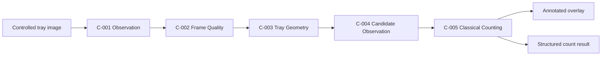
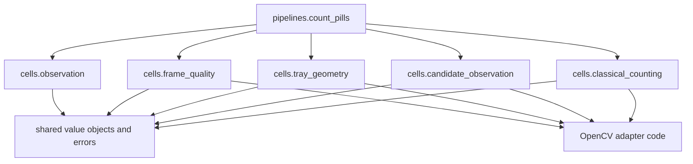
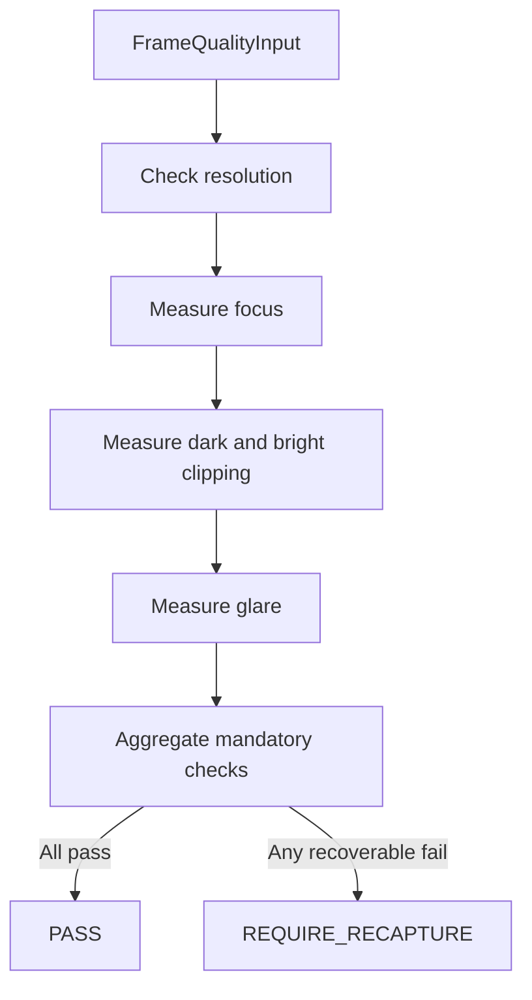
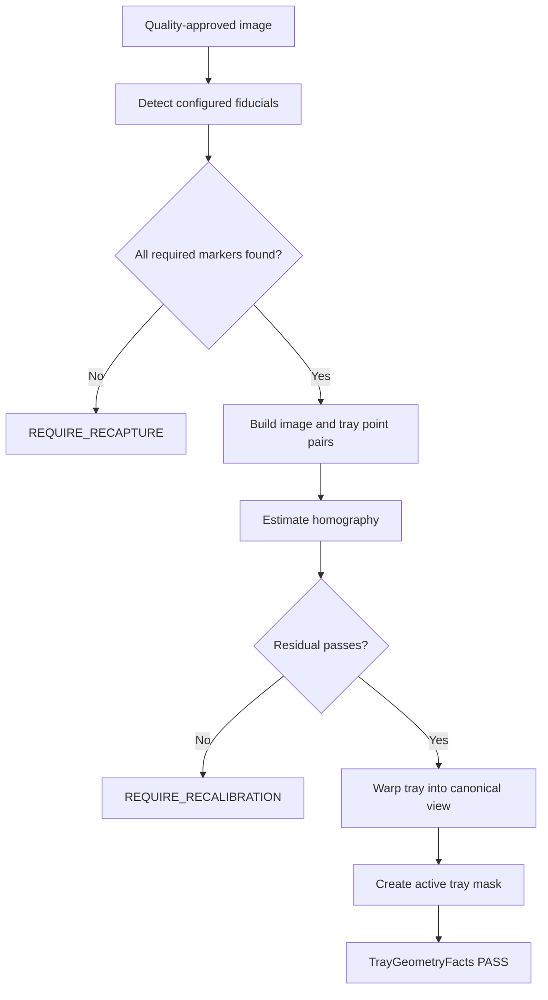
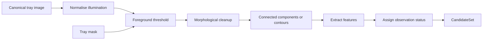
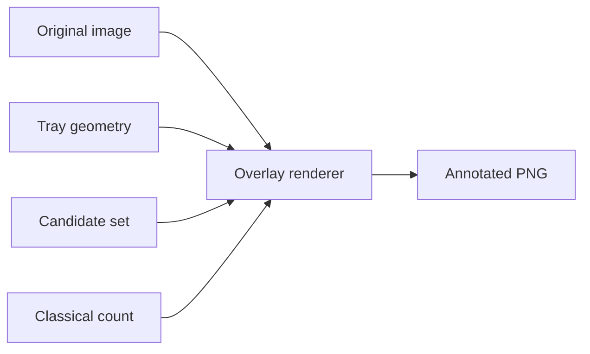
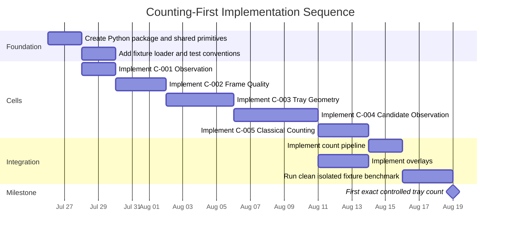

# P.C.A.I. Engineering Manual v0.2

## Version note

This file continues from `PCAI_ENGINEERING_MANUAL.md` v0.1. The previous file remains preserved as the first engineering baseline. All new implementation work continues here.

The focus of this version is execution, not further architecture expansion.

The immediate product objective is:

> Produce one trustworthy, replayable, human-confirmable pill count from a controlled tray image.

This version specifies the first executable path:

```text
C-001 Observation Cell
C-002 Frame Quality Cell
C-003 Tray Geometry Cell
C-004 Candidate Observation Cell
C-005 Classical Counting Cell
```

The segmentation, separation, reconciliation, evidence, verification, policy and session-completion Cells remain part of the full path, but the first code should establish a deterministic classical-counting baseline that works on controlled images before learned models are introduced.

# 1. Implementation outcome

## 1.1 First working milestone

The first milestone is complete when a developer can run one command against a controlled tray image and receive:

- a validated frame observation;
- a frame-quality assessment;
- a calibrated tray mask;
- a candidate set;
- a classical pill count;
- a visual overlay showing accepted and rejected regions;
- structured warnings and failure codes;
- deterministic test output;
- no hidden model dependency.

## 1.2 Milestone flow



## 1.3 Explicit exclusions for this version

This implementation baseline does not yet require:

- unrestricted medicine identification;
- OCR;
- learned segmentation;
- multi-pharmacy networking;
- LLM orchestration;
- motors;
- inventory updates;
- autonomous dispensing;
- production regulatory claims.

# 2. Repository implementation shape

```text
pcai/
  pyproject.toml
  README.md

  src/
    pcai/
      __init__.py

      shared/
        identifiers.py
        errors.py
        time.py
        hashing.py

      cells/
        observation/
          __init__.py
          contracts.py
          cell.py

        frame_quality/
          __init__.py
          contracts.py
          metrics.py
          cell.py

        tray_geometry/
          __init__.py
          contracts.py
          fiducials.py
          homography.py
          cell.py

        candidate_observation/
          __init__.py
          contracts.py
          segmentation.py
          features.py
          neighbours.py
          cell.py

        classical_counting/
          __init__.py
          contracts.py
          connected_components.py
          contours.py
          watershed.py
          cell.py

      pipelines/
        count_pills.py

      visualisation/
        overlays.py

  tests/
    unit/
      cells/
    contract/
    integration/
    fixtures/
      images/
      expected/
```

## 2.1 Dependency direction



Cells may depend on shared immutable value objects. Cells must not import one another directly. The pipeline coordinates them through contracts.

# 3. Shared engineering primitives

## 3.1 Identifiers

Use explicit identifier types rather than raw strings throughout the codebase.

```python
from __future__ import annotations

from dataclasses import dataclass


@dataclass(frozen=True, slots=True)
class FrameId:
    value: str


@dataclass(frozen=True, slots=True)
class ObservationId:
    value: str


@dataclass(frozen=True, slots=True)
class CandidateId:
    value: str
```

Identifiers should become validated UUIDv7 or ULID wrappers once the package utility is introduced. The first implementation may inject deterministic IDs in tests.

## 3.2 Stable domain errors

```python
from __future__ import annotations


class PcaiError(Exception):
    """Base exception for safe, typed P.C.A.I. failures."""

    code: str

    def __init__(self, *, code: str, message: str) -> None:
        super().__init__(message)
        self.code = code
        self.safe_message = message


class InvalidImageError(PcaiError):
    pass


class OperatingEnvelopeError(PcaiError):
    pass
```

No Cell should raise anonymous `ValueError` or `RuntimeError` across public boundaries.

## 3.3 Units

Measurements must encode units in types or names.

Preferred:

```python
blur_variance_laplacian: float
reprojection_error_px: float
area_px2: float
major_axis_mm: float
```

Avoid:

```python
blur: float
error: float
area: float
size: float
```

# 4. C-001 Observation Cell implementation

## 4.1 Purpose

C-001 converts incoming image bytes and capture metadata into an immutable `FrameObservation`.

## 4.2 Current status

**PROPOSED implementation contract.**

## 4.3 Input contract

```python
from __future__ import annotations

from dataclasses import dataclass
from datetime import datetime


@dataclass(frozen=True, slots=True)
class RegisterFrame:
    frame_id: str
    image_bytes: bytes
    source_name: str
    captured_at_utc: datetime
    camera_configuration_hash: str
    calibration_version: str
```

## 4.4 Output contract

```python
from __future__ import annotations

from dataclasses import dataclass
from datetime import datetime


@dataclass(frozen=True, slots=True)
class FrameObservation:
    frame_id: str
    object_sha256: str
    source_name: str
    captured_at_utc: datetime
    width_px: int
    height_px: int
    channels: int
    dtype_name: str
    camera_configuration_hash: str
    calibration_version: str
```

## 4.5 Cell interface

```python
from __future__ import annotations

from typing import Protocol


class ObservationCell(Protocol):
    def register(self, command: RegisterFrame) -> FrameObservation:
        """Validate and register one immutable frame observation."""
```

## 4.6 Reference implementation

```python
from __future__ import annotations

import hashlib

import cv2
import numpy as np


class OpenCvObservationCell:
    def register(self, command: RegisterFrame) -> FrameObservation:
        if not command.image_bytes:
            raise InvalidImageError(
                code="FRAME_BYTES_EMPTY",
                message="The captured frame contains no image bytes.",
            )

        encoded = np.frombuffer(command.image_bytes, dtype=np.uint8)
        image = cv2.imdecode(encoded, cv2.IMREAD_COLOR)

        if image is None:
            raise InvalidImageError(
                code="FRAME_DECODE_FAILED",
                message="The captured frame could not be decoded as an approved image.",
            )

        height_px, width_px, channels = image.shape
        object_sha256 = hashlib.sha256(command.image_bytes).hexdigest()

        return FrameObservation(
            frame_id=command.frame_id,
            object_sha256=object_sha256,
            source_name=command.source_name,
            captured_at_utc=command.captured_at_utc,
            width_px=width_px,
            height_px=height_px,
            channels=channels,
            dtype_name=str(image.dtype),
            camera_configuration_hash=command.camera_configuration_hash,
            calibration_version=command.calibration_version,
        )
```

## 4.7 Failure modes

| Code | Meaning | Recoverability |
|---|---|---|
| `FRAME_BYTES_EMPTY` | No bytes were received. | Recapture. |
| `FRAME_DECODE_FAILED` | Bytes are not a valid approved image. | Recapture or inspect transport. |
| `FRAME_CHANNELS_UNSUPPORTED` | Pixel format is unsupported. | Configuration correction. |
| `FRAME_RESOLUTION_UNSUPPORTED` | Resolution falls outside the configured range. | Camera configuration correction. |

## 4.8 Tests

```python
def test_observation_cell_registers_decodable_frame() -> None:
    command = valid_register_frame_command()
    cell = OpenCvObservationCell()

    observation = cell.register(command)

    assert observation.width_px > 0
    assert observation.height_px > 0
    assert len(observation.object_sha256) == 64


def test_observation_cell_rejects_empty_bytes() -> None:
    command = valid_register_frame_command(image_bytes=b"")
    cell = OpenCvObservationCell()

    with pytest.raises(InvalidImageError) as error:
        cell.register(command)

    assert error.value.code == "FRAME_BYTES_EMPTY"
```

# 5. C-002 Frame Quality Cell implementation

## 5.1 Purpose

C-002 decides whether a frame is fit for counting inside the configured operating envelope.

## 5.2 Current status

**PROPOSED deterministic baseline. Threshold values remain configuration, not product facts.**

## 5.3 Input contract

```python
from __future__ import annotations

from dataclasses import dataclass


@dataclass(frozen=True, slots=True)
class FrameQualityInput:
    frame_id: str
    image_bgr: "np.ndarray"
    configuration: "FrameQualityConfiguration"
```

## 5.4 Configuration

```python
from __future__ import annotations

from dataclasses import dataclass


@dataclass(frozen=True, slots=True)
class FrameQualityConfiguration:
    minimum_width_px: int
    minimum_height_px: int
    minimum_focus_score: float
    maximum_dark_pixel_ratio: float
    maximum_bright_pixel_ratio: float
    maximum_glare_pixel_ratio: float
```

## 5.5 Output contract

```python
from __future__ import annotations

from dataclasses import dataclass
from enum import StrEnum


class QualityStatus(StrEnum):
    PASS = "PASS"
    REQUIRE_RECAPTURE = "REQUIRE_RECAPTURE"
    REVIEW_REQUIRED = "REVIEW_REQUIRED"
    BLOCK = "BLOCK"


class CheckStatus(StrEnum):
    PASS = "PASS"
    FAIL = "FAIL"


@dataclass(frozen=True, slots=True)
class QualityCheck:
    name: str
    status: CheckStatus
    measured_value: float
    threshold: float
    comparison: str
    unit: str


@dataclass(frozen=True, slots=True)
class FrameQualityAssessment:
    frame_id: str
    status: QualityStatus
    checks: tuple[QualityCheck, ...]
    reason_codes: tuple[str, ...]
    required_action: str | None
```

## 5.6 Metric functions

```python
from __future__ import annotations

import cv2
import numpy as np


def focus_score(image_bgr: np.ndarray) -> float:
    gray = cv2.cvtColor(image_bgr, cv2.COLOR_BGR2GRAY)
    return float(cv2.Laplacian(gray, cv2.CV_64F).var())


def dark_pixel_ratio(image_bgr: np.ndarray, *, threshold: int = 10) -> float:
    gray = cv2.cvtColor(image_bgr, cv2.COLOR_BGR2GRAY)
    return float(np.mean(gray <= threshold))


def bright_pixel_ratio(image_bgr: np.ndarray, *, threshold: int = 245) -> float:
    gray = cv2.cvtColor(image_bgr, cv2.COLOR_BGR2GRAY)
    return float(np.mean(gray >= threshold))


def glare_pixel_ratio(image_bgr: np.ndarray) -> float:
    hsv = cv2.cvtColor(image_bgr, cv2.COLOR_BGR2HSV)
    saturation = hsv[:, :, 1]
    value = hsv[:, :, 2]
    glare_mask = (value >= 245) & (saturation <= 25)
    return float(np.mean(glare_mask))
```

## 5.7 Cell flow



## 5.8 Reference Cell skeleton

```python
from __future__ import annotations


class DeterministicFrameQualityCell:
    def assess(self, input_: FrameQualityInput) -> FrameQualityAssessment:
        checks = (
            self._resolution_check(input_),
            self._focus_check(input_),
            self._dark_exposure_check(input_),
            self._bright_exposure_check(input_),
            self._glare_check(input_),
        )

        failed = tuple(check for check in checks if check.status is CheckStatus.FAIL)

        if not failed:
            return FrameQualityAssessment(
                frame_id=input_.frame_id,
                status=QualityStatus.PASS,
                checks=checks,
                reason_codes=(),
                required_action=None,
            )

        return FrameQualityAssessment(
            frame_id=input_.frame_id,
            status=QualityStatus.REQUIRE_RECAPTURE,
            checks=checks,
            reason_codes=tuple(self._reason_code(check) for check in failed),
            required_action="CORRECT_FRAME_AND_RECAPTURE",
        )
```

## 5.9 Tests

Required unit cases:

- sharp image passes focus threshold;
- blurred image fails focus threshold;
- black image fails dark clipping;
- white image fails bright clipping;
- synthetic glare patch fails glare threshold;
- exact threshold boundary behaviour is deterministic;
- all output fields serialise consistently.

# 6. C-003 Tray Geometry Cell implementation

## 6.1 Purpose

C-003 establishes the valid tray region and pixel-to-physical mapping.

## 6.2 Current status

**PROPOSED interface. Exact fiducial design and thresholds remain experimental.**

## 6.3 Input contract

```python
from __future__ import annotations

from dataclasses import dataclass


@dataclass(frozen=True, slots=True)
class TrayGeometryInput:
    frame_id: str
    image_bgr: "np.ndarray"
    calibration_version: str
    expected_marker_ids: tuple[int, ...]
```

## 6.4 Output contract

```python
from __future__ import annotations

from dataclasses import dataclass
from enum import StrEnum


class GeometryStatus(StrEnum):
    PASS = "PASS"
    REQUIRE_RECAPTURE = "REQUIRE_RECAPTURE"
    REQUIRE_RECALIBRATION = "REQUIRE_RECALIBRATION"


@dataclass(frozen=True, slots=True)
class TrayGeometryFacts:
    frame_id: str
    status: GeometryStatus
    tray_mask: "np.ndarray | None"
    homography: "np.ndarray | None"
    reprojection_error_px: float | None
    pixels_per_mm_x: float | None
    pixels_per_mm_y: float | None
    reason_codes: tuple[str, ...]
```

## 6.5 Fiducial strategy

For the first prototype, use approved printed fiducials placed outside the active pill region. ArUco-style markers are acceptable for prototype validation but must not become a production decision until camera, tray, cleaning and operating tests are complete.

## 6.6 Geometry flow



## 6.7 Tests

- all configured markers detected;
- missing one required marker;
- incorrect marker ID;
- unstable homography;
- synthetic perspective warp maps back to canonical tray coordinates;
- mask excludes marker border and non-tray regions.

# 7. C-004 Candidate Observation Cell implementation

## 7.1 Purpose

C-004 converts the calibrated tray image into foreground regions and measured candidate observations.

## 7.2 Current status

**PROPOSED classical baseline.**

## 7.3 Input contract

```python
from __future__ import annotations

from dataclasses import dataclass


@dataclass(frozen=True, slots=True)
class CandidateObservationInput:
    frame_id: str
    canonical_tray_bgr: "np.ndarray"
    tray_mask: "np.ndarray"
    pixels_per_mm_x: float
    pixels_per_mm_y: float
    configuration: "CandidateConfiguration"
```

## 7.4 Configuration

```python
from __future__ import annotations

from dataclasses import dataclass


@dataclass(frozen=True, slots=True)
class CandidateConfiguration:
    minimum_area_mm2: float
    maximum_area_mm2: float
    minimum_solidity: float
    border_clearance_mm: float
    morphology_kernel_px: int
```

## 7.5 Output contracts

```python
from __future__ import annotations

from dataclasses import dataclass
from enum import StrEnum


class CandidateStatus(StrEnum):
    SINGLE_CANDIDATE = "SINGLE_CANDIDATE"
    TOUCHING_REGION = "TOUCHING_REGION"
    POSSIBLE_STACK = "POSSIBLE_STACK"
    FOREIGN_OBJECT = "FOREIGN_OBJECT"
    PARTIAL_OBJECT = "PARTIAL_OBJECT"
    ARTIFACT = "ARTIFACT"
    UNKNOWN = "UNKNOWN"


@dataclass(frozen=True, slots=True)
class CandidateObservation:
    candidate_id: str
    contour: "np.ndarray"
    bounding_box_xywh: tuple[int, int, int, int]
    centroid_xy: tuple[float, float]
    area_px2: float
    area_mm2: float
    perimeter_px: float
    circularity: float
    solidity: float
    aspect_ratio: float
    touches_tray_border: bool
    status: CandidateStatus
    reason_codes: tuple[str, ...]


@dataclass(frozen=True, slots=True)
class CandidateSet:
    frame_id: str
    foreground_mask: "np.ndarray"
    candidates: tuple[CandidateObservation, ...]
```

## 7.6 Candidate extraction flow



## 7.7 Feature functions

```python
from __future__ import annotations

import math

import cv2
import numpy as np


def contour_circularity(contour: np.ndarray) -> float:
    area = float(cv2.contourArea(contour))
    perimeter = float(cv2.arcLength(contour, True))

    if perimeter == 0.0:
        return 0.0

    return float((4.0 * math.pi * area) / (perimeter * perimeter))


def contour_solidity(contour: np.ndarray) -> float:
    area = float(cv2.contourArea(contour))
    hull = cv2.convexHull(contour)
    hull_area = float(cv2.contourArea(hull))

    if hull_area == 0.0:
        return 0.0

    return area / hull_area
```

## 7.8 Classification rule baseline

The first classifier must remain deterministic and conservative.

```text
if contour touches tray boundary:
    PARTIAL_OBJECT
else if physical area is outside broad allowed limits:
    ARTIFACT or UNKNOWN
else if solidity and shape indicate one isolated region:
    SINGLE_CANDIDATE
else if area and concavity suggest multiple touching objects:
    TOUCHING_REGION
else:
    UNKNOWN
```

The first version must not call uncertain regions pills merely to maximise apparent count accuracy.

# 8. C-005 Classical Counting Cell implementation

## 8.1 Purpose

C-005 produces an interpretable count observation from the candidate set.

## 8.2 Current status

**PROPOSED first executable count baseline.**

## 8.3 Input contract

```python
from __future__ import annotations

from dataclasses import dataclass


@dataclass(frozen=True, slots=True)
class ClassicalCountingInput:
    frame_id: str
    candidate_set: CandidateSet
    configuration: "ClassicalCountingConfiguration"
```

## 8.4 Configuration

```python
from __future__ import annotations

from dataclasses import dataclass


@dataclass(frozen=True, slots=True)
class ClassicalCountingConfiguration:
    allow_touching_regions: bool
    maximum_touching_regions: int
    reject_unknown_regions: bool
    reject_partial_objects: bool
```

## 8.5 Output contract

```python
from __future__ import annotations

from dataclasses import dataclass
from enum import StrEnum


class CountStatus(StrEnum):
    COUNTED = "COUNTED"
    REVIEW_REQUIRED = "REVIEW_REQUIRED"
    REJECTED = "REJECTED"


@dataclass(frozen=True, slots=True)
class ClassicalCountObservation:
    frame_id: str
    status: CountStatus
    candidate_count: int | None
    accepted_candidate_ids: tuple[str, ...]
    excluded_candidate_ids: tuple[str, ...]
    touching_region_ids: tuple[str, ...]
    unknown_region_ids: tuple[str, ...]
    partial_region_ids: tuple[str, ...]
    reason_codes: tuple[str, ...]
```

## 8.6 First counting rule

The first reliable baseline counts only candidates classified as `SINGLE_CANDIDATE`.

```python
from __future__ import annotations


class ClassicalCountingCell:
    def count(self, input_: ClassicalCountingInput) -> ClassicalCountObservation:
        candidates = input_.candidate_set.candidates

        singles = tuple(
            candidate
            for candidate in candidates
            if candidate.status is CandidateStatus.SINGLE_CANDIDATE
        )
        touching = tuple(
            candidate
            for candidate in candidates
            if candidate.status is CandidateStatus.TOUCHING_REGION
        )
        unknown = tuple(
            candidate
            for candidate in candidates
            if candidate.status is CandidateStatus.UNKNOWN
        )
        partial = tuple(
            candidate
            for candidate in candidates
            if candidate.status is CandidateStatus.PARTIAL_OBJECT
        )

        blocking_reasons: list[str] = []

        if touching and not input_.configuration.allow_touching_regions:
            blocking_reasons.append("TOUCHING_REGIONS_PRESENT")

        if unknown and input_.configuration.reject_unknown_regions:
            blocking_reasons.append("UNKNOWN_REGIONS_PRESENT")

        if partial and input_.configuration.reject_partial_objects:
            blocking_reasons.append("PARTIAL_OBJECTS_PRESENT")

        if blocking_reasons:
            return ClassicalCountObservation(
                frame_id=input_.frame_id,
                status=CountStatus.REVIEW_REQUIRED,
                candidate_count=None,
                accepted_candidate_ids=tuple(candidate.candidate_id for candidate in singles),
                excluded_candidate_ids=tuple(
                    candidate.candidate_id
                    for candidate in candidates
                    if candidate.status is not CandidateStatus.SINGLE_CANDIDATE
                ),
                touching_region_ids=tuple(candidate.candidate_id for candidate in touching),
                unknown_region_ids=tuple(candidate.candidate_id for candidate in unknown),
                partial_region_ids=tuple(candidate.candidate_id for candidate in partial),
                reason_codes=tuple(blocking_reasons),
            )

        return ClassicalCountObservation(
            frame_id=input_.frame_id,
            status=CountStatus.COUNTED,
            candidate_count=len(singles),
            accepted_candidate_ids=tuple(candidate.candidate_id for candidate in singles),
            excluded_candidate_ids=(),
            touching_region_ids=(),
            unknown_region_ids=(),
            partial_region_ids=(),
            reason_codes=(),
        )
```

## 8.7 Why this baseline is intentionally strict

The first version is not trying to count every difficult tray. It is trying to prove that the system can:

- count isolated pills correctly;
- reject unsupported conditions;
- expose exactly which regions caused rejection;
- produce repeatable outputs;
- provide a foundation for C-007 Touching-Pill Separation.

A tray with touching or stacked pills may initially return `REVIEW_REQUIRED`. That is better than a silently wrong number.

# 9. First end-to-end pipeline

```python
from __future__ import annotations

from dataclasses import dataclass


@dataclass(frozen=True, slots=True)
class CountPillsResult:
    observation: FrameObservation
    quality: FrameQualityAssessment
    geometry: TrayGeometryFacts | None
    candidates: CandidateSet | None
    classical_count: ClassicalCountObservation | None


class CountPillsPipeline:
    def __init__(
        self,
        *,
        observation_cell: ObservationCell,
        frame_quality_cell: DeterministicFrameQualityCell,
        tray_geometry_cell: "TrayGeometryCell",
        candidate_observation_cell: "CandidateObservationCell",
        classical_counting_cell: ClassicalCountingCell,
    ) -> None:
        self._observation_cell = observation_cell
        self._frame_quality_cell = frame_quality_cell
        self._tray_geometry_cell = tray_geometry_cell
        self._candidate_observation_cell = candidate_observation_cell
        self._classical_counting_cell = classical_counting_cell

    def run(self, request: "CountPillsRequest") -> CountPillsResult:
        observation = self._observation_cell.register(request.register_frame)
        image_bgr = request.decode_image()

        quality = self._frame_quality_cell.assess(
            FrameQualityInput(
                frame_id=observation.frame_id,
                image_bgr=image_bgr,
                configuration=request.frame_quality_configuration,
            )
        )

        if quality.status is not QualityStatus.PASS:
            return CountPillsResult(
                observation=observation,
                quality=quality,
                geometry=None,
                candidates=None,
                classical_count=None,
            )

        geometry = self._tray_geometry_cell.measure(
            request.to_tray_geometry_input(image_bgr=image_bgr)
        )

        if geometry.status is not GeometryStatus.PASS:
            return CountPillsResult(
                observation=observation,
                quality=quality,
                geometry=geometry,
                candidates=None,
                classical_count=None,
            )

        candidates = self._candidate_observation_cell.observe(
            request.to_candidate_input(
                image_bgr=image_bgr,
                geometry=geometry,
            )
        )

        classical_count = self._classical_counting_cell.count(
            ClassicalCountingInput(
                frame_id=observation.frame_id,
                candidate_set=candidates,
                configuration=request.classical_counting_configuration,
            )
        )

        return CountPillsResult(
            observation=observation,
            quality=quality,
            geometry=geometry,
            candidates=candidates,
            classical_count=classical_count,
        )
```

# 10. Visual overlays

Every development result must produce an optional overlay.

Overlay conventions:

- accepted single candidates: numbered boundaries;
- touching regions: labelled `TOUCHING`;
- unknown regions: labelled `UNKNOWN`;
- partial objects: labelled `PARTIAL`;
- excluded artifacts: visible but subdued;
- tray boundary and fiducials: visible;
- final candidate count and status: displayed in a corner panel.



# 11. Test data strategy

## 11.1 Fixture classes

```text
clean_isolated_round_tablets
clean_isolated_capsules
mixed_sizes_but_supported
one_partial_object
one_foreign_object
one_touching_pair
multiple_touching_regions
stacked_objects
strong_glare
blurred_frame
missing_fiducial
perspective_shift
empty_tray
```

## 11.2 Ground-truth record

Each fixture requires:

```json
{
  "fixture_id": "clean_isolated_round_tablets_001",
  "expected_visible_pill_count": 30,
  "expected_pipeline_status": "COUNTED",
  "expected_review_reason_codes": [],
  "allowed_count_error": 0,
  "notes": "Thirty isolated opaque round tablets inside tray boundary."
}
```

For unsupported conditions:

```json
{
  "fixture_id": "one_touching_pair_001",
  "expected_visible_pill_count": 30,
  "expected_pipeline_status": "REVIEW_REQUIRED",
  "expected_review_reason_codes": ["TOUCHING_REGIONS_PRESENT"],
  "allowed_count_error": null,
  "notes": "The baseline must refuse rather than return an incomplete count."
}
```

# 12. Acceptance gates

The first deterministic counting milestone passes only when:

- all clean isolated fixtures produce exact counts;
- repeated runs produce identical candidate IDs or deterministically stable ordering;
- unsupported fixtures return stable review codes;
- no rejected fixture returns `COUNTED`;
- overlays correspond to structured outputs;
- unit and integration tests pass on the development Mac and target Jetson environment;
- performance and memory are measured rather than assumed.

## 12.1 Initial metric set

```text
exact_count_accuracy_supported_frames
false_counted_rate_unsupported_frames
review_required_rate
frame_quality_false_pass_rate
candidate_detection_recall_supported_frames
candidate_false_positive_rate
median_pipeline_latency_ms
p95_pipeline_latency_ms
peak_memory_mb
```

The most important early safety metric is:

> False-counted rate on unsupported frames.

# 13. Engineering sequence



Dates are working placeholders, not commitments.

# 14. Next implementation version

The next major engineering version should begin only after this baseline is reviewed. Its likely scope is:

- C-006 Segmentation Counting Cell;
- C-007 Touching-Pill Separation Cell;
- C-008 Count Reconciliation Cell;
- structured Count Evidence Bundle;
- benchmark harness and comparison reports;
- event-store integration after the pure count path is stable.
