# P.C.A.I. Visual Atlas

## Purpose

This file is the visual companion to `PCAI_ARCHITECTURE_BIBLE.md` and `PCAI_ENGINEERING_MANUAL.md`.

It exists so that a new engineer can understand the system quickly before reading detailed contracts. Every diagram is expected to remain consistent with the engineering manual. When the implementation changes, the corresponding diagram must be updated in the same pull request.

The diagrams in this file are editable Mermaid unless a raster image is preserved for historical or review purposes.

# 1. Document relationship map

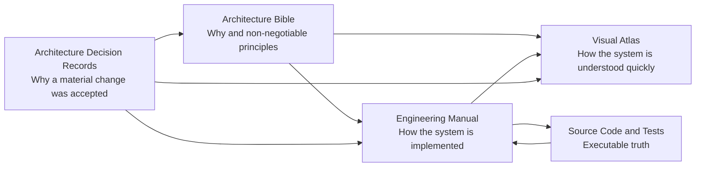

# 2. P.C.A.I. product priority map

Pill counting is the first product capability. Identification, agents, inventory and robotics build on top of a working count workflow.

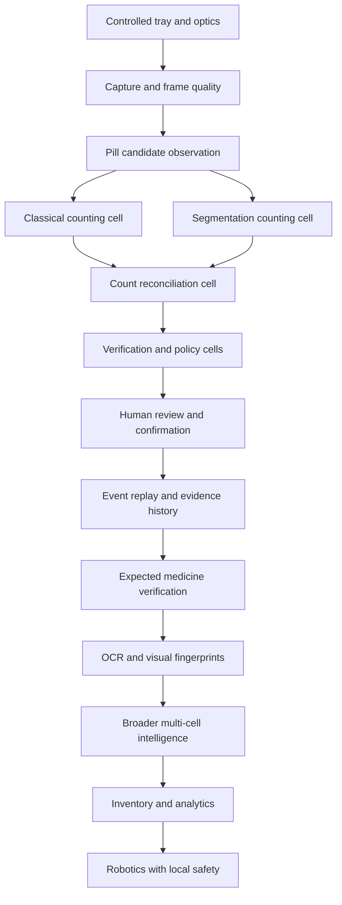

# 3. P.C.A.I. Cell Society

P.C.A.I. is composed of specialised logical Cells. A Cell is defined by mission, authority, contracts, tools, evidence responsibilities and failure behaviour. A Cell does not necessarily mean a separate process, container or model.

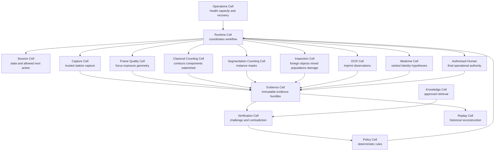

# 4. Pill-counting-first Cell architecture

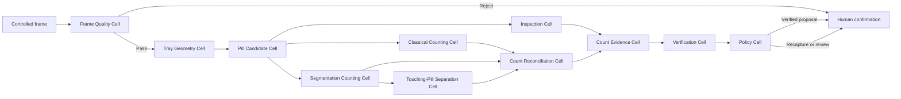

# 5. First working product flow

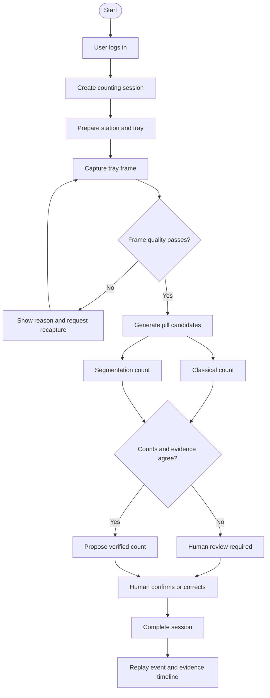

# 6. CountingSession state machine

The following Mermaid diagram is the editable representation of the state model shown in the founder-provided visual snapshot.

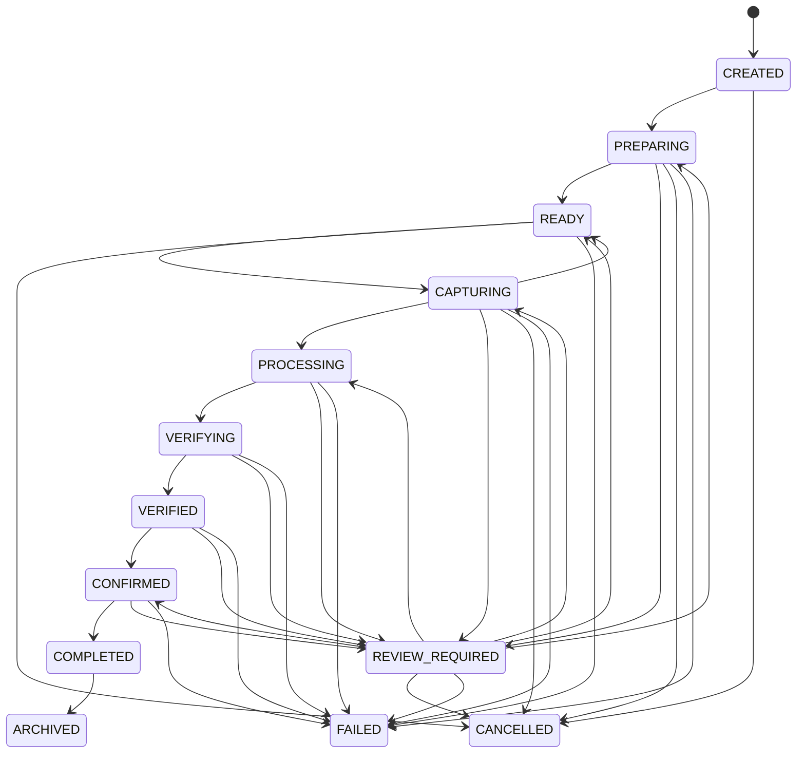

## 6.1 State transition classes

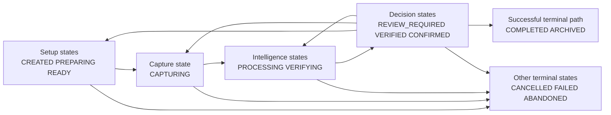

# 7. Counting session sequence diagram

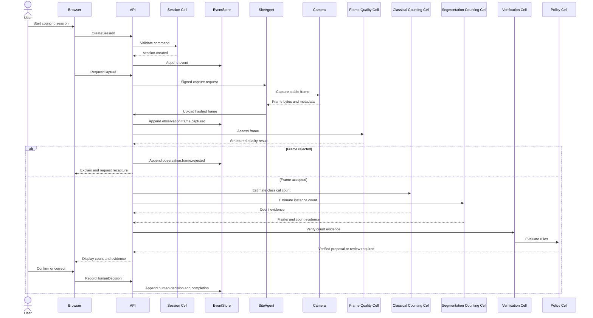

# 8. Counting Cell dependency tree

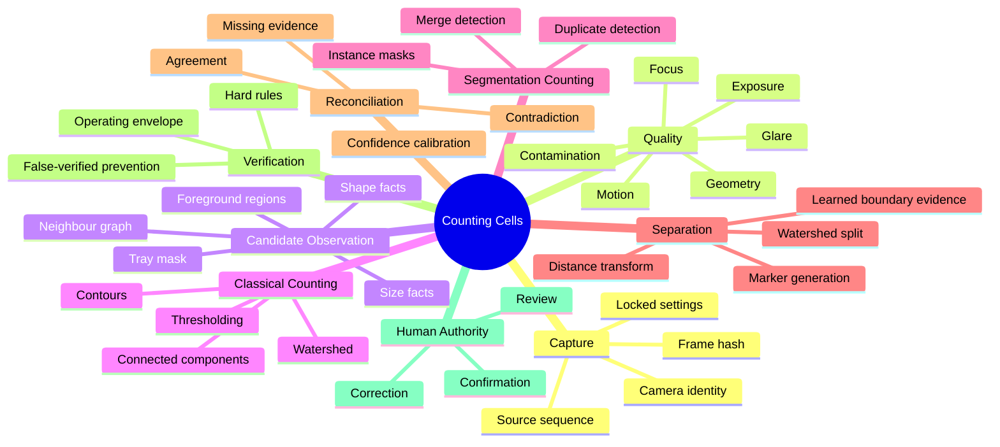

# 9. Count evidence flow

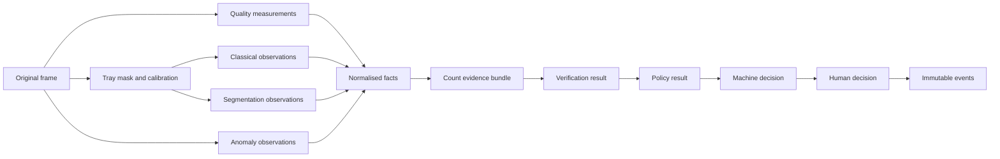

# 10. Candidate observation model

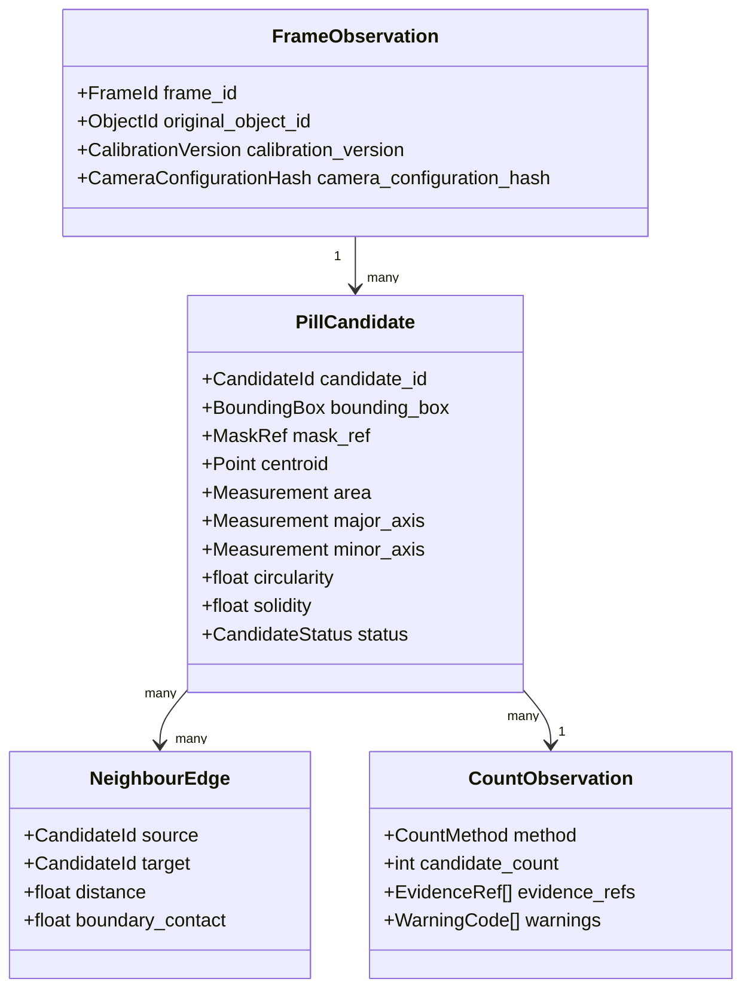

# 11. Candidate classification decision tree

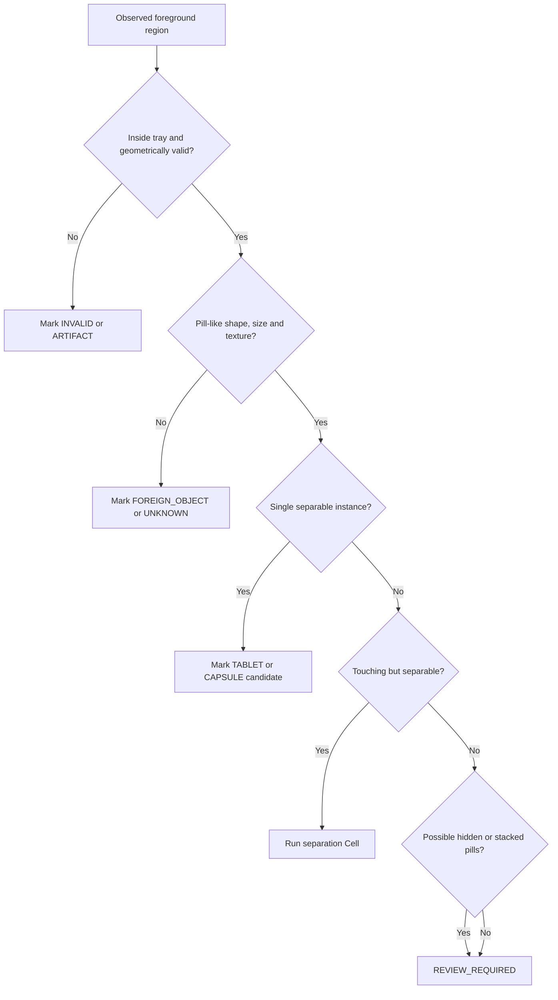

# 12. Count reconciliation decision tree

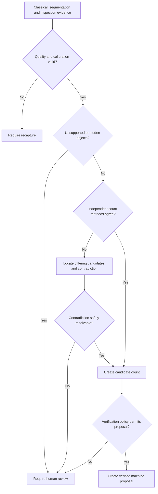

# 13. Cell authority boundaries

```mermaid
flowchart LR
    ObservationCells[Observation Cells\nCapture Quality Classical Segmentation OCR]
    EvidenceCell[Evidence Cell]
    VerificationCell[Verification Cell]
    PolicyCell[Policy Cell]
    SessionCell[Session Cell]
    Human[Authorised Human]

    ObservationCells -->|may observe and measure| EvidenceCell
    EvidenceCell -->|may package support contradiction and missing evidence| VerificationCell
    VerificationCell -->|may pass review or fail evidence sufficiency| PolicyCell
    PolicyCell -->|may allow require review recapture or block| SessionCell
    SessionCell -->|may advance only through valid transitions| Human
    Human -->|final operational confirmation or correction| SessionCell
```

No Cell may independently authorise dispensing. No Cell may edit raw observations or prior events.

# 14. Deployment overview

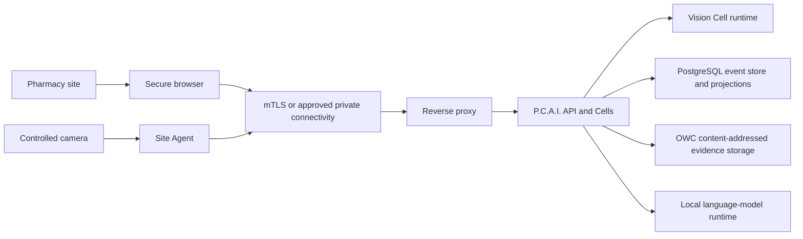

# 15. Visual maintenance rules

- Every major state machine must have an editable Mermaid representation.
- Every asynchronous workflow must have a sequence diagram.
- Every Cell must have an authority-boundary diagram or table.
- Every evidence-producing pipeline must show source, transformation and durable output.
- Every recoverable failure path must be visible in at least one diagram.
- Diagrams must not imply independence where Cells share the same model or source evidence.
- A diagram changed by code or contract changes must be updated in the same pull request.
- Diagrams explain architecture; they do not replace binding textual invariants and tests.

# 16. Next visual additions

The following diagrams will be added as engineering progresses:

- Detailed event-store append and outbox sequence.
- PostgreSQL event and projection entity-relationship diagram.
- Object-storage registration and reconciliation flow.
- Frame-quality measurement tree.
- Classical Counting Cell internal algorithm flow.
- Segmentation Counting Cell training and inference flow.
- Touching-pill separation challenge matrix.
- Count benchmark dataset lineage.
- Model promotion and rollback lifecycle.
- Site-agent pairing and certificate-rotation sequence.
- Boot, degradation and recovery state diagrams.
