# P.C.A.I. Visual Atlas

## Purpose

This file is the visual companion to `PCAI_ARCHITECTURE_BIBLE.md` and `PCAI_ENGINEERING_MANUAL.md`.

It exists so that a new engineer can understand the system quickly before reading detailed contracts. Every diagram is expected to remain consistent with the engineering manual. When implementation changes, the corresponding diagram must be updated in the same pull request.

The diagrams in this file are editable Mermaid unless a raster image is preserved for historical or review purposes.

# 1. Document relationship map

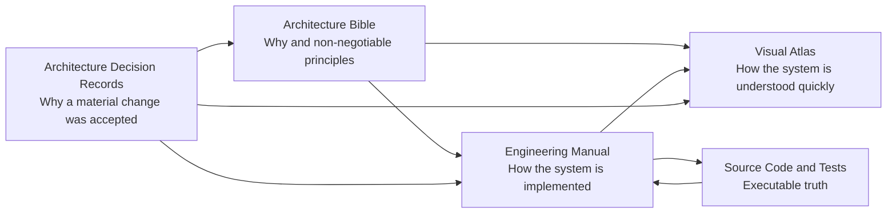

# 2. P.C.A.I. product priority map

Pill counting is the first product capability. Identification, agents, inventory and robotics build on top of a working count workflow.

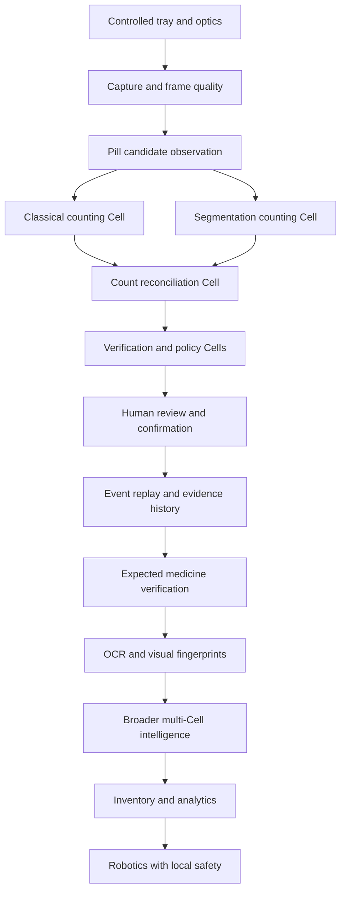

# 3. P.C.A.I. Cell Society

P.C.A.I. is composed of specialised logical Cells. A Cell is defined by mission, authority, contracts, tools, evidence responsibilities and failure behaviour. A Cell does not necessarily mean a separate process, container or model.

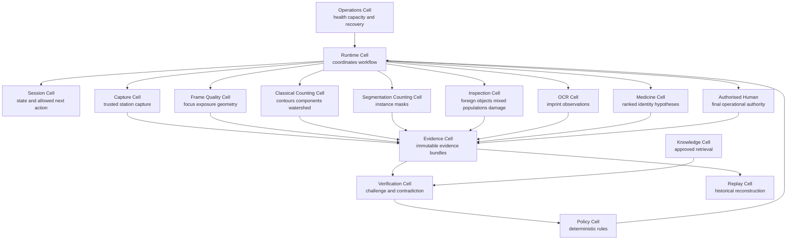

# 4. Pill-counting-first Cell architecture

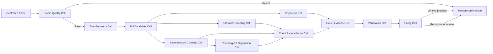

# 5. First working product flow


# 6. CountingSession state machine

The following Mermaid diagram is the editable representation of the founder-provided state visual.

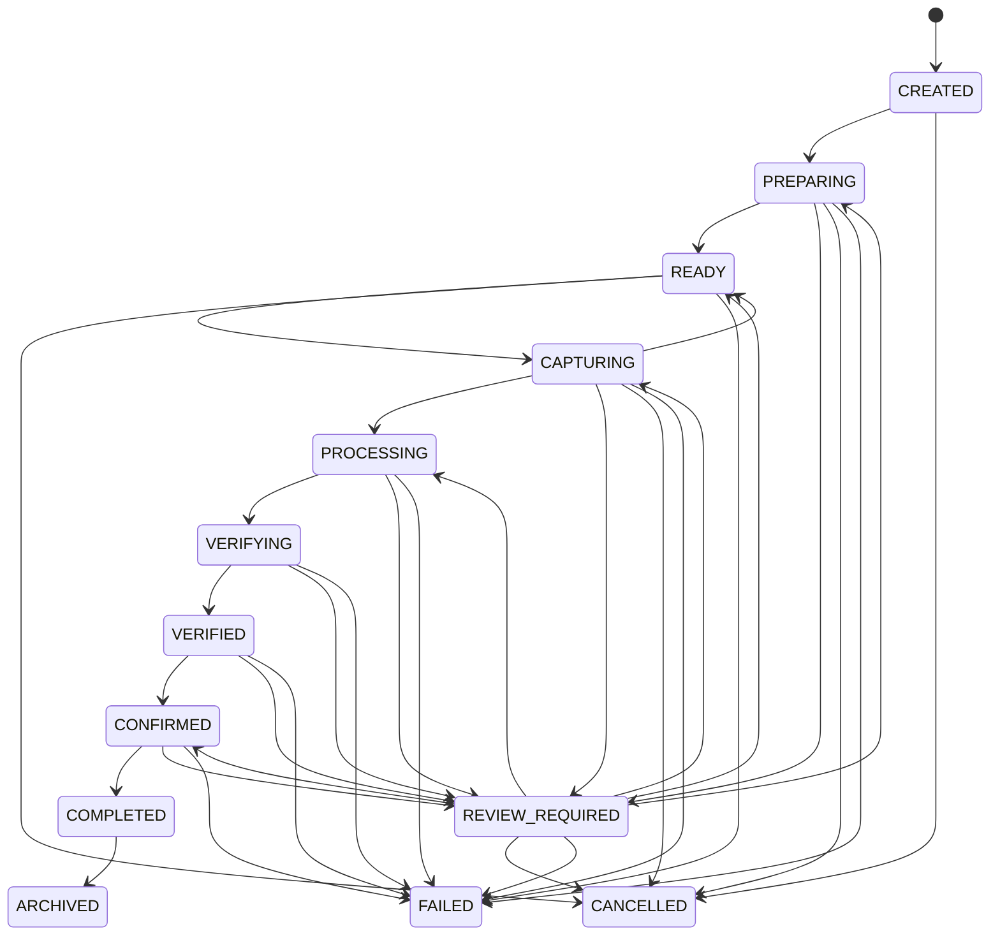

## 6.1 State transition classes

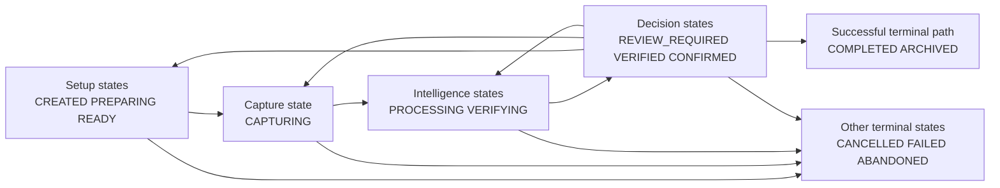

# 7. Counting session sequence diagram

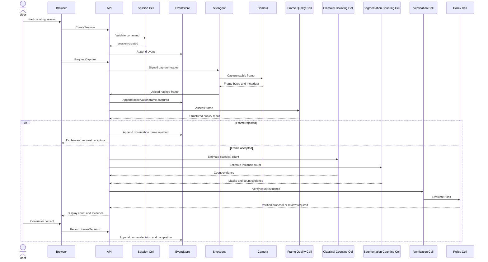

# 8. Counting Cell dependency tree

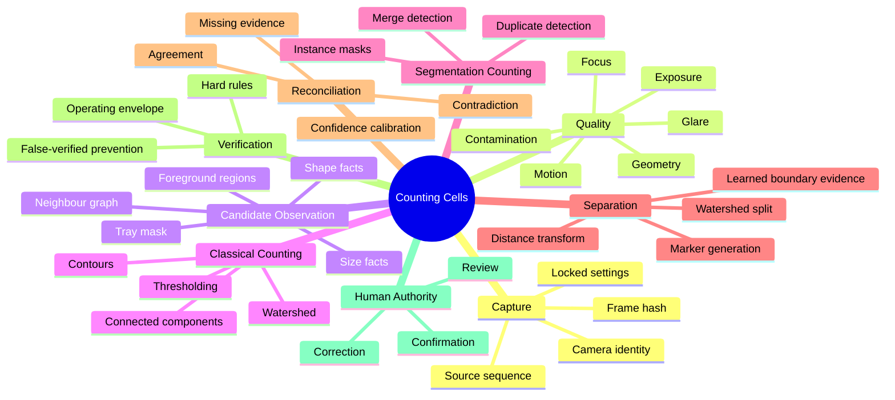

# 9. Count evidence flow

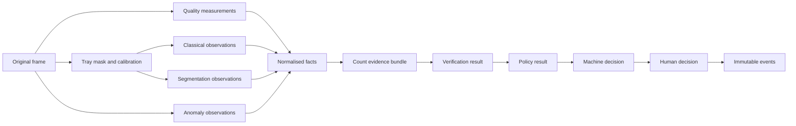

# 10. Candidate observation model

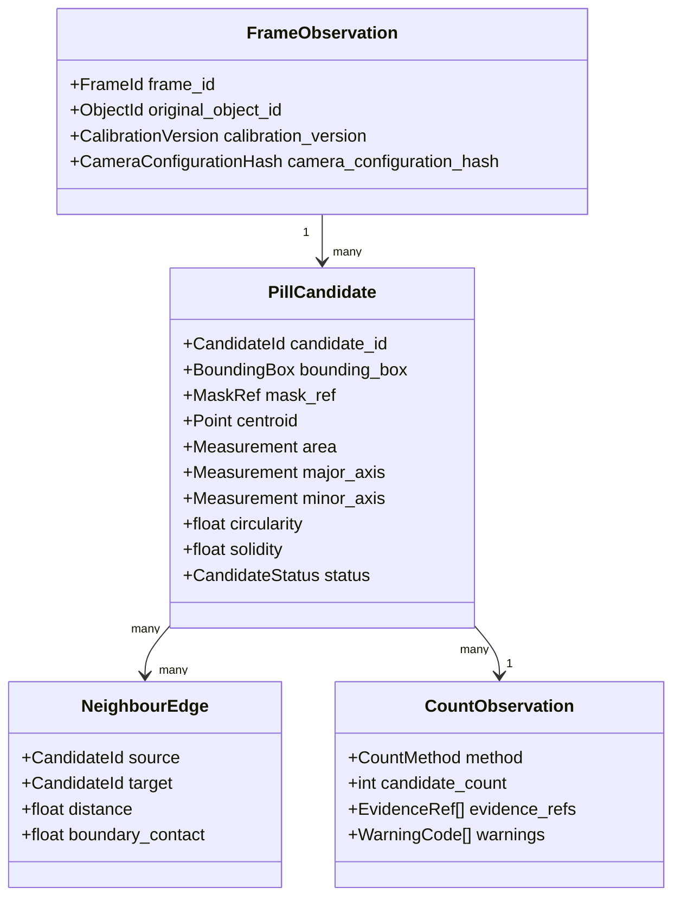

# 11. Candidate classification decision tree

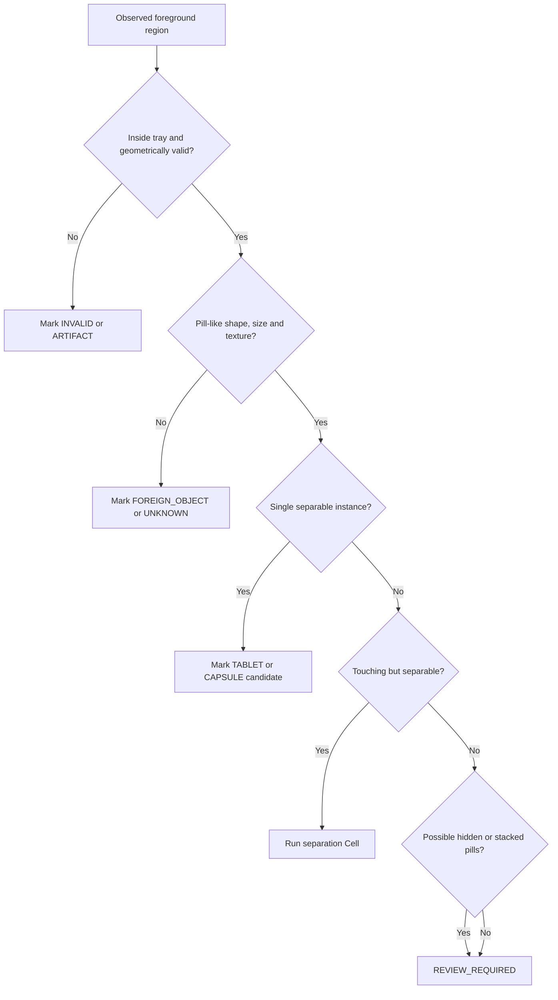

# 12. Count reconciliation decision tree

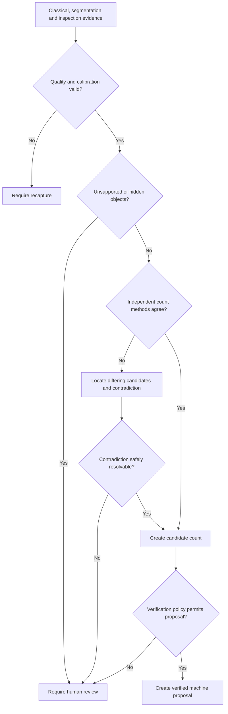

# 13. Cell authority boundaries

```mermaid
flowchart LR
    ObservationCells[Observation Cells\nCapture Quality Classical Segmentation OCR]
    EvidenceCell[Evidence Cell]
    VerificationCell[Verification Cell]
    PolicyCell[Policy Cell]
    SessionCell[Session Cell]
    Human[Authorised Human]

    ObservationCells -->|may observe and measure| EvidenceCell
    EvidenceCell -->|may package support contradiction and missing evidence| VerificationCell
    VerificationCell -->|may pass review or fail evidence sufficiency| PolicyCell
    PolicyCell -->|may allow require review recapture or block| SessionCell
    SessionCell -->|may advance only through valid transitions| Human
    Human -->|final operational confirmation or correction| SessionCell
```

No Cell may independently authorise dispensing. No Cell may edit raw observations or prior events.

# 14. Deployment overview

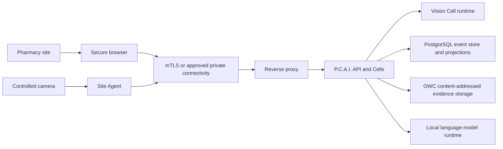

# 15. Permanent Cell catalogue

Cell IDs are stable vocabulary across architecture, engineering, code, logs, events, tests and support documentation. A Cell may evolve internally without changing its permanent ID.

| Cell ID | Name | Primary mission | Initial priority |
|---|---|---|---|
| `C-001` | Observation Cell | Register trustworthy physical observations. | NOW |
| `C-002` | Frame Quality Cell | Determine whether a frame is fit for counting. | NOW |
| `C-003` | Tray Geometry Cell | Establish the calibrated tray region and scale. | NOW |
| `C-004` | Candidate Observation Cell | Convert foreground regions into pill candidates and facts. | NOW |
| `C-005` | Classical Counting Cell | Produce an interpretable classical-vision count. | NOW |
| `C-006` | Segmentation Counting Cell | Produce instance masks and a learned count. | NOW |
| `C-007` | Touching-Pill Separation Cell | Resolve touching regions only inside validated limits. | NOW |
| `C-008` | Count Reconciliation Cell | Compare count methods and locate disagreement. | NOW |
| `C-009` | Evidence Cell | Build immutable evidence bundles. | NOW |
| `C-010` | Verification Cell | Challenge evidence and identify contradictions or gaps. | NOW |
| `C-011` | Policy Cell | Apply deterministic workflow and safety rules. | NOW |
| `C-012` | Session Cell | Govern workflow state and valid transitions. | NOW |
| `C-013` | Knowledge Cell | Retrieve approved medicine and operating knowledge. | NEXT |
| `C-014` | Replay Cell | Reconstruct historical events, evidence and decisions. | NOW |
| `C-015` | Operations Cell | Observe health, capacity, recovery and drift. | NOW |
| `C-016` | OCR Cell | Produce imprint observations and alternatives. | NEXT |
| `C-017` | Medicine Cell | Rank medicine hypotheses against approved profiles. | NEXT |
| `C-018` | Inspection Cell | Detect mixed populations, damage, debris and foreign objects. | NOW |
| `C-019` | Runtime Cell | Coordinate bounded Cell plans and resource admission. | NOW |

# 16. Synapses

A Synapse is a typed, versioned communication contract between Cells. Cells do not exchange unrestricted chat. A Synapse transports validated references, facts, evidence requests, capability results or workflow signals.

```mermaid
flowchart LR
    Observation[C-001 Observation]
    Quality[C-002 Frame Quality]
    Geometry[C-003 Tray Geometry]
    Candidates[C-004 Candidate Observation]
    Classical[C-005 Classical Counting]
    Segment[C-006 Segmentation Counting]
    Reconcile[C-008 Count Reconciliation]
    Evidence[C-009 Evidence]
    Verify[C-010 Verification]
    Policy[C-011 Policy]
    Session[C-012 Session]

    Observation -- S-001 FrameObservation --> Quality
    Observation -- S-002 FrameObservation --> Geometry
    Geometry -- S-003 TrayGeometryFacts --> Candidates
    Candidates -- S-004 CandidateSet --> Classical
    Candidates -- S-005 CandidateSet --> Segment
    Classical -- S-006 CountObservation --> Reconcile
    Segment -- S-007 CountObservation --> Reconcile
    Reconcile -- S-008 ReconciledCountFacts --> Evidence
    Evidence -- S-009 EvidenceBundle --> Verify
    Verify -- S-010 VerificationResult --> Policy
    Policy -- S-011 PolicyResult --> Session
```

## 16.1 Synapse envelope

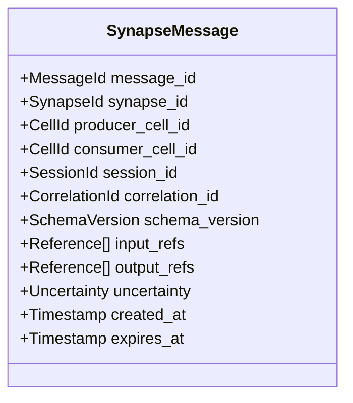

A Synapse must be schema validated, permission checked, tenant scoped, traceable to inputs and idempotent where retries are possible.

# 17. Blackboard

The Blackboard is session-scoped structured working memory. It is not the event store and not a free-form chat transcript.

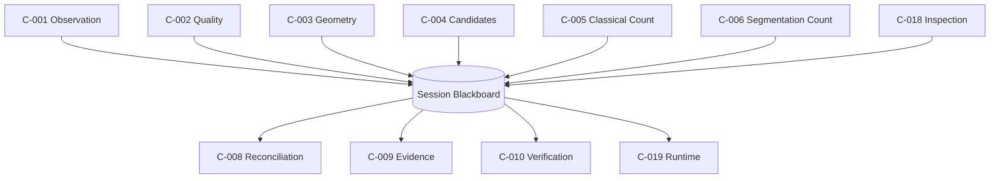

## 17.1 Blackboard lifecycle

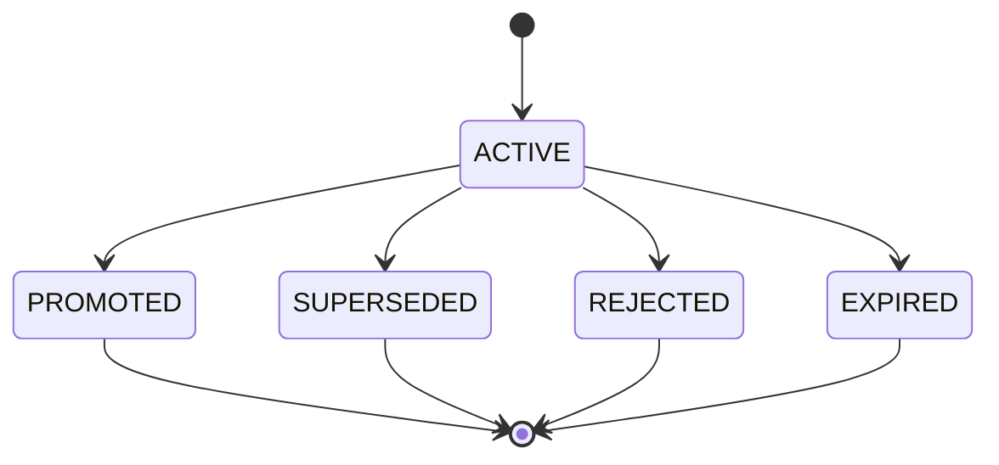

Only promoted entries become durable business evidence or events. Expired working state may be discarded after bounded retention.

# 18. Knowledge progression

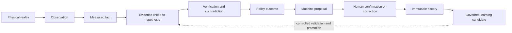

# 19. C-001 Observation Cell

## 19.1 Mission

Register physical-world observations faithfully and immutably. C-001 does not count pills or interpret medicine identity.

## 19.2 Authority

```mermaid
flowchart LR
    Input[Trusted capture input]
    Cell[C-001 Observation Cell]
    Output[FrameObservation]

    Input --> Cell --> Output

    Cell -. prohibited .-> Count[Count pills]
    Cell -. prohibited .-> Identify[Identify medicine]
    Cell -. prohibited .-> Decide[Advance workflow]
    Cell -. prohibited .-> Rewrite[Modify prior observation]
```

## 19.3 Inputs and outputs

```mermaid
flowchart TD
    Request[Capture request]
    Device[Device and station identity]
    Bytes[Frame bytes]
    Metadata[Camera metadata]
    Time[Wall and monotonic time]
    Calibration[Calibration version]
    Configuration[Camera configuration hash]

    Observation[C-001 Observation Cell]

    Frame[FrameObservation]
    Hash[Content hash]
    Integrity[Integrity status]
    Object[Registered object reference]
    Event[Observation events]

    Request --> Observation
    Device --> Observation
    Bytes --> Observation
    Metadata --> Observation
    Time --> Observation
    Calibration --> Observation
    Configuration --> Observation

    Observation --> Frame
    Observation --> Hash
    Observation --> Integrity
    Observation --> Object
    Observation --> Event
```

## 19.4 Internal pipeline

```mermaid
flowchart TD
    Receive[Receive capture upload]
    Bind[Validate request session station and device binding]
    Sequence[Validate nonce source sequence and expiry]
    Hash[Compute and verify SHA-256]
    Metadata[Validate camera metadata and schema]
    Stage[Write object to staging]
    Verify[Verify stored bytes]
    Promote[Move into content-addressed storage]
    Register[Register immutable object metadata]
    Observe[Create FrameObservation]
    Event[Append observation.frame.captured]

    Receive --> Bind --> Sequence --> Hash --> Metadata --> Stage --> Verify --> Promote --> Register --> Observe --> Event
```

## 19.5 Failure routing

```mermaid
flowchart TD
    Failure[Observation input failure]
    Binding{Binding valid?}
    Deny[Reject and emit security or mismatch event]
    Integrity{Hash and bytes valid?}
    Quarantine[Quarantine object and open integrity incident]
    Metadata{Metadata valid?}
    Reject[Reject observation with stable reason]
    Storage{Durable storage available?}
    Retry[Return retryable storage failure]
    Success[Register observation]

    Failure --> Binding
    Binding -- No --> Deny
    Binding -- Yes --> Integrity
    Integrity -- No --> Quarantine
    Integrity -- Yes --> Metadata
    Metadata -- No --> Reject
    Metadata -- Yes --> Storage
    Storage -- No --> Retry
    Storage -- Yes --> Success
```

## 19.6 Primary events

```text
observation.frame.received
observation.integrity.verified
observation.integrity.failed
observation.frame.captured
observation.registration.failed
```

# 20. C-002 Frame Quality Cell

## 20.1 Mission

Determine whether a registered frame is fit for pill counting inside the active operating envelope. C-002 measures quality; it does not count pills.

## 20.2 Measurement tree

```mermaid
mindmap
  root((Frame Quality))
    Focus
      Fiducial sharpness
      Edge response
      Lens contamination signal
    Exposure
      Dark clipping
      Bright clipping
      Histogram range
    Glare
      Saturated regions
      Specular area
      Candidate interference
    Geometry
      Fiducial visibility
      Homography residual
      Tray coverage
    Motion
      Burst displacement
      Blur estimate
      Stability window
    Colour
      White balance
      Reference patch drift
    Contamination
      Debris
      Stains
      Unexpected foreground
    Integrity
      Decode validity
      Resolution
      Pixel format
      Configuration match
```

## 20.3 Quality decision flow

```mermaid
flowchart TD
    Frame[FrameObservation]
    Decode{Image decodes and format is approved?}
    Geometry{Tray geometry and fiducials valid?}
    Focus{Focus passes?}
    Exposure{Exposure passes?}
    Glare{Glare within limit?}
    Motion{Frame stable?}
    Contamination{Tray clean enough?}
    Pass[Quality PASS]
    Recapture[REQUIRE_RECAPTURE]
    Review[REVIEW_REQUIRED]
    Block[BLOCK STATION OR CAPTURE]

    Frame --> Decode
    Decode -- No --> Block
    Decode -- Yes --> Geometry
    Geometry -- No --> Recapture
    Geometry -- Yes --> Focus
    Focus -- No --> Recapture
    Focus -- Yes --> Exposure
    Exposure -- No --> Recapture
    Exposure -- Yes --> Glare
    Glare -- No --> Recapture
    Glare -- Yes --> Motion
    Motion -- No --> Recapture
    Motion -- Yes --> Contamination
    Contamination -- Severe --> Review
    Contamination -- Acceptable --> Pass
```

## 20.4 Output contract

```mermaid
classDiagram
    class FrameQualityAssessment {
      +AssessmentId assessment_id
      +FrameId frame_id
      +QualityStatus status
      +QualityCheck[] checks
      +ReasonCode[] reason_codes
      +ActionCode required_action
      +OperatingEnvelopeVersion operating_envelope_version
      +ConfigurationVersion threshold_configuration
      +ProviderVersion provider_version
    }

    class QualityCheck {
      +CheckName name
      +CheckStatus status
      +float measured_value
      +float threshold
      +string unit
      +EvidenceRef evidence_ref
    }

    FrameQualityAssessment "1" --> "many" QualityCheck
```

## 20.5 Quality status semantics

| Status | Meaning | Workflow action |
|---|---|---|
| `PASS` | All mandatory quality checks satisfy the active envelope. | Continue to tray geometry and candidate observation. |
| `REQUIRE_RECAPTURE` | The observation can be repeated after a clear corrective action. | Show operator instruction and capture again. |
| `REVIEW_REQUIRED` | The condition is unusual or potentially unsafe and needs authorised review. | Preserve evidence and stop automatic counting. |
| `BLOCK` | Input integrity, station configuration or calibration is invalid. | Prevent counting until maintenance or configuration correction. |

## 20.6 Events

```text
observation.quality.assessment_started
observation.quality.measured
observation.frame.accepted
observation.frame.rejected
observation.quality.review_required
camera.quality_drift_detected
```

# 21. Counting-first execution map

The first product release must reach a real count before expanding identity features.

```mermaid
gantt
    title P.C.A.I. Counting-First Engineering Sequence
    dateFormat  YYYY-MM-DD
    axisFormat  %b %d

    section Physical Baseline
    Confirm camera tray lighting assumptions     :a1, 2026-07-27, 5d
    Capture representative controlled frames     :a2, after a1, 4d

    section Trusted Observation
    Implement C-001 Observation Cell contracts   :b1, 2026-07-27, 6d
    Implement C-002 Frame Quality Cell baseline  :b2, after b1, 6d

    section Counting Cells
    Implement C-003 tray geometry                :c1, after b2, 5d
    Implement C-004 candidate observations       :c2, after c1, 5d
    Implement C-005 classical count baseline     :c3, after c2, 7d
    Implement C-006 segmentation baseline        :c4, after c2, 10d
    Implement C-007 touching separation          :c5, after c3, 8d
    Implement C-008 reconciliation               :c6, after c4, 5d

    section Trust and User Flow
    Implement C-009 evidence bundle              :d1, after c6, 4d
    Implement C-010 verification and C-011 policy:d2, after d1, 5d
    Implement review confirmation replay UI      :d3, after d2, 7d

    section First Working Count
    Controlled end-to-end count demonstration    :milestone, m1, after d3, 0d
```

Dates are planning placeholders and must not be treated as commitments until hardware availability and engineering capacity are confirmed.

# 22. Visual maintenance rules

- Every major state machine must have an editable Mermaid representation.
- Every asynchronous workflow must have a sequence diagram.
- Every Cell must have an authority-boundary diagram or table.
- Every Synapse must have a typed message contract.
- Every evidence-producing pipeline must show source, transformation and durable output.
- Every recoverable failure path must be visible in at least one diagram.
- Diagrams must not imply independence where Cells share the same model or source evidence.
- A diagram changed by code or contract changes must be updated in the same pull request.
- Diagrams explain architecture; they do not replace binding textual invariants and tests.

# 23. Next visual additions

- C-003 Tray Geometry Cell specification.
- C-004 Candidate Observation Cell specification.
- C-005 Classical Counting Cell internal algorithm flow.
- C-006 Segmentation Counting Cell training and inference flow.
- C-007 Touching-Pill Separation challenge matrix.
- C-008 Count Reconciliation contradiction localisation.
- Detailed event-store append and outbox sequence.
- PostgreSQL event and projection entity-relationship diagram.
- Object-storage registration and reconciliation flow.
- Count benchmark dataset lineage.
- Model promotion and rollback lifecycle.
- Site-agent pairing and certificate-rotation sequence.
- Boot, degradation and recovery state diagrams.
