# P.C.A.I. Visual Atlas v0.3

## Version note

This file continues from `PCAI_VISUAL_ATLAS.md` v0.2. The previous file is preserved as a historical baseline. All new major visual architecture work continues here.

The central refinement introduced in this version is **Intent-driven Cell activation**. P.C.A.I. is not a fixed pipeline and not a single engine. It is a cognitive platform composed of bounded Cells connected through typed Synapses, coordinated through explicit Intent, and sharing session-scoped working knowledge through the Blackboard.

Pill counting remains the first product capability and first end-to-end implementation target.

# 1. Cognitive system overview

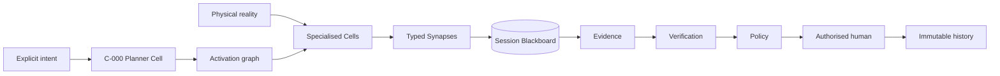

# 2. Intent model

An Intent defines the bounded outcome the system is trying to achieve. It must be explicit, typed, versioned and linked to a session.

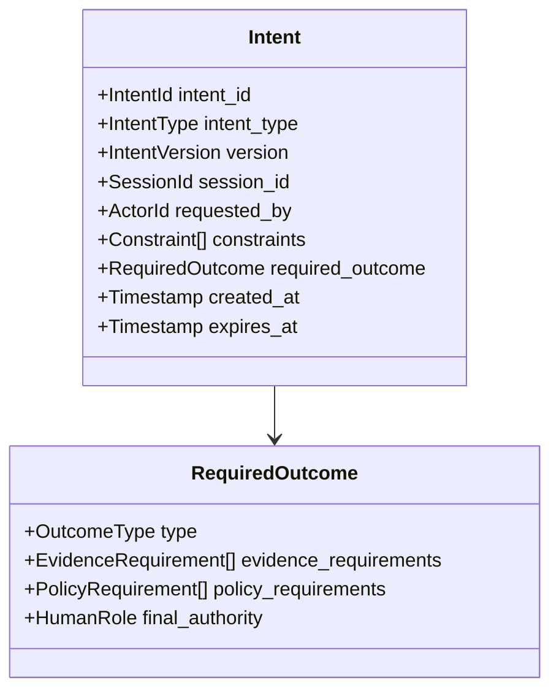

Initial intent types:

```text
COUNT_PILLS
VERIFY_EXPECTED_MEDICINE
IDENTIFY_MEDICINE_CANDIDATES
INSPECT_TRAY
EXPLAIN_SESSION
REPLAY_SESSION
ASSESS_SYSTEM_HEALTH
```

Only `COUNT_PILLS` is required for the first working product milestone.

# 3. C-000 Planner Cell

## 3.1 Mission

Translate an approved Intent into a bounded activation graph of Cells and Synapses.

The Planner Cell is an orchestrator, not an authority. It may select the required execution graph, but it may not count pills, change policy, skip verification, fabricate evidence or advance the session directly.

## 3.2 Authority boundary

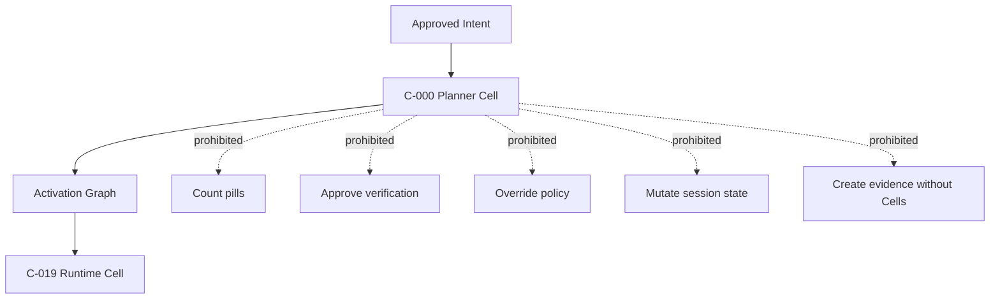

## 3.3 Planner output

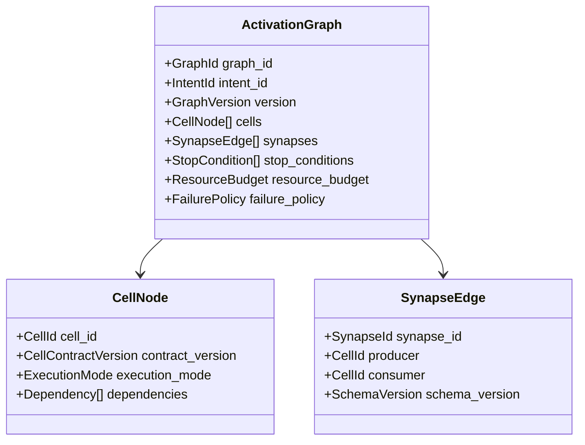

# 4. Intent-to-activation examples

## 4.1 Count pills

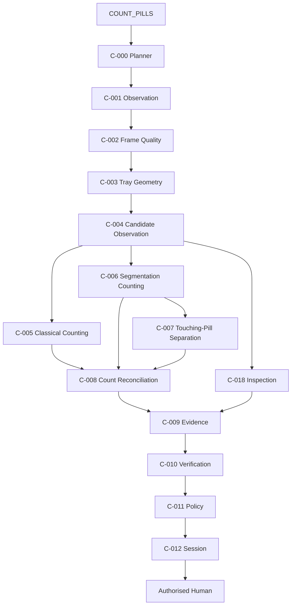

## 4.2 Explain session

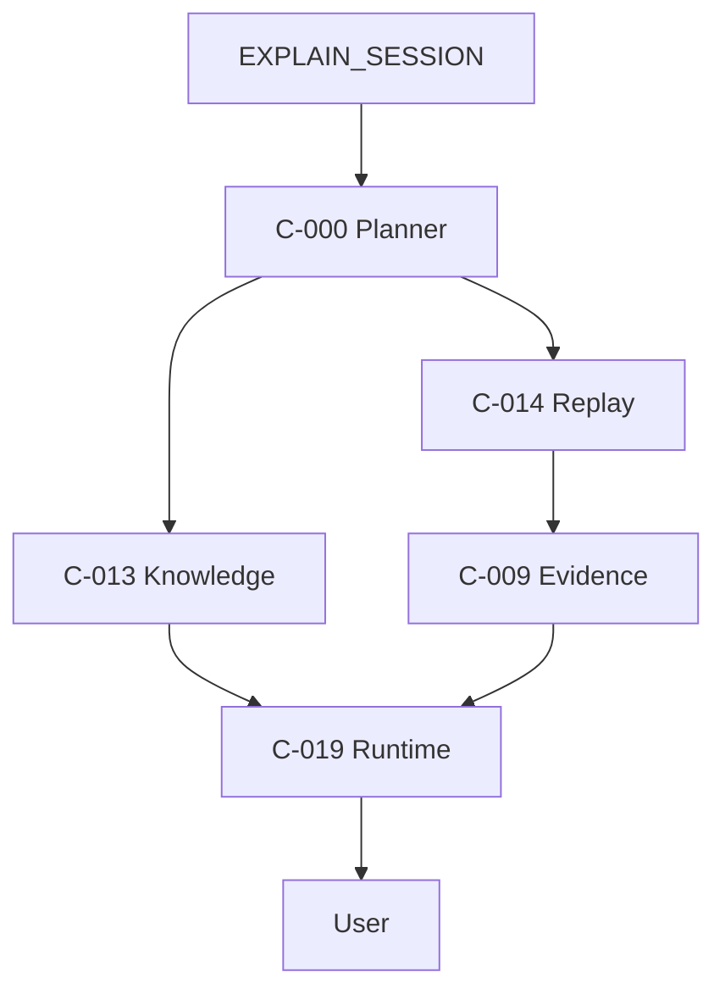

# 5. Dynamic activation graph

The Planner selects Cells according to Intent and current evidence. It does not activate every Cell unnecessarily.

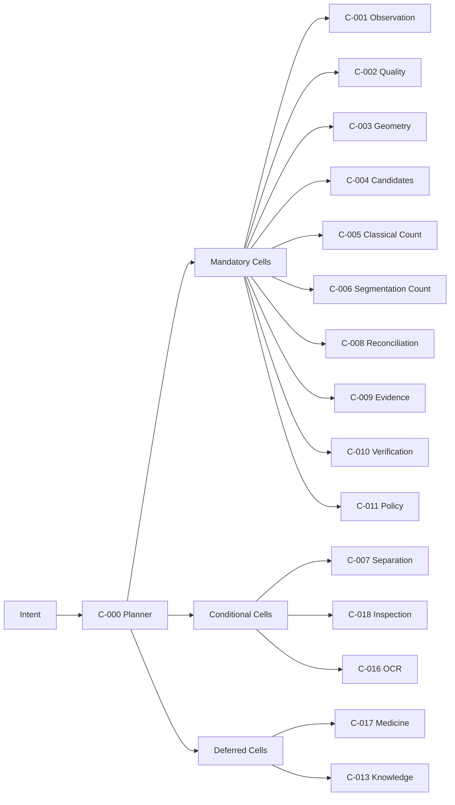

# 6. Cell-Synapse-Blackboard relationship

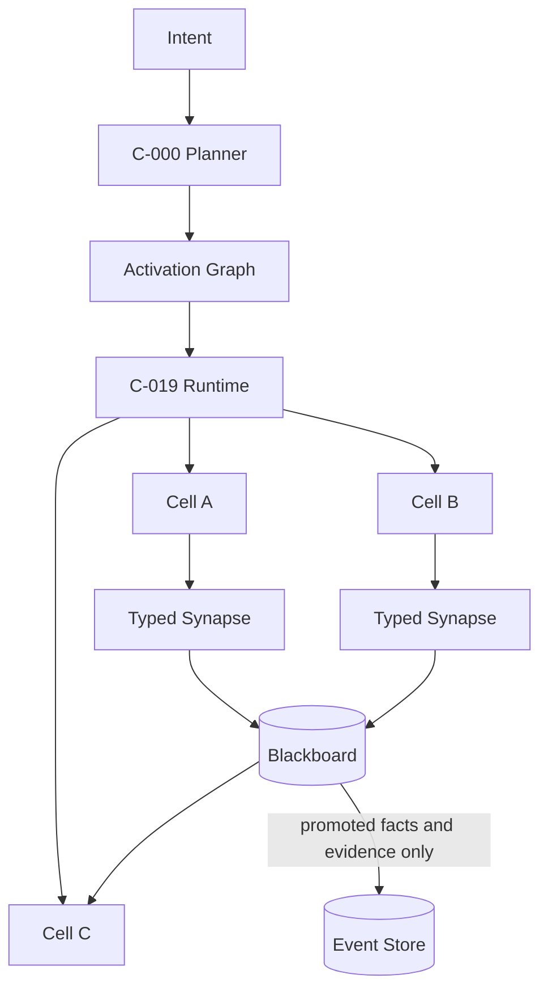

# 7. Blackboard knowledge classes

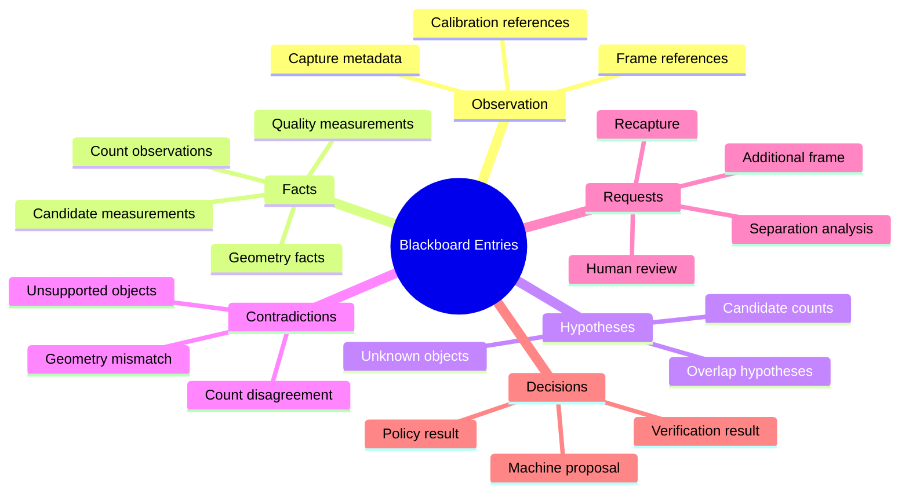

# 8. Pill-counting knowledge graph

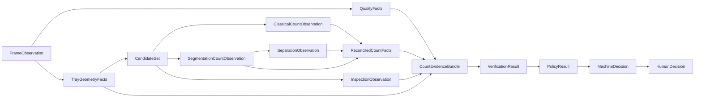

# 9. C-003 Tray Geometry Cell

## 9.1 Mission

Convert a quality-approved frame into a calibrated tray-space representation.

C-003 establishes where valid pill observations may exist and how pixels map to physical measurement. It does not classify or count pills.

## 9.2 Inputs and outputs

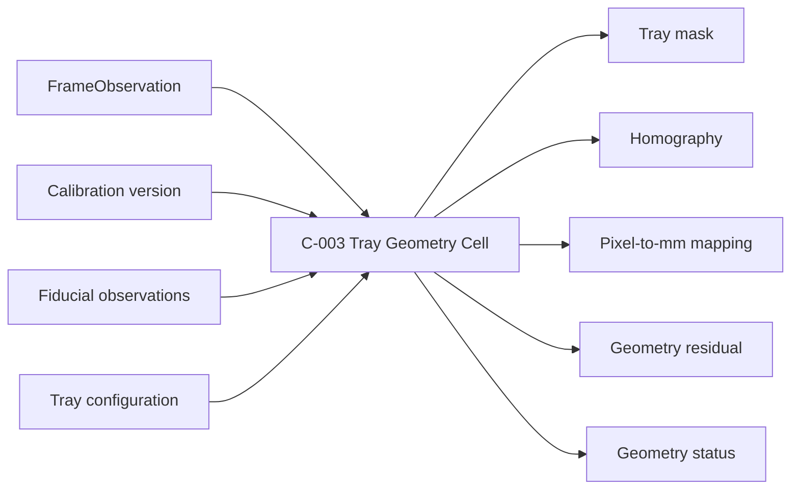

## 9.3 Geometry flow

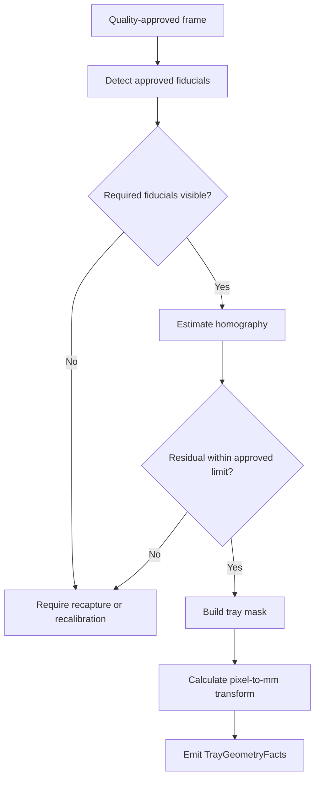

## 9.4 Output contract

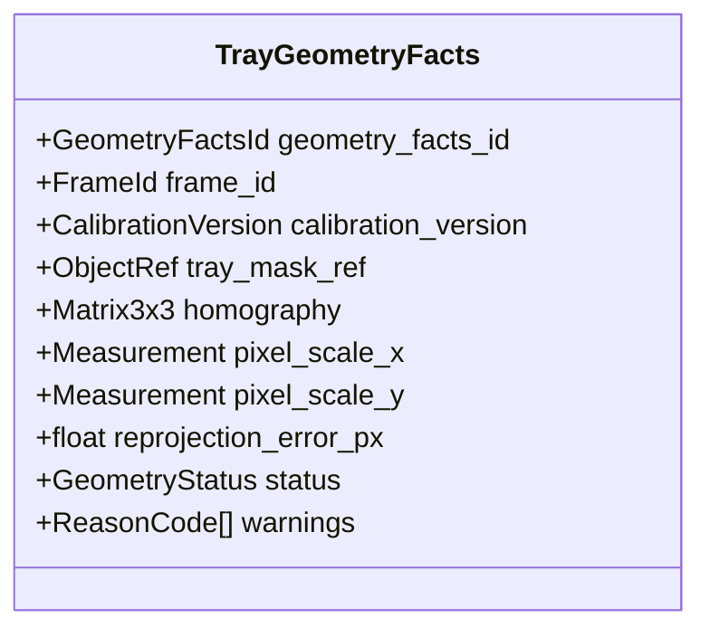

## 9.5 Failure modes

```text
FIDUCIALS_MISSING
FIDUCIAL_PATTERN_MISMATCH
TRAY_PARTIALLY_OUTSIDE_FRAME
HOMOGRAPHY_UNSTABLE
REPROJECTION_ERROR_HIGH
CALIBRATION_VERSION_MISMATCH
PIXEL_SCALE_UNAVAILABLE
```

# 10. C-004 Candidate Observation Cell

## 10.1 Mission

Transform the calibrated tray region into a set of observed foreground candidates and measurable properties.

A candidate is not yet assumed to be one pill. It may be a tablet, capsule, merged group, fragment, foreign object, reflection, shadow or unknown region.

## 10.2 Candidate generation flow

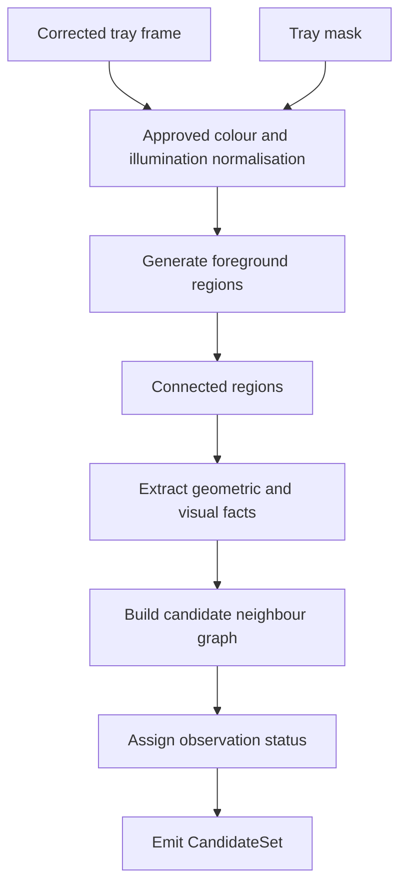

## 10.3 Candidate status model

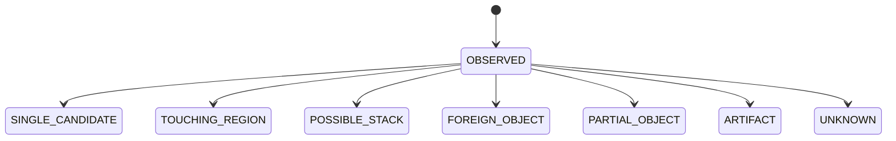

## 10.4 Candidate object

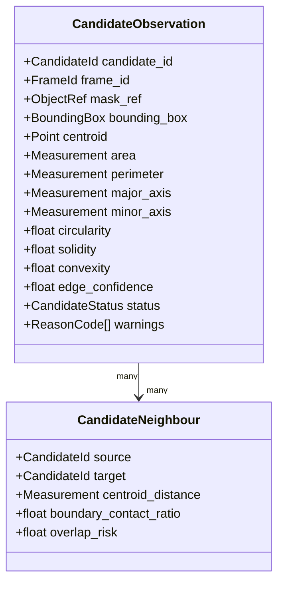

## 10.5 Candidate decision tree

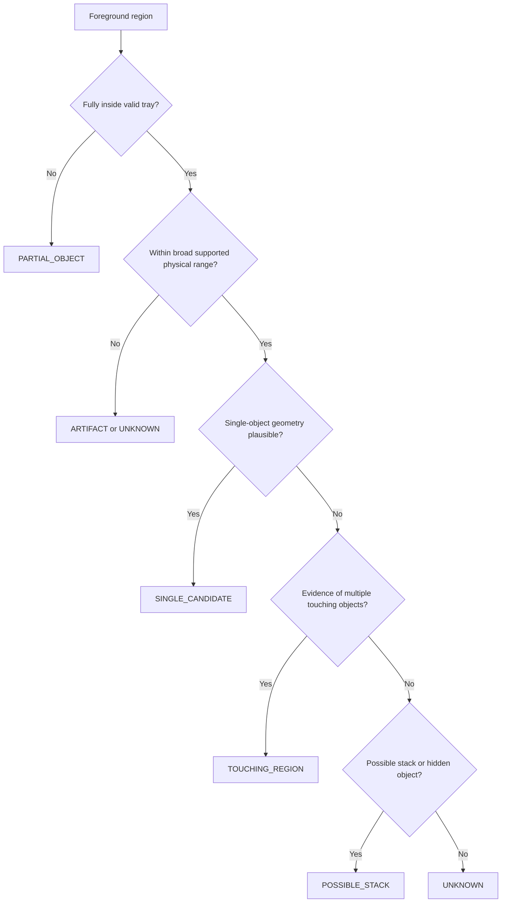

# 11. Counting-first Cell set

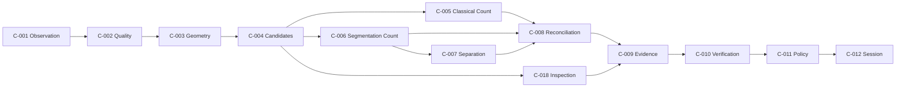

# 12. Cell activation lifecycle

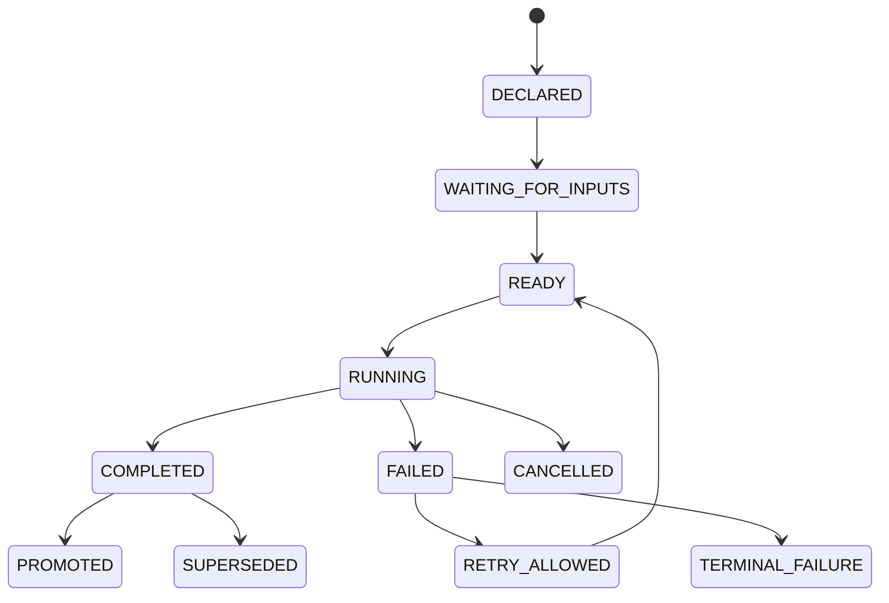

# 13. Synapse reliability flow

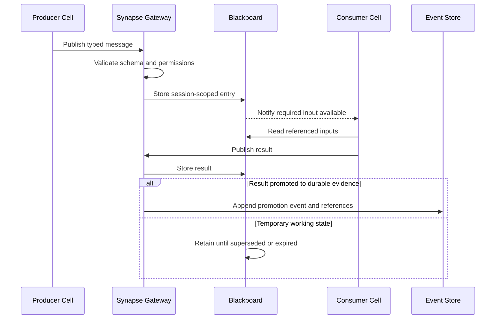

# 14. Planner safety rules

```mermaid
flowchart TD
    Proposed[Planner proposes activation graph]
    Contracts{All Cells and Synapses approved?}
    Reject[Reject graph]
    Policy{Required policy and verification Cells present?}
    RejectUnsafe[Reject unsafe graph]
    Budget{Within resource budget?}
    Queue[Queue or degrade nonessential work]
    Activate[Runtime activates graph]

    Proposed --> Contracts
    Contracts -- No --> Reject
    Contracts -- Yes --> Policy
    Policy -- No --> RejectUnsafe
    Policy -- Yes --> Budget
    Budget -- No --> Queue --> Activate
    Budget -- Yes --> Activate
```

The Planner must never produce a graph that omits mandatory verification, policy or human-authority steps for the active workflow.

# 15. Versioning rule for visual files

- Minor wording, label, typo or small diagram corrections may update the current file in place.
- A major conceptual addition, new architecture layer, renamed primary abstraction or substantially revised system map creates a new versioned file.
- Previous major versions remain preserved.
- New files state which version they continue or supersede.
- Code and engineering changes must reference the current active Visual Atlas version.

# 16. Next version scope

The next major Visual Atlas version should add:

- C-005 Classical Counting Cell.
- C-006 Segmentation Counting Cell.
- C-007 Touching-Pill Separation Cell.
- C-008 Count Reconciliation Cell.
- Count disagreement localisation diagrams.
- Count evidence object lineage.
- Benchmark dataset and evaluation graphs.
- Event-store append/outbox sequence.
- PostgreSQL ER diagram.
