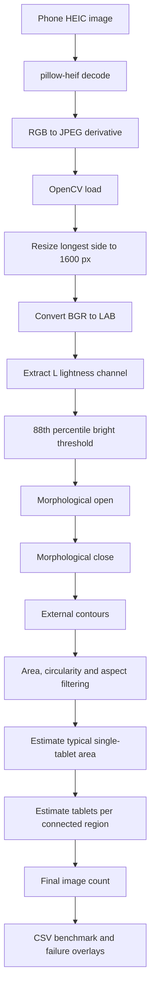

# P.C.A.I. Architecture Bible

## Document status

- **Project:** P.C.A.I. — Pharmacy Computer-Aided Intelligence
- **Branch:** `implementation/counting-cells-v0.1`
- **Milestone covered:** M-001 — First Real Vision Pipeline
- **Reference commit before this documentation update:** `61feb75`
- **Status:** Living engineering authority

This file records the architecture that is actually implemented or experimentally validated. Future plans are explicitly marked as planned. The document must not describe speculative features as completed.

---

## 1. Mission

P.C.A.I. is an offline-first pharmacy vision system whose first production responsibility is reliable tablet counting. The longer-term platform may support identification, quality inspection, contamination warnings, audit records, explanation, and assisted pharmacy workflows, but those capabilities must not weaken the counting path.

The product is designed to resemble an open counting station rather than a fully enclosed machine. A browser-based application will eventually expose the system, while the Jetson runs the local vision and AI workloads.

### Primary engineering objective

Produce a defensible tablet count from a captured image while preserving:

- deterministic evidence,
- reproducible processing,
- confidence and rejection reasons,
- immutable audit events,
- separation between observation and decision,
- safe refusal when the operating envelope is violated.

---

## 2. Architectural principles

### 2.1 Event-sourced system of record

Every significant system action and AI decision will be represented as an immutable event. Events are intended to support replay, debugging, audit, model comparison, and incident investigation.

Examples:

- `FrameReceived`
- `FrameQualityEvaluated`
- `TrayGeometryEstimated`
- `CandidatesObserved`
- `CountProduced`
- `CountRejected`
- `OperatorOverrideRecorded`
- `ModelVersionActivated`
- `DatasetSampleAccepted`

The current counting-cell code establishes deterministic processing components; full persistence and event-store integration are planned.

### 2.2 Cell-based responsibility boundaries

The implemented code separates responsibilities into Cells:

- Observation Cell
- Frame Quality Cell
- Tray Geometry Cell
- Candidate Observation Cell
- Classical Counting Cell

A Cell may produce evidence within its authority but must not silently assume responsibilities belonging to another Cell.

### 2.3 Conservative counting

The counting system must prefer rejection over an unjustified count. A partial pill, unsupported cluster, uncertain stack, missing tray boundary, or invalid image must remain visible as a reason code rather than being hidden behind a guessed number.

### 2.4 Offline-first deployment

The Jetson Orin Nano is the current edge computer. Core counting must run locally without sending pharmacy images to external services.

### 2.5 Hardware and software are co-designed

The first phone-image benchmark used a dark, reflective wooden surface. The benchmark showed that the counting hypothesis is viable but also demonstrated that surface design materially affects segmentation. A future matte, low-glare tray is not a cosmetic accessory; it is part of the vision system.

---

## 3. Current reference hardware

| Component | Current state | Role |
|---|---:|---|
| NVIDIA Jetson Orin Nano Developer Kit | Active | Edge compute and local inference |
| Memory | 8 GB | Runtime memory |
| microSD | 64 GB | JetPack and system storage |
| Temporary USB drive | Active | Dataset, reports, converted images, artifacts |
| OWC Envoy Ultra 2 TB | Available for later use | Planned high-capacity project and model storage |
| Phone camera | Active dataset source | Initial image acquisition |
| Webcam / production camera | Deferred | To be integrated after offline counting works |

### Storage strategy

Current:

```text
microSD
└── Ubuntu + JetPack + system tools

USB drive
├── original phone images
├── converted JPEG images
├── benchmark reports
├── diagnostic artifacts
└── experiment outputs
```

Later:

```text
microSD
└── Operating system and recovery environment

OWC / production storage
├── datasets
├── models
├── event log
├── reports
├── artifacts
├── application data
└── backups
```

The project must use logical paths and configuration rather than hard-coded device names so migration from temporary USB storage to OWC storage does not require architectural changes.

---

## 4. Current reference software environment

| Layer | Version / state |
|---|---|
| Ubuntu | 22.04.5 LTS |
| Kernel | 5.15.148-tegra |
| Jetson Linux | R36.4.4 |
| JetPack | 6.2.1 baseline, packages updated |
| Python | 3.11.15 managed with `uv` |
| OpenCV Python | 5.0.0 headless in project environment |
| NumPy | 2.4.6 |
| Pillow | 12.3.0 |
| pillow-heif | 1.5.0 |
| pytest | 9.1.1 |
| Git transport | SSH |
| Remote development | Mac to Jetson over SSH |

### Why Python 3.11 is required

The code uses Python 3.11 language/runtime features including `enum.StrEnum` and `datetime.UTC`. JetPack's Ubuntu 22.04 system Python is 3.10, so P.C.A.I. uses a separate `uv`-managed Python 3.11 environment. The system Python must not be replaced because Jetson platform packages may depend on it.

---

## 5. Repository architecture implemented today

```text
src/pcai/
├── cells/
│   ├── observation/
│   ├── frame_quality/
│   ├── tray_geometry/
│   ├── candidate_observation/
│   └── classical_counting/
├── domain/
├── shared/
└── vision/

tests/
├── integration/
└── unit/
```

### Implemented Cells

#### Observation Cell

Creates a valid observation identity and normalized frame record. It is responsible for input integrity, not counting.

#### Frame Quality Cell

Evaluates whether a frame is sufficiently usable. Quality evidence is intentionally separate from candidate extraction.

#### Tray Geometry Cell

Represents the canonical tray and projective geometry. The present phone benchmark does not yet use a production tray calibration flow, but the Cell boundary is already established.

#### Candidate Observation Cell

Segments foreground, extracts contours, computes geometric measurements, and classifies observed regions conservatively.

Candidate states include concepts such as:

- single candidate,
- touching region,
- partial object,
- artifact,
- unknown.

#### Classical Counting Cell

Consumes candidate evidence and produces or rejects a count according to policy. It must not perform hidden image segmentation inside the count decision.

---

## 6. First real data milestone

### 6.1 Dataset source

The initial dataset was captured manually with a phone using expired Aleve tablets placed randomly on a table.

Ground-truth folder structure:

```text
/media/saika/USB/
├── 10/   # every valid image contains 10 tablets
└── 30/   # every valid image contains 30 tablets
```

After excluding macOS AppleDouble metadata files beginning with `._`:

| Dataset | Valid images |
|---|---:|
| 10-tablet set | 52 |
| 30-tablet set | 66 |
| Total | 118 |

The 10-tablet set is the first benchmark. The 30-tablet set remains reserved for the next stage after the baseline is documented and stabilized.

### 6.2 Ingestion decision

The source files are iPhone HEIC images. Two ingestion failures were discovered:

1. OpenCV did not decode the HEIC files directly.
2. Ubuntu's `heif-convert` failed on auxiliary image references present in the iPhone files.

The validated ingestion path is:

```text
HEIC
  ↓
pillow-heif primary image decode
  ↓
Pillow RGB image
  ↓
JPEG quality 95
  ↓
OpenCV analysis
```

Raw HEIC images remain immutable. Converted images are derivative working data.

---

## 7. Working data layout

```text
/media/saika/USB/pcai-working/
├── converted/
│   ├── 10/
│   └── 30/
├── artifacts/
│   ├── first-real-image/
│   ├── first-real-image-light/
│   └── first-real-count/
├── results/
└── reports/
    └── ten-tablet-v0/
        ├── results.csv
        ├── failures/
        └── failure_contact_sheet.jpg
```

Rules:

- raw images are never overwritten,
- generated images are reproducible artifacts,
- reports are versioned by experiment name,
- benchmark scripts must not infer ground truth inside the algorithm,
- folder labels may be used only for evaluation after prediction.

---

## 8. Classical vision V0

### 8.1 Experimental pipeline



### 8.2 First successful real image

For `IMG_8031.jpg`:

- usable connected regions: 9,
- one region was approximately twice the typical tablet area,
- typical estimated single-tablet area: 5,784 px²,
- estimated tablet count: 10,
- ground truth: 10.

This was the first exact count from a real phone photograph running locally on the Jetson.

### 8.3 Batch benchmark

Dataset: 52 images, each containing 10 tablets.

| Metric | V0 result |
|---|---:|
| Exact counts | 26 / 52 |
| Exact-count accuracy | 50.00% |
| Mean absolute count error | 1.635 tablets |
| Most common prediction | 10 |

Prediction distribution:

```text
{1: 2, 2: 1, 4: 1, 6: 2, 7: 3, 9: 4,
 10: 26, 11: 8, 12: 2, 15: 1, 17: 1, 18: 1}
```

### Interpretation

The baseline is not pharmacy-grade, but it validates the counting hypothesis. The contact sheet shows that the algorithm often locates the correct tablets, while errors arise mainly from the uncontrolled dark reflective base, touching groups, threshold instability, glare, and occasional split or merged regions.

The result must not be presented as 50% object-detection accuracy. It is **50% exact whole-image count accuracy** under an intentionally uncontrolled temporary surface.

---

## 9. Test and repository repairs completed

The Jetson validation revealed several defects in the branch:

- missing `OperatingEnvelopeError`,
- incorrect OpenCV border handling during tray-border detection,
- incorrect expected SHA-256 digest in a unit test,
- pytest import collisions caused by repeated `test_cell.py` names when using the default import mode.

Repairs were validated with:

```text
28 passed
```

The test suite is run using:

```bash
PYTHONPATH=src python -m pytest --import-mode=importlib -q
```

---

## 10. Tray and optical design implication

The temporary dark wooden base has visible grain, non-uniform reflectance, glare, and local highlights. It is useful as a stress condition but not an appropriate production surface.

### Planned tray requirements

- matte finish,
- low glare,
- uniform colour,
- colour selected for high separation from common tablets,
- shallow edge or lip,
- repeatable tablet area,
- visible full tray boundary,
- cleanable pharmacy-compatible material,
- no mirror-like surface,
- no visually dominant texture,
- compatible with fixed overhead lighting.

### Current decision

Do not overfit V0 to the wooden base. Preserve the benchmark as evidence, then repeat the same benchmark after selecting a controlled tray. Hardware improvement and algorithm improvement must be measured separately.

---

## 11. Security and privacy posture

- Images remain on local storage during counting development.
- Remote administration uses SSH.
- GitHub access uses an ED25519 SSH key generated on the Jetson.
- The private SSH key must never be copied into documentation or source control.
- Pharmacy production deployments will require device identity, encrypted storage, authenticated browser access, least-privilege services, and event-log integrity controls.

---

## 12. Immediate roadmap

### M-002 — Controlled-base repeatability

1. Select a temporary matte base or tray.
2. Recreate a representative 10-tablet and 30-tablet subset.
3. Run V0 unchanged.
4. Compare against the wooden-base benchmark.
5. Record exact-count accuracy and MAE.

### M-003 — Classical Vision V1

Planned improvements:

- illumination normalization,
- CLAHE/local contrast,
- adaptive or colour-aware thresholding,
- improved background rejection,
- distance-transform evidence,
- watershed separation for touching tablets,
- stronger shape and solidity constraints,
- explicit uncertainty and rejection policy.

### M-004 — 30-tablet benchmark

Run the stabilized pipeline against the 66-image 30-tablet set. Do not tune solely against the 10-tablet set.

### M-005 — Live camera integration

Only after offline repeatability:

- connect available webcam,
- calibrate fixed geometry,
- standardize exposure and focus,
- capture frames into the same Observation Cell contract,
- compare phone and live-camera distributions.

### M-006 — Hybrid vision

Introduce learned models only where evidence shows classical methods are insufficient. Possible roles include touching-cluster separation, difficult-pill segmentation, pill identity, defect detection, and confidence arbitration.

---

## 13. Definition of success for the counting path

P.C.A.I. must ultimately demonstrate more than average accuracy. Required evidence will include:

- exact-count accuracy across pill counts and pill types,
- false count and rejection rates,
- performance on touching and stacked pills,
- border-partial detection,
- robustness to lighting and tray contamination,
- deterministic replay,
- model and configuration version tracking,
- operator-visible reason codes,
- latency on the target Jetson,
- repeatability over multiple captures of the same arrangement.

The project is currently at validated experimental prototype status, not pharmacy-production status.
