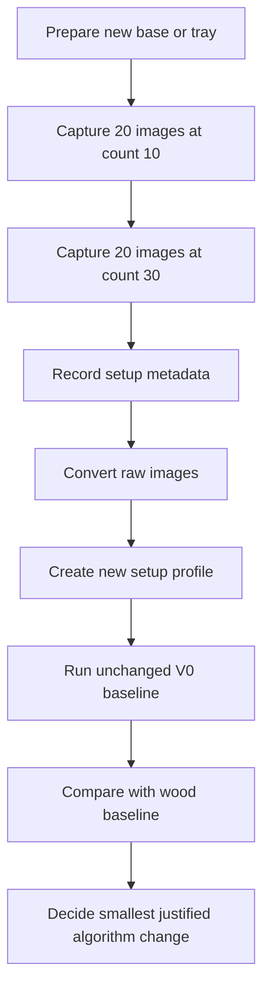

# P.C.A.I. Dataset Capture Protocol

## Purpose

This protocol defines how to create new tablet-counting datasets while allowing the physical setup to evolve. It prevents the codebase and benchmarks from becoming tied to one phone, tray, background, lighting condition, pill type, or tablet count.

The protocol applies to temporary experiments, near-final hardware trials, and future production-camera captures.

---

## Core rule

The physical setup may change. The evaluation contract must not.

Every dataset must preserve:

- known ground truth,
- immutable raw files,
- a unique setup identifier,
- a capture-session identifier,
- explicit environmental notes,
- separation between training/tuning images and final evaluation images,
- no use of ground truth inside the counting algorithm.

---

## Required folder layout

```text
dataset_root/
├── raw/
│   ├── count-10/
│   ├── count-30/
│   └── other-counts/
├── converted/
├── manifests/
├── reports/
└── artifacts/
```

Raw files must never be edited or overwritten. Converted JPEG or PNG files are derivatives and may be regenerated.

---

## Dataset identity

Each dataset must have a stable identifier using this pattern:

```text
<source>_<surface>_<camera-state>_<revision>
```

Examples:

```text
phone_wood_uncontrolled_v0
phone_matte_tray_fixed_v1
webcam_matte_tray_fixed_v1
production_camera_tray_calibrated_v1
```

The identifier describes the physical setup, not the algorithm version.

---

## Capture-session metadata

Record the following for every session:

| Field | Description |
|---|---|
| dataset_id | Stable setup identifier |
| session_id | Unique capture session |
| capture_date | Date of acquisition |
| image_source | Phone, webcam, CSI camera, or production camera |
| device_model | Camera or phone model if known |
| surface | Background or tray material and colour |
| lighting | Natural, room light, diffuse LED, mixed, or controlled |
| camera_height | Approximate or measured height |
| camera_angle | Overhead, angled, or calibrated |
| focus_mode | Auto, locked, or manual |
| exposure_mode | Auto, locked, or manual |
| pill_type | Human-readable pill description |
| expected_count | Ground-truth tablet count |
| operator | Person who captured the session |
| notes | Shadows, overlap, glare, motion, or anomalies |

---

## Capture groups

For each tablet count, create three groups.

### Group A — Clean separation

Tablets are separated with minimal touching. This measures basic segmentation and candidate detection.

### Group B — Natural random spread

Tablets are poured or scattered naturally. Some touching is expected. This represents the main operating condition.

### Group C — Difficult cases

Include controlled examples of:

- touching pairs,
- touching clusters,
- partial border objects,
- small stacks,
- strong shadows,
- mild glare,
- uneven distribution,
- tablets close to the tray edge.

Difficult cases must be intentional and labelled as such. They should not silently contaminate the clean benchmark.

---

## Minimum near-final comparison set

Before a large capture, create a small verification set:

| Count | Clean | Natural | Difficult | Minimum total |
|---|---:|---:|---:|---:|
| 10 | 5 | 10 | 5 | 20 |
| 30 | 5 | 10 | 5 | 20 |

Run the existing baseline unchanged on these 40 images. Only after confirming that the images are useful should the session be expanded.

---

## Recommended full dataset growth

The project should gradually include multiple counts rather than only 10 and 30.

Suggested sequence:

```text
1, 5, 10, 20, 30, 50, 75, 100
```

Not every count needs the same number of images initially. The objective is to expose the system to changing density and connected-cluster behaviour.

---

## Image-capture rules

1. Keep the entire usable tray or counting area visible.
2. Avoid cutting tablets at the image boundary unless recording a deliberate partial-object test.
3. Keep the camera as stable as the current setup allows.
4. Do not digitally zoom.
5. Do not apply filters, portrait mode, or computational blur.
6. Keep original resolution.
7. Preserve EXIF metadata where possible.
8. Record whether exposure and focus were automatic or locked.
9. Capture multiple arrangements, not repeated images of one arrangement.
10. Do not move tablets merely to make the algorithm succeed.

---

## Background and tray evaluation

When selecting a near-final base, record:

- material,
- colour,
- reflectivity,
- visible texture,
- lip or edge design,
- cleaning behaviour,
- contrast against light tablets,
- contrast against dark tablets,
- glare under intended lighting.

A surface that works only for one pill colour is not automatically a production tray. The first near-final setup may still be an experimental profile.

---

## Manifest principle

Every image should eventually map to one manifest record. The manifest is the source of truth for evaluation.

Example conceptual record:

```json
{
  "image_id": "session-001-img-0001",
  "relative_path": "raw/count-30/IMG_0001.HEIC",
  "expected_count": 30,
  "capture_group": "NATURAL",
  "dataset_id": "phone_matte_tray_fixed_v1",
  "session_id": "session-001",
  "pill_type": "Aleve tablet",
  "notes": ["two touching pairs"]
}
```

The expected count belongs to evaluation metadata only. Production segmentation and counting code must never read it.

---

## Dataset split policy

Do not tune and evaluate on the same images.

For each sufficiently large dataset:

- development/tuning set: 60%,
- validation set: 20%,
- held-out test set: 20%.

Images from the same physical arrangement must remain in the same split. Near-duplicate frames must not be spread across train, validation, and test sets.

---

## Versioning policy

A new dataset revision is required when any major physical condition changes:

- camera source,
- camera height,
- tray or background,
- lighting system,
- capture resolution,
- pill type,
- calibration method.

Do not overwrite an old dataset to make it look cleaner. Preserve historical datasets so benchmarks remain reproducible.

---

## Acceptance checklist

Before declaring a new dataset ready:

- [ ] Raw images are preserved.
- [ ] Valid image count is known.
- [ ] AppleDouble or other metadata files are excluded.
- [ ] Ground truth is verified.
- [ ] Dataset and session identifiers are recorded.
- [ ] Setup notes are complete.
- [ ] Clean, natural, and difficult groups exist.
- [ ] Near-duplicates are identified.
- [ ] Conversion succeeds without modifying raw files.
- [ ] Baseline evaluation runs end to end.
- [ ] Reports and failure overlays are generated.

---

## Immediate next dataset

The next dataset is expected to use a different background and a setup closer to the final product. The first action is not algorithm modification. The sequence is:



This protects the project from overfitting to temporary images while keeping the implementation small, readable, and adaptable.
