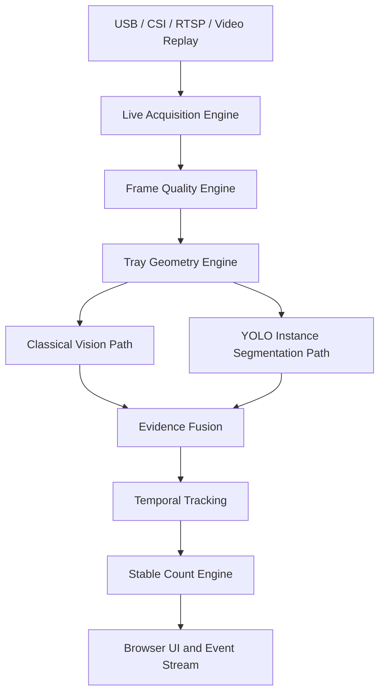
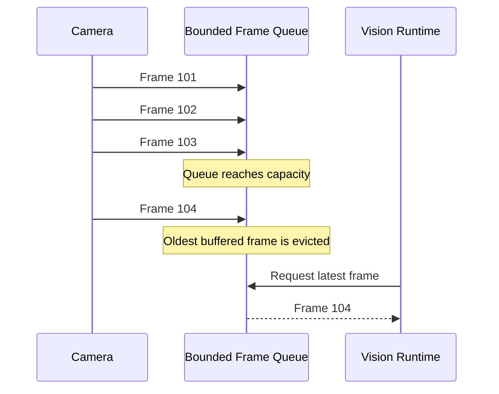
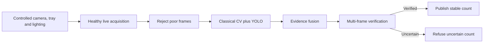

# P.C.A.I. Live Acquisition Engine V1

## Status

**Implementation branch:** `implementation/live-acquisition-v1`

**Purpose:** provide a reliable, low-latency, camera-agnostic live frame stream for the P.C.A.I. vision engine.

This subsystem is the first production layer in the real-time tablet counting stack. It does not count tablets. It guarantees that downstream vision modules receive fresh, timestamped, validated frames through a stable interface.

---

## 1. Product objective

P.C.A.I. is being designed for live operation:

```text
Tablets are poured onto a tray
        ↓
Camera produces a continuous video stream
        ↓
P.C.A.I. evaluates successive frames
        ↓
A stable tablet count is published
```

The system is not based on a user manually taking a photograph and submitting it for analysis. Still images remain useful for testing, calibration, replay, and dataset creation, but the production workflow is continuous live video.

The acquisition engine therefore prioritizes:

- low latency;
- newest-frame processing;
- bounded memory;
- deterministic metadata;
- camera health visibility;
- recoverable camera failures;
- support for local and network cameras;
- hardware-specific configuration outside source code.

---

## 2. Position in the complete vision architecture



The acquisition subsystem is deliberately isolated from counting logic. A change from a USB webcam to a Jetson CSI camera or wireless RTSP camera must not require changes to segmentation, YOLO, fusion, or tracking.

---

## 3. Design principles

### 3.1 Process the newest useful frame

For live counting, old frames rapidly lose value. If the camera produces frames faster than the vision engine can process them, the system evicts the oldest buffered frame instead of building an ever-growing backlog.



This keeps latency bounded and ensures that the displayed count corresponds to the current tray state.

### 3.2 Separate contracts from camera backends

Downstream code depends on `CameraSource`, `CameraFrame`, `FrameMetadata`, and `AcquisitionSnapshot`, not directly on OpenCV or GStreamer.

This permits future backends such as:

- USB cameras;
- Jetson CSI cameras;
- RTSP / ONVIF wireless cameras;
- prerecorded video replay;
- industrial GigE Vision cameras;
- synthetic test sources.

### 3.3 Configuration over source-code edits

Camera-specific values are stored in JSON profiles. Hardware changes should normally require profile and calibration updates, not architectural rewrites.

### 3.4 Observable failure instead of silent degradation

The subsystem exposes camera state, measured FPS, queue depth, dropped frames, last-frame age, and the last error. The vision runtime can refuse to publish a count when acquisition health is degraded.

---

## 4. Repository structure

```text
src/pcai/acquisition/
├── __init__.py
├── capture_worker.py
├── config_loader.py
├── contracts.py
├── diagnostics.py
├── exceptions.py
├── frame_queue.py
├── opencv_camera.py
└── session.py

configs/camera/
├── usb_default.json
└── jetson_csi.json

examples/
└── live_camera.py

tests/unit/acquisition/
├── test_capture_worker.py
├── test_config_loader.py
├── test_diagnostics.py
├── test_frame_queue.py
├── test_opencv_camera.py
└── test_session.py
```

---

## 5. Core contracts

### 5.1 `CameraConfig`

Defines the physical or network source and requested capture properties.

Important fields:

- `source`: integer camera index, device path, RTSP URL, video file, or GStreamer pipeline;
- `width_px` and `height_px`;
- `fps`;
- `backend`;
- `buffer_size`;
- `fourcc`;
- `camera_id`.

### 5.2 `FrameMetadata`

Every frame includes:

- monotonically increasing sequence number;
- UTC capture timestamp;
- monotonic clock timestamp;
- camera identifier;
- actual frame width and height.

UTC time supports audit records and event correlation. Monotonic time supports reliable local latency and timeout calculations.

### 5.3 `CameraFrame`

A frame consists of:

- a BGR NumPy image;
- immutable metadata.

The OpenCV adapter copies the backend buffer before returning the frame. This prevents later camera-buffer mutation from altering an image already being processed.

### 5.4 `AcquisitionSnapshot`

Runtime health snapshot:

- current camera state;
- frames captured;
- frames dropped by the bounded queue;
- measured FPS;
- queue depth;
- last-frame age;
- last error.

---

## 6. Runtime components

### 6.1 `OpenCvCamera`

The first concrete `CameraSource` implementation.

Supported source forms:

```text
0
/dev/video0
rtsp://camera-address/live
/path/to/video.mp4
nvarguscamerasrc ... ! appsink
```

Responsibilities:

- open the configured source;
- request resolution, FPS, buffer size, and FOURCC;
- capture frames;
- attach metadata;
- maintain camera state;
- convert backend failures into typed acquisition errors;
- close the capture handle safely.

### 6.2 `FrameQueue`

A thread-safe bounded queue optimized for live vision.

Behavior when full:

```text
Oldest buffered frame → removed
Newest incoming frame → accepted
Dropped-frame counter → incremented
```

The queue provides both:

- `get()` for FIFO processing;
- `get_latest()` for newest-frame processing and latency minimization.

The real-time counting runtime should normally use `get_latest()`.

### 6.3 `CaptureWorker`

Runs camera capture on a dedicated background thread.

Responsibilities:

- open the camera when required;
- continuously capture frames;
- publish frames into `FrameQueue`;
- measure effective FPS;
- track latest frame time;
- attempt configured reconnects after acquisition failures;
- report the last error;
- shut down cleanly.

### 6.4 `AcquisitionDiagnostics`

Converts raw runtime metrics into a health classification.

Health states:

```text
HEALTHY
DEGRADED
UNHEALTHY
STOPPED
```

Current reason codes include:

- `CAMERA_CLOSED`;
- `CAMERA_FAILED`;
- `LAST_ERROR_PRESENT`;
- `FRAME_STALE`;
- `DROP_RATIO_HIGH`;
- `FPS_LOW`.

Thresholds remain configuration values and will be tuned against the final camera and Jetson runtime.

### 6.5 `AcquisitionSession`

High-level orchestration API that combines:

- camera;
- frame queue;
- capture worker;
- diagnostics.

Typical downstream usage:

```python
from pcai.acquisition import AcquisitionSession

with AcquisitionSession() as session:
    frame = session.read_latest(timeout_s=1.0)
    if frame is not None:
        process(frame)
```

The future live vision runtime will consume this API rather than constructing camera internals directly.

---

## 7. Camera profiles

### 7.1 USB camera

File:

```text
configs/camera/usb_default.json
```

Initial reference configuration:

- V4L2 backend;
- 1920 × 1080;
- 30 FPS;
- MJPG;
- queue-friendly camera buffering.

These are starting values, not final hardware guarantees. The production camera will be benchmarked for supported resolution, actual FPS, exposure behavior, focus, latency, and image quality.

### 7.2 Jetson CSI camera

File:

```text
configs/camera/jetson_csi.json
```

Uses an NVIDIA GStreamer pipeline with `nvarguscamerasrc`, NVMM memory, `nvvidconv`, BGR conversion, and a low-latency `appsink` configuration.

### 7.3 Wireless camera

The current contracts support network camera URLs such as RTSP. A production wireless profile must later define:

- URL and authentication handling;
- codec;
- expected latency;
- reconnect policy;
- packet-loss tolerance;
- timestamp policy;
- network security requirements.

A wireless camera may work, but it introduces additional delay, compression artifacts, packet loss, and connection variability. A directly connected USB, CSI, or industrial camera is expected to be more reliable for the final counting station. Wireless support remains useful for testing and selected deployment scenarios.

---

## 8. Running the live example

File:

```text
examples/live_camera.py
```

USB camera:

```bash
PYTHONPATH=src python examples/live_camera.py --source 0
```

Headless mode:

```bash
PYTHONPATH=src python examples/live_camera.py --source 0 --headless
```

RTSP source:

```bash
PYTHONPATH=src python examples/live_camera.py \
  --source 'rtsp://camera-address/live' \
  --headless
```

Exit the preview with `q` or `Esc`.

The example reports:

- camera ID;
- frame sequence;
- actual resolution;
- measured FPS;
- dropped frames;
- queue depth;
- frame age.

---

## 9. Testing strategy

The unit tests use fake camera backends wherever possible, allowing the subsystem to be validated without physical camera hardware.

Covered behaviors include:

- frame contract validation;
- queue overflow and oldest-frame eviction;
- newest-frame reads;
- timeout and close behavior;
- background capture;
- idempotent worker start;
- diagnostics classifications;
- camera-profile parsing;
- USB and GStreamer backend mapping;
- missing or invalid profile failures;
- OpenCV camera lifecycle;
- camera open/read failures;
- backend-buffer isolation;
- RTSP source acceptance;
- session configuration validation.

Run tests on the Jetson:

```bash
cd ~/pcai
source .venv/bin/activate
PYTHONPATH=src python -m pytest --import-mode=importlib -q
```

Hardware integration tests will be added when the camera is connected. They must measure actual behavior rather than assume requested OpenCV properties were honored by the device.

---

## 10. Accuracy relationship

The acquisition engine cannot independently guarantee counting accuracy. It creates the conditions required for accuracy by delivering current, traceable, observable frames.

The complete reliability strategy is:



The system should approach the requested reliability by publishing only inside a validated operating envelope. It must not manufacture confidence when the image is blurred, the tray is obstructed, tablets are stacked beyond supported limits, or the classical and AI paths disagree without resolution.

The practical target is:

> Correct count or explicit refusal to count; never a confidently published unsupported result.

---

## 11. Event-sourcing integration

Significant acquisition actions should later emit immutable events, consistent with the P.C.A.I. architecture:

```text
CameraSessionStarted
CameraOpened
FrameCaptured
FrameDropped
CameraReadFailed
CameraReconnectAttempted
AcquisitionHealthChanged
CameraSessionStopped
```

Raw video should not automatically be persisted for every session. Event records should reference configured evidence artifacts according to retention, privacy, storage, and debugging policies.

---

## 12. Known limitations before hardware validation

The current implementation is a strong software baseline, but it has not yet been validated against the final camera.

Items that may require small hardware-specific changes:

- actual camera device index or path;
- GStreamer pipeline details;
- FOURCC selection;
- resolution and frame-rate combinations;
- exposure and white-balance control;
- autofocus behavior;
- OpenCV backend availability;
- RTSP authentication and codec behavior;
- reconnect timing;
- measured health thresholds;
- Jetson performance tuning.

These should generally be adapter, profile, or calibration changes. The acquisition contracts and downstream architecture should remain stable.

---

## 13. Completion criteria for V1

The subsystem is ready to freeze after all of the following are demonstrated on the Jetson:

- full unit suite passes;
- USB or CSI camera opens through a profile;
- live preview or headless stream runs continuously;
- actual FPS and resolution are reported;
- frames remain fresh under downstream processing load;
- queue memory remains bounded;
- clean shutdown works repeatedly;
- unplug/reconnect behavior is observed and documented;
- a hardware benchmark report is recorded.

---

## 14. Next subsystem: Frame Quality Engine

The next layer will examine every incoming frame and produce a structured quality report before tablet detection.

Planned metrics:

- focus and sharpness;
- motion blur;
- mean brightness;
- dark clipping;
- bright clipping;
- glare and specular reflections;
- contrast;
- noise;
- shadow coverage;
- color / white-balance drift;
- histogram stability;
- frame-to-frame motion;
- tray visibility;
- usable ROI coverage.

Planned output:

```text
FrameQualityReport
├── overall_score
├── decision: ACCEPT | WAIT | REJECT
├── focus_score
├── exposure_score
├── glare_score
├── motion_score
├── lighting_stability_score
├── reason_codes
└── recommended_action
```

Only accepted frames will enter tray geometry, classical segmentation, YOLO inference, fusion, tracking, and stable-count publication.

---

## 15. Development rule going forward

Hardware-specific knowledge belongs in:

- camera profiles;
- calibration profiles;
- tray profiles;
- model manifests;
- operating-envelope thresholds.

Core algorithms and contracts should not be rewritten each time a camera, tray, or lighting component changes.
